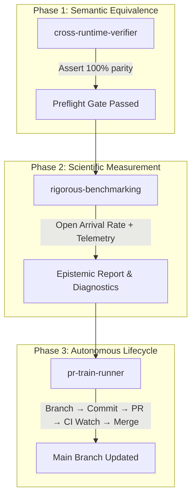

# Autonomous Performance Engineering Suite (`.agents/`)

This directory contains workspace skills and customization assets developed for Google Antigravity, derived from real-world lessons in benchmarking Rails on CRuby, JRuby, and Spinel C-AOT (Issues #11–#21, PRs #22–#28).

---

## Skills Overview

```
.agents/skills/
├── pr-train-runner/          # Autonomous PR chain, CI watcher, and auto-merger
├── rigorous-benchmarking/    # Open-arrival-rate workload, cgroup telemetry, warmup audit
└── cross-runtime-verifier/   # Black-box semantic differential testing across runtimes
```

| Skill | Primary Problem Solved | Core Artifacts |
|---|---|---|
| **[pr-train-runner](./skills/pr-train-runner/SKILL.md)** | Eliminates 10+ manual confirmations per epic, auto-merges green PRs, and handles Windows PowerShell / GitHub Actions cancelled run quirks. | [SKILL.md](./skills/pr-train-runner/SKILL.md)<br>[Why & What](./skills/pr-train-runner/references/why-and-what.md)<br>[pr_train.ps1](./skills/pr-train-runner/scripts/pr_train.ps1) |
| **[rigorous-benchmarking](./skills/rigorous-benchmarking/SKILL.md)** | Eliminates Coordinated Omission, verifies JIT warmup convergence ($CV \le 5\%$), and calculates JIT interaction factors ($I$). | [SKILL.md](./skills/rigorous-benchmarking/SKILL.md)<br>[Why & What](./skills/rigorous-benchmarking/references/why-and-what.md)<br>[k6 template](./skills/rigorous-benchmarking/resources/k6-open-arrival-template.js) |
| **[cross-runtime-verifier](./skills/cross-runtime-verifier/SKILL.md)** | Guarantees semantic equivalence (HTML DOM, JSON AST) across heterogeneous runtimes before benchmarking, preventing fake performance wins. | [SKILL.md](./skills/cross-runtime-verifier/SKILL.md)<br>[Why & What](./skills/cross-runtime-verifier/references/why-and-what.md)<br>[verify_differential.py](./skills/cross-runtime-verifier/scripts/verify_differential.py) |

---

## Interlocking Workflow

When conducting high-assurance performance engineering or complex multi-step refactoring, these skills work together:


