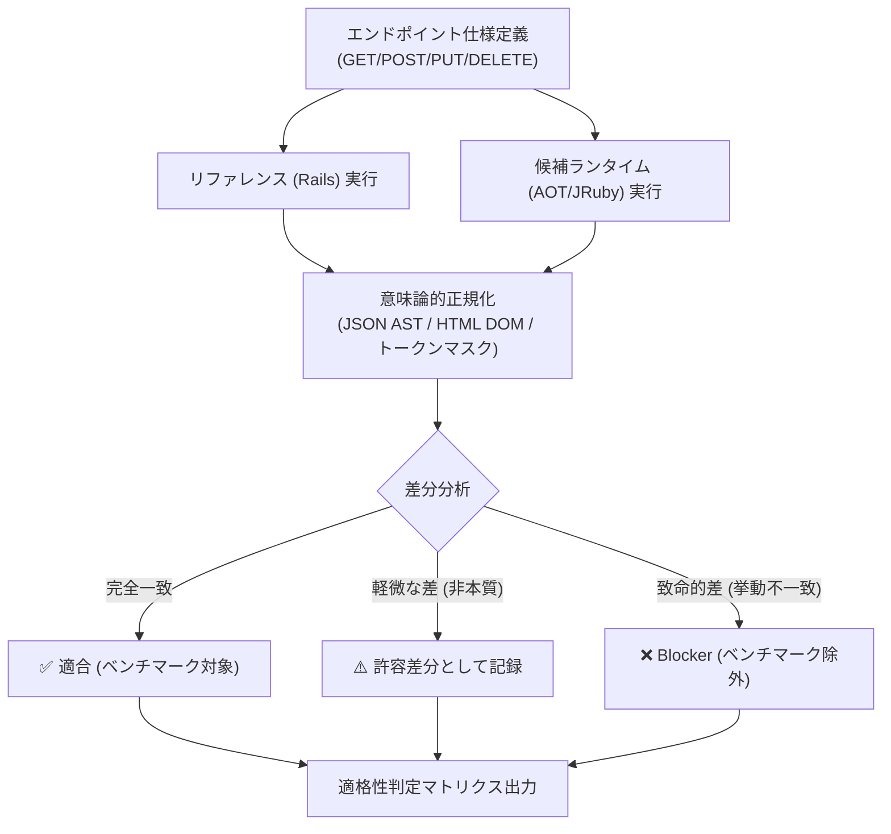

# Cross-Runtime Verifier: Why and What Concept Document

## 1. 経緯と背景 (Why)

### 1.1 起源: 異種ランタイム比較における「リンゴとミカンの比較」リスク
`example-rails-aot` では、同一のブログアプリケーション仕様を以下の 3 つの全く異なる実行基盤で動作させました。
1. **CRuby 3.4 + Puma + Rails 7.2** (標準 Ruby スタック)
2. **JRuby 9.4 + Puma + Rails 7.2** (JVM / HotSpot C2 + JDBC ドライバ)
3. **Spinel AOT** (Rails コードをトランスパイル・事前コンパイルした単一 C バイナリ + イベント駆動 C HTTP サーバー + ネイティブ SQLite C バインディング)

この多層的な異種ランタイム比較を行う際、**「事前等価性確認（Preflight Gate）」** を行わずにいきなりベンチマークを実行すると、以下のような致命的な測定事故が発生します。

#### (1) エラー応答の高速処理を「高性能」と誤認する罠
- **問題**: AOT 側で特定のエンドポイント（例: 不正入力時のバリデーションや CSRF 検証）の実装が不完全で即座に 422 や 500 を返している場合、重たい HTML レンダリングや DB トランザクションがスキップされるため、見かけ上の RPS が数十倍〜数百倍に跳ね上がります。
- **実体験**: Issue #14 および #20 の事前確認ゲートにおいて、全エンドポイントの HTML/JSON 応答および DB 状態変化を綿密に比較した結果、以下の **3 つの未解決 Blocker** を発見しました。
  1. HTML バリデーションエラー時の CSS クラス差（`
` の有無）
  2. JSON エラー構造の差分（Rails の ActiveModel::Errors 辞書形式 vs 配列形式）
  3. 不正 CSRF トークン送信時の挙動差（Rails は 422 拒絶、AOT は受容）
- **対処**: この等価性検証により、「書き込み・不正入力系は現時点で公平な比較が成立しない」と特定し、**100% の挙動一致が証明された読み取り系 5 エンドポイントのみを有効な比較対象に限定** しました。

#### (2) 表面的な差分（空白・ヘッダー順・CSRF トークン）による偽陽性
- **問題**: 単純な `diff` や `curl` の文字列比較を行うと、動的に生成される CSRF トークンや、JSON のキー順序、HTML の改行・空白の差異によって「不一致（Mismatch）」と判定され、正当な比較対象まで除外されてしまいます。
- **解決策**: セマンティック（意味論的）な正規化（HTML DOM 比較、JSON パース比較、非決定論的トークンのマスキング）を行う差分検証機構が必要となりました。

---

## 2. コンセプトと提供価値 (What)

### 2.1 コンセプト: 「意味論的差分検証 (Semantic Differential Testing)」
`cross-runtime-verifier` は、トランスパイラ、コンパイラ、リプレイス先サービス（Go/Rust/C）と元のリファレンス実装（Rails/Django/Node）の間で、**ブラックボックス HTTP レベルでの等価性と健全性を網羅的に検証・適格性判定する** スキルです。

### 2.2 検証判定の 3 分類

1. **Eligible (適合)**:
   - レスポンスステータス、HTTP メソッド、ボディの意味論的内容（DOM/JSON）、DB 副作用が完全に一致。ベンチマークの正当な比較対象。
2. **Acceptable Variance (許容差分)**:
   - `Server` ヘッダーの違い、キャッシュヘッダーのタイムスタンプ差異、意図的な高速化に起因する非セマンティックな順序差。
3. **Benchmark Blocker (除外対象)**:
   - バリデーション失敗時のフォーマット乖離、認証・認可の欠落、DB 永続化スキップ。これらが解消されるまで、該当エンドポイントでの性能比較は禁止される。
