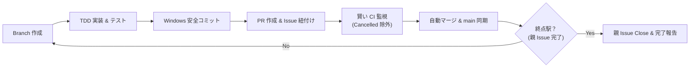

# PR Train Runner: Why and What Concept Document

## 1. 経緯と背景 (Why)

### 1.1 起源: example-rails-aot における Issue #11〜#21 の実体験
本リポジトリにおける親 Issue [#11](https://github.com/koduki/example-rails-aot/issues/11)「Roundhouse による YJIT／JRuby の性能変化と Spinel AOT を比較する」は、合計 10 個のサブ Issue（#12〜#21）と 7 つの Pull Request（#22〜#28）を順次実装・検証していく長大な開発ロードマップでした。

その過程において、以下の **3 つの構造的ボトルネック** が発生しました。

#### (1) 対話オーバーヘッドと過剰な人間介入
エージェントは各 PR の実装や CI 完了のたびに停止し、人間側はログ上で以下のように何度も同じ承認・継続の合図を入力せざるを得ませんでした。
```text
ユーザー: 「マージして」
ユーザー: 「ok」
ユーザー: 「CIの完了後マージして。」
ユーザー: 「続けて」
ユーザー: 「CI後にマージ」
ユーザー: 「はい。そのまま実施して、マージまでして」
ユーザー: 「はい」
ユーザー: 「はい」
ユーザー: 「はい」
```
本来、親 Issue と依存関係グラフが合意されているならば、CI がグリーンである限りエージェントは自律的に次のタスクへ進むべきですが、「1 PR ごとに立ち止まって確認する」という一般アシスタントの慎重さが、反復開発における大きな摩擦となっていました。

#### (2) GitHub Actions の重複実行と cancelled ステータスの誤判定
ブランチへの push と Pull Request のオープンが短時間に連続すると、GitHub Actions の Concurrency Group やイベントトリガーにより、push 起因のランが `cancelled` となり、`gh pr view --json mergeStateStatus` が `UNSTABLE` を返します。
これにより、CI が実質的に全ジョブ pass しているにもかかわらず、「エラーで停止した」と誤認して調査に時間を要する問題が生じました。

#### (3) Windows PowerShell 環境での Git 自動化トラップ
Windows 11 + PowerShell 環境特有の問題として:
- 改行を含む複数行のコミットメッセージを直接コマンドライン引数で渡すと、エスケープ漏れやパーサーエラーが発生する。
- 一時ファイル経由のコミット（`git commit -F <file>`）と、削除時の `del` コマンド強制が必要。
これらを毎回アドホックに処理するとコマンド試行回数が増加します。

---

## 2. コンセプトと提供価値 (What)

### 2.1 コンセプト: 「PR 列車 (PR Train)」
`pr-train-runner` は、あらかじめ定義された **Issue / タスクの依存グラフ（駅）** に沿って、エージェントが自律的に PR の作成・CI 監視・マージ・次タスクへの遷移を安全かつ連続的に運行するプロトコルです。



### 2.2 コア原則 (Core Principles)

1. **Autonomous-by-Default (原則自律運行)**
   - 親タスクのゴールと完了条件が承認された後は、テスト失敗や要件変更などの **「異常系」が発生しない限り、人間の入力を待たずに次の PR へ進む**。
2. **Deterministic Pre-flight (手元検証の厳格化)**
   - リモート CI に投げる前に、ローカル単体テスト・構文チェック・差分検査を必ずパスさせる。壊れたコミットで CI を汚染しない。
3. **Smart CI Evaluation (重複ラン・キャンセルの賢い除外)**
   - `gh pr checks` の結果において、同一ブランチで先行実行されキャンセルされた古い push ランを無視し、PR の HEAD コミットに紐づく有効なチェックランのみを監視する。
4. **Environment-Resilient Execution (Windows 堅牢化)**
   - コミットメッセージは常に一時ファイル (`.git/COMMIT_EDITMSG_TEMP`) 経由で適用し、作業後は即座に `del` で破棄する。

---

## 3. Before vs After 比較

| 評価軸 | 従来の対応 (Before) | pr-train-runner 導入後 (After) |
|---|---|---|
| **人間の操作回数** | PR ごとに平均 2〜3 回（計 15 回以上） | 最初のマイルストーン計画承認 1 回のみ |
| **CI 完了待ちの復帰** | 人間がステータスを確認して「マージして」と命令 | エージェントが reactive wakeup / watch で検知し即座に自動マージ |
| **CI 誤判定リスク** | cancelled ランを見て「失敗したか？」と手動確認 | 有効ランを特定し、pass を確認して自動進行 |
| **ブランチ同期** | 手動で `git checkout main; git pull` を指示 | マージ直後に自動でリモートブランチ削除＋ローカル main 同期 |
