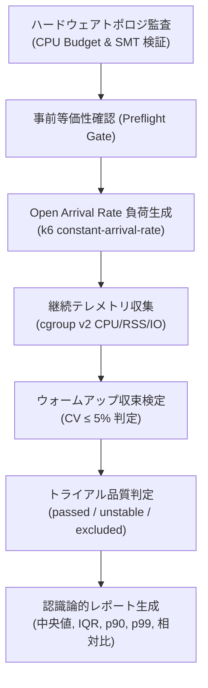

# Rigorous Benchmarking: Why and What Concept Document

## 1. 経緯と背景 (Why)

### 1.1 起源: ソフトウェア性能測定における「嘘と欺瞞」の排除
`example-rails-aot` のベンチマーク設計（Issue #11〜#21）において、私たちは以下の **「ナイーブな測定が引き起こす 5 つの致命的な誤謬」** を経験し、それを克服するための厳密な工学的手法を確立しました。

#### (1) Coordinated Omission（協調的脱落）の罠
- **問題**: 多くのベンチマークツール（`ab`, `wrk` のデフォルトモード等）は「固定接続数（VU）がレスポンスを受信してから次のリクエストを送る」クローズドループ型です。サーバーが一時停止（GC や DB ロック等）すると、クライアントも送信を停止するため、本来その期間に発生するはずだった遅延サンプリングが大量に脱落し、高パーセンタイル遅延（p99 等）が見かけ上極端に過小評価されます。
- **解決策**: k6 の `constant-arrival-rate` エグゼキューターを採用し、サーバーの応答速度とは完全に独立して外生的にリクエストを生成する **Open Arrival Rate** を標準化しました。

#### (2) ウォームアップ未収束と JIT 到達性能の混同
- **問題**: JRuby (HotSpot C2) などの高度な JIT ランタイムは、起動後数分間にわたりバイトコードの解釈実行からプロファイリング、C1/C2 最適化コンパイルが段階的に行われます。1 専有 vCPU の環境下では、リクエスト処理と JIT コンパイラスレッドが CPU を激しく奪い合い、45 秒の測定区間内でスループットが **+506%** も急激に変化しました。
- **解決策**: 測定開始前にウォームアップ区間を設け、スライディングウィンドウによる変動係数（$CV \le 5\%$）または IQR 収束検定を行い、定常状態（Steady State）に達したデータのみを比較対象としました。

#### (3) 仮想コア（vCPU）と物理トポロジの混同（SMT 干渉）
- **問題**: GitHub-hosted runner 等のクラウド環境では、4 vCPU と表記されていても実体は 2 物理コアの SMT（同時マルチスレッディング）です。アプリコンテナに 4 vCPU を割り当てると、負荷生成側（k6）に割り当てる CPU がゼロになり、クライアント側でリクエスト送信遅延（dropped / delayed iterations）が発生して測定が無効化します。
- **解決策**: アプリと負荷生成器の CPU 予算（CPU Budget）を厳格に分離し、専有コア比率とトポロジ制約を明記するガードロジックを実装しました。

#### (4) データベース並行特性の軽視（SQLite WAL の単一ライター制約）
- **問題**: SQLite WAL モードは複数リーダーの並行読み取りを許容しますが、書き込みは常に「単一ライター（Single Writer）」です。ナイーブに複数 VU からランダムに更新リクエストを叩くと、合成トランザクションロック競合（`busy_timeout`）が発生し、アプリ性能ではなく DB ロック待ち時間を測定することになります。
- **解決策**: VU ごとに更新対象レコードを重複なく分割（VU-partitioned targeting: `targetId = 1 + ((__VU * 31 + __ITER) % total)`）し、不要なロック競合を排除しました。

#### (5) 認知的バイアスと交絡因子の混同
- **問題**: 「Ruby-to-C トランスパイルによる高速化」と宣伝されるものが、実際には「Puma + Rack スタックから C 言語 epoll HTTP サーバーへの差し替え」や「ActiveRecord から SQLite ネイティブ C バインディングへの差し替え」というインフラスタック全体の差分であるケースが多々あります。
- **解決策**: 
  - **JIT 相互作用比 ($I$)** の導入: 
    $$I = \frac{G_{\text{emitted}}}{G_{\text{Rails}}} = \frac{1.332}{1.654} = 0.805$$
    Rails 単体の YJIT 向上率と、平坦化コードの YJIT 向上率を対比し、動的ディスパッチ除去コードに対する JIT の寄与度を数理的に分離。
  - **認識論的分類（Epistemic Classification）**: 実測事実（Observed Facts）、支持観測（Supporting Observations）、未検証仮説（Unverified Hypotheses）を厳密に分離してレポート。

---

## 2. コンセプトと提供価値 (What)

### 2.1 コンセプト: 「科学的・再現可能な性能工学」
`rigorous-benchmarking` は、宣伝文句や一握りの幸運な試行に頼る「マイクロベンチマーク」を排し、システム工学に基づいた **再現性・統計的有意性・環境分離** を担保するベンチマーク実行体系です。

### 2.2 4 つのコアメトリクス基準

1. **Throughput (Achieved RPS)**: クライアント側で遅延なく実際にサーバーへ到達・処理されたリクエスト数。
2. **True Latency (p50 / p90 / p99)**: Coordinated Omission のない外生タイマー基準の往復遅延。
3. **Footprint & Efficiency (Peak RSS / CPU Efficiency)**: cgroup v2 による正確な物理メモリ（RSS）と、1 RPS を生み出すのに消費された CPU ミリコア。
4. **Trial Validity**: クライアント側ドロップ率 $0.00\%$、HTTP エラー率 $0.00\%$、ウォームアップ収束をパスした試行のみを有効（`passed`）とする。
