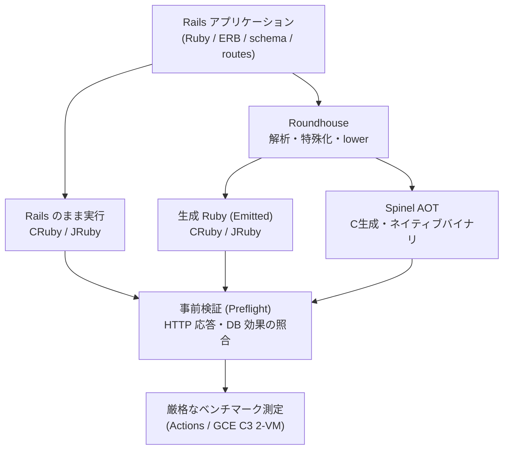

# Rails × Roundhouse × Spinel AOT

Rails アプリケーションを [Roundhouse](https://github.com/rubys/roundhouse) で特殊化（lowering）し、[Spinel](https://github.com/matz/spinel) でネイティブバイナリ（Ahead-of-Time: AOT コンパイル）へ変換・実行するまでを検証・評価する実験リポジトリです。

Rails（標準実行）、Roundhouse 変換後 Ruby（CRuby / JRuby）、および Spinel AOT（ネイティブ実行）における**応答の正確性・処理能力・メモリ効率・JIT 相互作用・運用資源境界**を多角的に実証しています。

---

## 総合検証レポート・公開資料

本リポジトリで実施されたすべての実験（小規模 Actions 測定、GCE C3 二台 VM 容量探索、同負荷同率比較、件数スケーリング・DB ページング対照、Spinel FD 上限検証）を統合した包括的な報告書を公開しています。

- 📄 **総合レポート**: [**Railsの特殊化とJIT/AOTへの影響の考察**](docs/roundhouse-rails-jit-aot-report.md)
- 📑 **図表付き PDF**: [**rails-specialization-jit-aot.pdf**](docs/rails-specialization-jit-aot.pdf)
- 📊 **作図・集計データ**: [`docs/data/rails-specialization-jit-aot/`](docs/data/rails-specialization-jit-aot/) / [`docs/assets/rails-specialization-jit-aot/`](docs/assets/rails-specialization-jit-aot/)
- 🏷️ **完全生データ・検証ログ**: [GitHub Releases 一覧](#実験系列とデータ来歴)

---

## 主要な検証結果と知見（サマリー）

「Rails のアプリ固有情報を事前に解決する『特殊化』は、実行時の仕事量、JIT の効果、AOT の適用可能性、メモリ使用量をどのように変えるか」という中心的な問いに対し、以下の知見が実証されました。

1. **少件数・DB ページング時の圧倒的な低レイテンシ（4〜7倍高速）**
   - 3〜20 件の少件数や DB LIMIT/OFFSET（`db-paged`）による取得において、Roundhouse による特殊化コード（emit）は Rails に比べてレイテンシが約 4〜7 倍短縮（DB20件取得で emit YJIT p50 1.14 ms vs Rails YJIT 4.95 ms）。
   - Spinel AOT は少件数 closed-loop で 4,500+ RPS（p50 0.88 ms）の高い観測処理量を達成。
2. **大件数（1,000件全取得）での性能逆転と機序解明（二重ループ走査）**
   - 1,000 件全件取得（`app-sliced`）では、emit コードが Rails より低速化する逆転を観測（JIT Off で emit 21.87 RPS vs Rails 56.24 RPS）。
   - 実測生成コードの `ArticlesController#index` 内に、親 N 件 × 子 M 件の関連付け走査（1,000×1,000 = 100万回比較）が存在することを確認。
   - DB LIMIT で取得を 20 件に絞ると優位が完全に回復し、逆転の原因がアルゴリズムの仕事量にあることを実証。
3. **同負荷（10 RPS）におけるメモリ削減（約 61% 削減）とテールレイテンシの安定性**
   - GCE C3 上の 10 RPS 開放型到着測定において、`emit-cruby-yjit` のコンテナメモリは 179.8 MiB となり、`rails-cruby-yjit`（458.8 MiB）の **約 39%（60.8% 削減）** に抑制。JRuby でも約 25% 削減。
   - テールレイテンシも極めてフラット（p50 19.10 ms に対し p99 21.65 ms、Rails は GC 等により p99 63.37 ms）。
4. **YJIT との強い相乗効果（4.71倍の JIT 加速）**
   - emit コードは動的ディスパッチを排除した平坦な構造のため、YJIT の型推論・インラインキャッシュが最大限に機能。
   - JIT 倍率（YJIT On / Off）は Rails の 1.72 倍に対し、emit コードは **4.71倍**（21.87 → 103.11 RPS）へと加速し Rails を逆転。
5. **JRuby におけるウォームアップ収束速度の優位**
   - `emit-jruby` は全反復で平均 270〜294 秒（約 4.5 分）で迅速かつ安定にウォームアップ収束。
   - 一方 `rails-jruby` は巨大なクラスロードと動的メタプログラミングにより平均 769 秒（約 13 分）を要し、900 秒制限によるタイムアウト除外も発生。
6. **Spinel AOT の成果と運用資源（FD・接続数）の境界**
   - Spinel は少接続（pool 10）下では 25 RPS においても p99 28 ms、エラー 0 件、メモリ 88 MiB で極めて安定。
   - 多接続（pool 512）かつ default soft nofile（1,024）では `dup(2) failed for fd 1023` によるタイムアウトが発生。nofile を 8,192 に引き上げるとエラー 0 件で完全合格。
   - AOT 本体の処理能力ではなく、HTTP ランタイムの FD 管理・keep-alive 接続保持・例外時ソケット解放が運用条件となることを実証。

---

## 測定アーキテクチャと対象構成



### 比較対象の 9 構成

正本アプリは **Rails 8.0.5.1**（正常系比較のため CSRF 検証を無効化）です。

| 実行系 | ターゲット ID | JIT 設定 | Roundhouse 特殊化 | 特徴・役割 |
| --- | --- | :---: | :---: | --- |
| **CRuby / Rails** | `rails-cruby-off` | JIT Off | なし | 標準的な CRuby インタプリタ実行ベースライン |
| **CRuby / Rails** | `rails-cruby-yjit` | YJIT On | なし | 標準 Rails に対する YJIT 有効化の効果 |
| **CRuby / 変換後 Ruby** | `emit-cruby-off` | JIT Off | **あり** | 特殊化コードのインタプリタ実行（アルゴリズム感度検証） |
| **CRuby / 変換後 Ruby** | `emit-cruby-yjit` | YJIT On | **あり** | 特殊化コード × YJIT（低メモリ・高 JIT 加速） |
| **JRuby / Rails** | `rails-jruby-off` | JRuby JIT Off | なし | 補助診断用（JVM HotSpot は動作） |
| **JRuby / Rails** | `rails-jruby` | JRuby JIT On | なし | JVM 上での標準 Rails（Tiered Compilers） |
| **JRuby / 変換後 Ruby** | `emit-jruby-off` | JRuby JIT Off | **あり** | 補助診断用 |
| **JRuby / 変換後 Ruby** | `emit-jruby` | JRuby JIT On | **あり** | JVM 上での特殊化コード（迅速なウォームアップ収束） |
| **Spinel AOT** | `spinel` | 対象外 (AOT) | **あり** | C 経由ネイティブバイナリ、Ruby ランタイム不要 |

---

## 実験系列とデータ来歴

すべての測定結果は、GitHub Actions の実行ログおよび専用 GCE インスタンスによる GitHub Releases に生データと完全な SHA-256 チェックサム付きでアーカイブされています。

| 系列 | 実施時期 | 実行環境 | 主な条件・目的 | 実施ログ / Release |
| :---: | :---: | :---: | --- | --- |
| **A** | 2026-09-28 | Actions | 3件 fixture, closed loop (10s), CRuby / Spinel 予備測定 | [Run 36380159185](https://github.com/koduki/example-rails-aot/actions/runs/36380159185) |
| **B** | 2026-09-28 | Actions | 3件 fixture, closed loop (30s), JRuby JIT 3反復収束 | [Run 36362615236](https://github.com/koduki/example-rails-aot/actions/runs/36362615236) |
| **C** | 2026-09-30 / 10-01 | GCE C3 × 2 | 1,000件全取得, open arrival 容量探索 (二分探索) | [Release C1](https://github.com/koduki/example-rails-aot/releases/tag/gce-c3-capacity-20260930) / [Release C2](https://github.com/koduki/example-rails-aot/releases/tag/gce-c3-retest-20261001-c3-retest-20261001T061200Z) |
| **D** | 2026-10-02 | GCE C3 × 2 | 共通 10 RPS 同負荷比較, CRuby 2×2, JRuby 収束, Spinel 接続分離 (計66試行) | [Release D](https://github.com/koduki/example-rails-aot/releases/tag/gce-c3-followup-20261002-c3-followup-20261001T225541Z) |
| **E** | 2026-10-03 | GCE C3 × 2 | 件数スケーリング (3/20/1,000件), DB ページング対照, Spinel FD 上限対照 (計72試行) | [Release E](https://github.com/koduki/example-rails-aot/releases/tag/gce-c3-mechanism-20261003-c3-mechanism-20261003T001500Z) |

---

## 正確性の検証方針（Correctness Gate）

ベンチマーク測定前に、全構成で HTTP 応答および SQLite データベースの更新結果を Rails 基準と照合します。

1. **事前検証ゲート (`preflight`)**:
   `preflight/preflight.json` において対象エンドポイントが `eligible_endpoints` に含まれることを確認します。HTML/JSON のステータスコード、レスポンス構造、DB 反映が一致しない構成は測定対象から除外されます。
2. **正常系 CRUD 検証**:
   `read/update`（[`crud.yml`](bench/profiles/crud.yml)）および `create/delete`（[`crud-create-delete.yml`](bench/profiles/crud-create-delete.yml)）の各シナリオで、HTTP 成功と SQLite の永続化状態を照合します。
3. **試行判定の厳格性**:
   `trials/per-run.json` で `passed` と判定された試行のみを性能比較に採用します。未収束（`unstable`）、除外（`excluded`）、失敗（`failed`）を成功に混ぜて数値を算出することはありません。

---

## 人間による再現実験

### 1. AOT アプリを起動する（Docker）

Docker のマルチステージビルドにより、Roundhouse と Spinel の固定版ツールチェーンを用いて Ruby ランタイムを含まない軽量ネイティブコンテナを作成・実行できます。

```bash
git clone https://github.com/koduki/example-rails-aot.git
cd example-rails-aot

# AOT コンテナのビルド
docker build -t example-rails-aot:local .

# データ永続化ボリュームを作成して起動
docker volume create example_rails_aot_data
docker run -d --name example-rails-aot-demo -p 3000:3000 \
  -v example_rails_aot_data:/app/storage example-rails-aot:local

# 疎通確認
curl http://127.0.0.1:3000/articles
```

コンテナの永続化テストは `bash scripts/aot/test-container.sh` で実行できます。

### 2. ローカルでの差分比較検証（Rails vs AOT）

ホスト環境に Ruby 3.4.5、Bundler、Node.js、ビルドツールチェーンがインストールされている場合、Rails と AOT の直接比較を実行できます。

```bash
bash scripts/aot/test-rails.sh
bash scripts/aot/install-toolchain.sh
bash scripts/aot/build.sh
bash scripts/aot/smoke-native.sh
bash scripts/aot/run-comparison.sh
```

差分レポートは `reports/differential/` に出力されます。使用ツールの固定バージョンは [`config/aot-toolchain.env`](config/aot-toolchain.env) を参照してください。

### 3. ベンチマークスイートの実行

ベンチマークランナー（Python 3.11+）を使用してローカル測定やプロファイル実行が可能です。アプリと負荷生成器に**異なる物理コア**を割り当てて実行します。

```bash
# ユニットテスト
python3 -m unittest discover -s tests/bench -q

# CPU 割り当て例 (環境に合わせて調整)
APP_CPUS=0
LOAD_CPUS=2,3

# ビルド・事前検証・測定実行
python3 scripts/bench/run.py build --profile bench/profiles/smoke.yml \
  --app-cpus "$APP_CPUS" --load-cpus "$LOAD_CPUS" --output bench-results/build-local-01

python3 scripts/bench/run.py preflight --profile bench/profiles/smoke.yml \
  --app-cpus "$APP_CPUS" --load-cpus "$LOAD_CPUS" --output bench-results/preflight-local-01

python3 scripts/bench/run.py run --profile bench/profiles/smoke.yml \
  --app-cpus "$APP_CPUS" --load-cpus "$LOAD_CPUS" \
  --preflight-file bench-results/preflight-local-01/preflight/preflight.json \
  --output bench-results/measurement-local-01

python3 scripts/bench/run.py report --output bench-results/measurement-local-01
```

正常系 CRUD の機能検証は以下で実行できます：

```bash
# 読み取り・更新の照合
python3 scripts/bench/run.py run --profile bench/profiles/crud.yml \
  --app-cpus "$APP_CPUS" --load-cpus "$LOAD_CPUS" \
  --preflight-file bench-results/preflight-local-01/preflight/preflight.json \
  --output bench-results/crud-local-01

# 作成・削除の照合
python3 scripts/bench/run.py run --profile bench/profiles/crud-create-delete.yml \
  --app-cpus "$APP_CPUS" --load-cpus "$LOAD_CPUS" \
  --preflight-file bench-results/preflight-local-01/preflight/preflight.json \
  --output bench-results/create-delete-local-01
```

より大規模な 2-VM（GCE）環境での実行手順や測定プロトコルについては、[`docs/benchmark.md`](docs/benchmark.md) および [`.agents/skills/gce-benchmark-runbook/`](.agents/skills/gce-benchmark-runbook/SKILL.md) を参照してください。

---

## ドキュメント体系

- [**Railsの特殊化とJIT/AOTへの影響の考察（総合レポート）**](docs/roundhouse-rails-jit-aot-report.md) / [PDF版](docs/rails-specialization-jit-aot.pdf)
- [GCE C3 ベンチマークレポート（容量測定）](docs/gce-c3-benchmark-report.md)
- [GCE C3 追加再試験 分析レポート（系列 D）](docs/gce-c3-followup-analysis-20261002.md)
- [GCE C3 メカニズム試験指示書（系列 E）](docs/gce-c3-mechanism-test-instructions-20261003.md)
- [GCE C3 1,000記事再テスト分析（系列 C2）](docs/gce-c3-retest-analysis-20261001.md)
- [ベンチマーク仕様・CRUD 検証手順](docs/benchmark.md)
- [来歴・アーキテクチャ詳細](docs/provenance.md)

---

## ライセンス

本リポジトリの独自コードおよび文書は [Apache License 2.0](LICENSE) の下で公開されています。
同梱の Roundhouse 由来スクリプト（[`scripts/vendor/create-blog`](scripts/vendor/create-blog)）は [MIT License](scripts/vendor/LICENSE-MIT) です。Roundhouse、Spinel、Rails および各依存パッケージのライセンスは各々の定めに従います。
