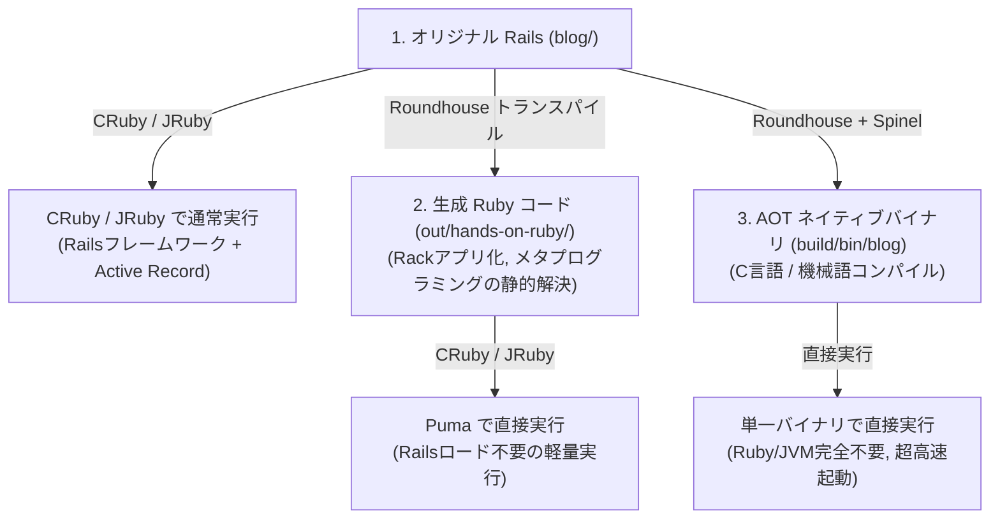

# Rails × Roundhouse × Spinel ハンズオン手順書

本手順書は、ベンチマークや性能測定を目的としたものではなく、**開発者が手作業でコマンドを実行し、CRuby、JRuby、Roundhouse、Spinel の各ツールが「何を入力とし、何を生成し、どのように動くのか」を直感的に理解・学習するためのテストガイド**です。

---

## 0. DevContainer の準備と起動

単一コンテナ内に以下のすべてのツールが導入されています。

| ツール | バージョン | コマンド / パス | 備考 |
| :--- | :--- | :--- | :--- |
| **CRuby** | 3.4.5 (Bookworm) | `ruby`, `bundle`, `gem` | デフォルトの Ruby 環境 |
| **OpenJDK** | 21.0.12.1 (Temurin) | `java`, `javac` | JRuby 実行用 JVM |
| **JRuby** | 10.0.7.0 (Ruby 3.4互換) | `jruby`, `jbundle`, `jgem` | 独立した Gem 環境 (`/opt/jruby-bundle`) |
| **Roundhouse** | v2026.9.18 | `roundhouse` | Rails トランスパイラ |
| **Spinel** | 2026.09.12 | `spin`, `spinel` | AOT ネイティブコンパイラ |
| **ネイティブツール** | Clang, SQLite3, Node.js | `clang`, `sqlite3`, `node` | ビルドおよびアセット用 |

### コンテナの起動方法

#### 選択肢 A: VS Code から起動する場合
VS Code で本リポジトリを開き、左下の緑のアイコンまたはコマンドパレットから **「Dev Containers: Reopen in Container」** を選択します。

#### 選択肢 B: ターミナル（PowerShell）から手動起動する場合
ホストの PowerShell で以下を実行します。gem や作業ファイルの永続化用にボリュームをマウントします。

```powershell
# 1. DevContainer イメージのビルド
docker build -f .devcontainer/Dockerfile -t rails-aot-devcontainer:local .

# 2. コンテナの対話シェルを起動（ポート 3000, 3001, 3002 を開放）
docker run -it --rm `
  -p 3000:3000 -p 3001:3001 -p 3002:3002 `
  -v cruby_gems:/usr/local/bundle `
  -v jruby_gems:/opt/jruby-bundle `
  -v "${PWD}:/workspace" `
  -w /workspace `
  rails-aot-devcontainer:local bash
```

> **これ以降の手順は、すべてコンテナ内のシェル（`/workspace`）で実行します。**

---

## 1. ツールのバージョン確認

コンテナに入ったら、まず全ツールが揃っているか確認します。

```bash
ruby -v
jruby -v
java -version
roundhouse --version
spin
```

- `ruby` は CRuby 3.4.5、`jruby` は JRuby 10.0.7.0 を指していること
- `bundle` は CRuby 用、`jbundle` は JRuby 用にそれぞれ分離されていること

---

## 2. CRuby でオリジナルの Rails 8 を手動実行

まずは基準となる「通常の Rails アプリケーション」の動作を確認します。

```bash
# blog ディレクトリに移動
cd /workspace/blog

# 依存 Gem のインストール
bundle install

# SQLite データベースの作成とマイグレーション、シード投入（3件の記事）
bin/rails db:prepare

# Rails サーバーをポート 3000 で起動
bin/rails server -b 0.0.0.0 -p 3000
```

### 動作確認
別ターミナルまたはホストのブラウザからアクセスします。
- ブラウザ: `http://localhost:3000/articles`
- curl: `curl http://127.0.0.1:3000/articles`

確認できたら `Ctrl + C` でサーバーを停止します。

---

## 3. JRuby でオリジナルの Rails 8 を手動実行

JRuby では、C 拡張（SQLite3 gem 等）の代わりに Java 拡張（JDBC アダプタ）が必要です。  
正本を汚さずに JRuby 互換設定のコピーを作るヘルパー `prepare_app.py` を使って起動します。

```bash
cd /workspace

# JRuby 互換の作業ディレクトリ out/jruby-app を作成
python3 scripts/bench/prepare_app.py out/jruby-app

cd /workspace/out/jruby-app

# JRuby 用 Bundler (jbundle) で Gem をインストール
jbundle install

# JRuby 上で Rails サーバーをポート 3001 で起動
jruby -S bin/rails server -b 0.0.0.0 -p 3001
```

### 動作確認
- ブラウザ: `http://localhost:3001/articles`
- curl: `curl http://127.0.0.1:3001/articles`

確認できたら `Ctrl + C` で停止します。

---

## 4. Roundhouse による静的解析とトランスパイル

Roundhouse が Rails アプリをどのように解析し、コードを変換するのかを観察します。

### 4.1 静的解析（Check）
```bash
cd /workspace
roundhouse check blog
```
`roundhouse-check: blog — 0 parse error(s), 0 error(s)...` と表示され、Rails アプリの構文がトランスパイル可能であることが確認できます。

### 4.2 静的アセットのビルド
```bash
bash scripts/aot/prepare-assets.sh
```
Tailwind CSS のコンパイルや Turbo/Stimulus JS が `.cache/static-assets` に集約されます。

### 4.3 Ruby ターゲットへのトランスパイル
```bash
roundhouse --target ruby -o out/hands-on-ruby blog
```

### 4.4 生成されたコードを観察する（重要！）
`out/hands-on-ruby/` の中身を覗いてみます。
```bash
ls -l out/hands-on-ruby/
cat out/hands-on-ruby/config.ru
ls -l out/hands-on-ruby/runtime/
```
- **Rails フレームワークの排除**: `config/application.rb` や `config/environment.rb` はなく、純粋な `config.ru`（Rack アプリケーション）が生成されています。
- **軽量な構造**: コントローラやルーティングが静的に展開された Ruby クラスにトランスパイルされています。
- **静的 SQL**: `out/hands-on-ruby/db/seed.sql` にスキーマとシードデータが出力されています。

---

## 5. Roundhouse 変換後 Ruby を CRuby で手動実行

Roundhouse が生成したコードを Puma で直接動かします。**Rails フレームワークを起動しないため、非常に高速・省メモリで立ち上がります。**

```bash
cd /workspace/out/hands-on-ruby

# 依存 Gem（Rack, Puma, SQLite3 の最小限構成）をインストール
bundle install

# データベースを seed.sql から初期化
mkdir -p storage
sqlite3 storage/development.sqlite3 < db/seed.sql

# 静的アセットを配置
mkdir -p static/assets
cp -a /workspace/.cache/static-assets/. static/assets/

# Puma で Rack アプリケーションを起動（ポート 3000）
bundle exec puma -p 3000 config.ru
```

### 動作確認
- ブラウザ: `http://localhost:3000/articles`
- curl: `curl http://127.0.0.1:3000/articles`

Rails を使わずに起動したにもかかわらず、**オリジナルの Rails と全く同一の HTML / レスポンス** が返ってくることを体感できます。  
確認後、`Ctrl + C` で停止します。

---

## 6. Roundhouse 変換後 Ruby を JRuby で手動実行

同じトランスパイル済みコードを JRuby 向けに出力して動かします。

```bash
cd /workspace
roundhouse --target jruby -o out/hands-on-jruby blog

cd /workspace/out/hands-on-jruby
jbundle install

mkdir -p storage
sqlite3 storage/development.sqlite3 < db/seed.sql
mkdir -p static/assets
cp -a /workspace/.cache/static-assets/. static/assets/

# JRuby 上で Puma を起動（ポート 3001）
jruby -S bundle exec puma -p 3001 config.ru
```

### 動作確認
- ブラウザ: `http://localhost:3001/articles`

確認後、`Ctrl + C` で停止します。

---

## 7. Spinel でネイティブ AOT バイナリをビルド＆実行

最後に、**Ruby や JVM を一切介さず、単一の実行可能バイナリ（ELF）を生成して実行**します。

### 7.1 Spinel 向けトランスパイル
```bash
cd /workspace
roundhouse --target spinel -o out/hands-on-spinel blog
```
`out/hands-on-spinel` の中に `spin.toml` や C/Spinel ソースコードが出力されます。

### 7.2 ネイティブコンパイル
```bash
cd /workspace/out/hands-on-spinel
CC=clang spin build
```
コンパイルが完了すると、`build/bin/blog` が生成されます。

### 7.3 ネイティブバイナリの検査
```bash
file build/bin/blog
```
> 出力例: `build/bin/blog: ELF 64-bit LSB pie executable, x86-64 ...`

```bash
ldd build/bin/blog
```
> 出力例: `libc`, `libsqlite3`, `libjemalloc`, `libm` のみがリンクされており、**Ruby や JVM のライブラリが一切含まれていない** ことが分かります。

### 7.4 ネイティブバイナリの直接起動
```bash
# データベースとアセットの準備
mkdir -p storage
sqlite3 storage/development.sqlite3 < db/seed.sql
mkdir -p static/assets
cp -a /workspace/.cache/static-assets/. static/assets/

# 単一バイナリを実行（ポート 3000）
PORT=3000 ./build/bin/blog
```

### 動作確認
- ブラウザ: `http://localhost:3000/articles`
- curl: `curl http://127.0.0.1:3000/articles`

ミリ秒未満で即座に起動し、Rails と同じブログ画面が表示されます。  
確認後、`Ctrl + C` で停止します。

---

## まとめ：各ステップで何が起きていたか


