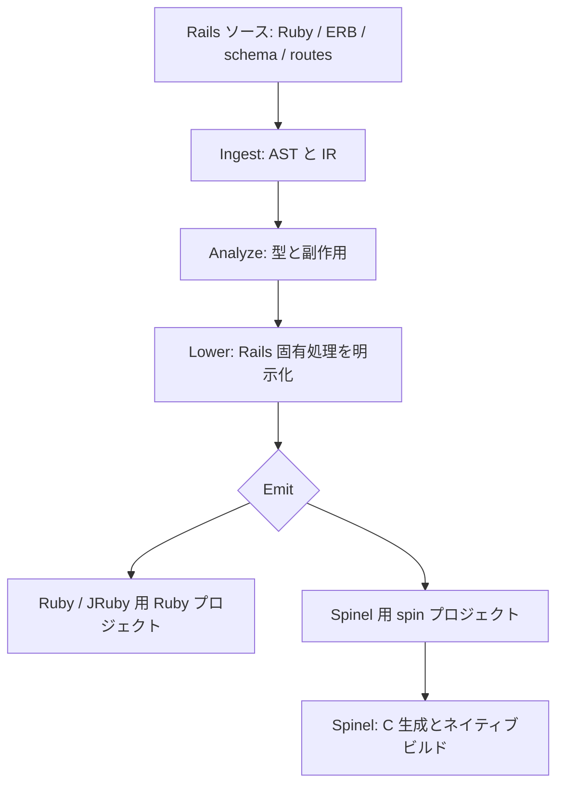

# Source and toolchain provenance

## Selection

Issues #1–#4 are implemented together. The Rails baseline and fixed tools are prerequisites; strict transpilation and native startup expose the highest compatibility risk early.

| Issue | Importance | Difficulty | Order |
|---|---|---|---|
| #1 Rails baseline | High: reference behavior for every later comparison | Medium | First |
| #2 Toolchain | High: all generation and build results must be repeatable | Medium | Alongside #1 |
| #3 Transpilation | High: determines whether this Rails source is supported | High | After #1/#2 |
| #4 Native binary | High: proves the AOT path actually runs | High | After #3 |

## Generated application

The initial `blog/` was generated on GitHub Actions from Rails 8.1.3.1 using Ruby 3.4.5 and Bundler 2.6.9. That is historical provenance for early runs, not the current app version. The generator is the unchanged `scripts/create-blog` from Roundhouse v2026.9.18 (Git blob `3c89d6dc94340bbbb3a31d7957803c3c704fcf34`), vendored with its MIT license.

The canonical checked-in fixture now pins **Rails 8.0.5.1**, matching the benchmark adapter's JRuby-compatible Rails line. Its Gemfile, lockfile, application defaults, schema, and migrations are kept together. The fixture disables CSRF verification for both AOT and benchmark paths; this explicitly narrows the security behavior under test. `scripts/bench/prepare_app.py` no longer rewrites Rails 8.1 syntax, but still derives an isolated app with JRuby dependencies and measurement settings. The wrapper removes newly generated credentials and pins the Rails dependency. Ordinary CI runs do not regenerate application source. New source hashes require a fresh preflight; historical benchmark artifacts remain tied to their original commits.

## Native tools

Roundhouse v2026.9.18 and Spinel 2026.09.12 are the pairing documented in [Roundhouse RELEASES.md](https://github.com/rubys/roundhouse/blob/v2026.9.18/RELEASES.md). Release archives are checked against the SHA-256 values in `config/aot-toolchain.env`. This pins the native tools; OS packages are resolved from Ubuntu 24.04 repositories, so the build is reproducible at the source/version level, not promised byte-for-byte.

## Assets

The checked-in Rails bundle builds Tailwind CSS and provides Turbo/Stimulus. `scripts/aot/prepare-assets.sh` stages those files and application JavaScript. Roundhouse's documented `ROUNDHOUSE_ASSETS_DIR` hook includes them in the emitted project. No generated Ruby is patched by hand.

## Validation

The initial bootstrap [Actions run](https://github.com/koduki/example-rails-aot/actions/runs/35874563878) passed:

- Rails: 21 tests, 54 assertions, zero failures/errors/skips.
- Strict Roundhouse analysis and emission, followed by `spin build`.
- Native HTTP index, invalid input (422), article creation/redirect, detail read, and SQLite persistence after restart.
- The same runtime package in an Ubuntu 24.04 container without Ruby or Spinel.

That initial run preceded committed-source and asset packaging changes. The latest PR check is the authority for the current tree. Diagnostics and runtime artifacts are attached to each run.

Roundhouse's analyzer reports 0 parse errors, 0 errors, 0 warnings and 0 survey gaps. The separate lowering/emission stage reports four `lower_residue` warnings:

| Source | Diagnostic and impact |
|---|---|
| `articles_controller.rb:32,45` | The inline `render json: @article.errors` arm is dropped because the encoder is unavailable. The diagnostic says JSON negotiation for create/update falls back to HTML. These JSON paths are not claimed equivalent. |
| `application_mailer.rb:2,3` | `default` and `layout` are not modeled. The generated base mailer has no mail actions and is unused by the blog workflows. Mail behavior is not validated. |

The code is emitted in strict mode without survey/stub flags; strict success is not proof of full semantic equivalence. Preserve these warnings and cover the JSON cases explicitly in #5/#6 before declaring parity. No application feature has been deleted to hide these warnings.

Spinel also reports two upstream RBS boxed-array warnings (`Attached.@variations`, `UserAgent.@tokens`). They do not prevent this build or the exercised operations; warnings remain in the build log. They are not evidence that all framework paths are validated. Rails/AOT differential testing, Cable behavior and runtime-image distribution remain in #5–#9.

## Appendix: Roundhouse architecture (v2026.9.18)

この Appendix は本リポジトリで固定した [Roundhouse v2026.9.18](https://github.com/rubys/roundhouse/tree/v2026.9.18) を対象にする。上流の [analyze](https://github.com/rubys/roundhouse/blob/v2026.9.18/docs/pipeline/analyze.md)、[lower](https://github.com/rubys/roundhouse/blob/v2026.9.18/docs/pipeline/lower.md)、[emit](https://github.com/rubys/roundhouse/blob/v2026.9.18/docs/pipeline/emit.md)、[runtime](https://github.com/rubys/roundhouse/blob/v2026.9.18/docs/pipeline/runtime.md) と [Spinel 手順](https://github.com/rubys/roundhouse/blob/v2026.9.18/docs/guide/spinel.md) をもとに、今回の比較に関わる部分を整理したもの。上流の新しい main ブランチの構成や性能値を、この固定版の測定結果と混同しない。

| 段階 | このアプリで扱うもの | 意味 |
| --- | --- | --- |
| Ingest | Ruby、ERB、schema、routes、seeds | Rails のソースを、後続の解析が扱える IR に取り込む。ここで元アプリを起動する必要はない。 |
| Analyze | カラム型、関連、コントローラから view への値、DB 読み書きなど | Rails の規約を手掛かりに式の型と副作用を推論する。メソッドの戻り値と引数について全体の情報を反復して収束させる。解析診断は生成可能範囲を知るための信号となる。 |
| Lower | validation、association、query、route、controller action、view | Rails 固有の DSL や暗黙の処理を明示的なクラス・関数・処理本体に変換する。例えば `before_action` の対象処理を action に展開し、route を dispatch の形にする。各ターゲットで同じ Rails DSL を解釈し直さない設計。 |
| Emit | 共通化された IR とターゲット用ランタイム | `ruby`、`jruby`、`spinel` を指定して、それぞれ独立したプロジェクトを生成する。対象の言語処理系と実行環境の差を引き受ける。 |

生成物には、Roundhouse が Ruby で定義した Active Record・Action Controller・Action View 相当の**共通フレームワークランタイム**と、DB 接続・HTTP・WebSocket などを担う**ターゲット別の手書きランタイム**が組み合わされる。これは元の Rails gem をリクエストごとにそのまま動かす構成とは異なる。Ruby/JRuby ターゲットは変換後の Ruby プロジェクトをそれぞれの処理系で実行する。Spinel ターゲットは同系統の Ruby 形状を `spin.toml` 付きのプロジェクトとして出力し、別ツールである Spinel の `spin build` が C を経由してネイティブ実行ファイルを作る。Spinel 側の HTTP・DB 実装差も結果に含まれる。[上流のランタイム説明](https://github.com/rubys/roundhouse/blob/v2026.9.18/docs/pipeline/runtime.md)と[Spinel 出力説明](https://github.com/rubys/roundhouse/blob/v2026.9.18/docs/guide/spinel.md)を参照。

本リポジトリでは [`scripts/transpile.sh`](../scripts/transpile.sh) が `roundhouse check --continue` を記録してから、survey/stub なしでターゲット別の出力を作る。`ruby` / `jruby` / `spinel` の出力には静的アセットを付け、ベンチマークでは [`scripts/bench/emit.py`](../scripts/bench/emit.py) が SQLite pragma、隠しフィールド、計測対象外の runtime probe に対する差分を明示的に記録する。Spinel のバイナリ化は [`scripts/build.sh`](../scripts/build.sh) で行う。解析の成功だけで全経路の同等性は証明できない。現行の `lower_residue` 警告と書き込み時の差はこの文書と [検証レポート](roundhouse-rails-jit-aot-report.md) に記録し、HTTP/DB の preflight を別途適用する。

Roundhouse 上流は性能改善の機序を「リクエストごとに変わらない Rails の判断を変換時に済ませ、動的な処理のみを残す」と説明している（[上流 README](https://github.com/rubys/roundhouse/blob/v2026.9.18/README.md)）。本リポジトリの予備測定だけでは、その内部要因や JIT への寄与を独立に特定できない。CRuby/JRuby の同一処理系内での Rails 対変換後コード比較と、Spinel の**実行スタック全体**の比較を分けて解釈する。
