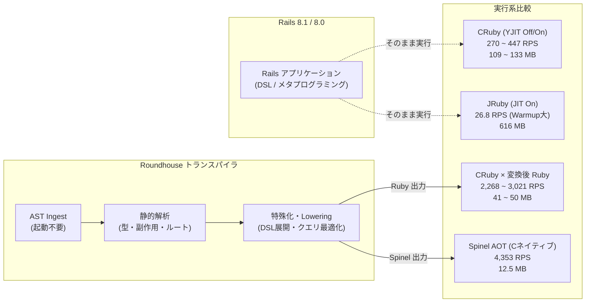
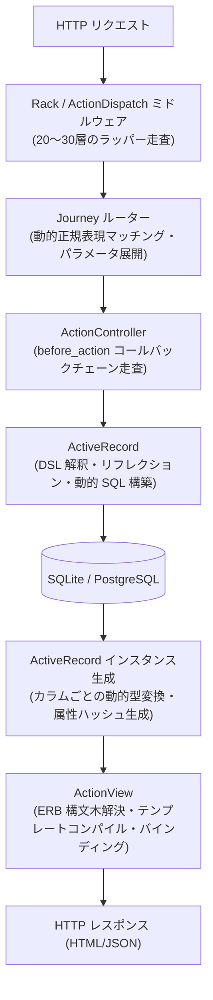
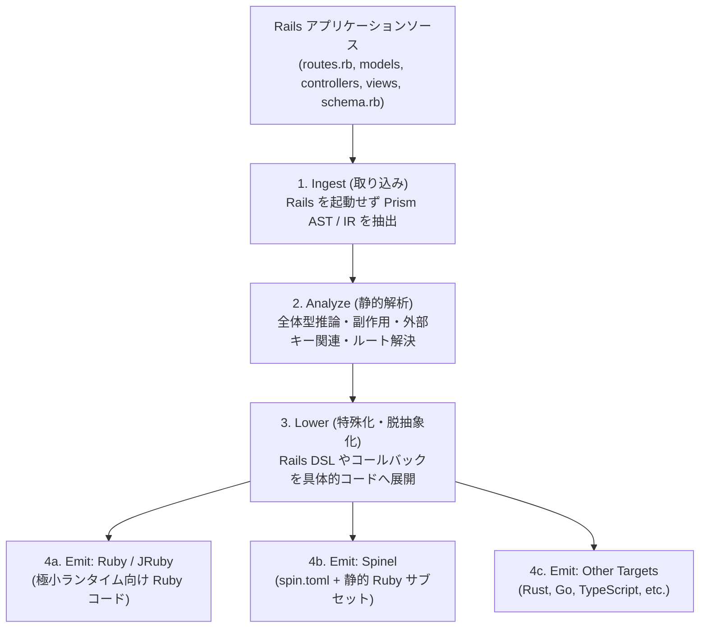
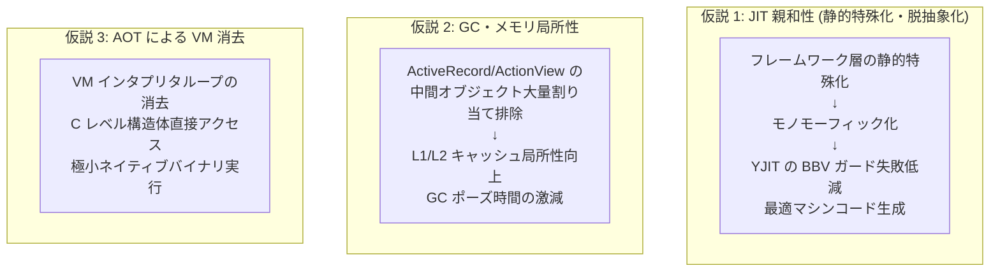
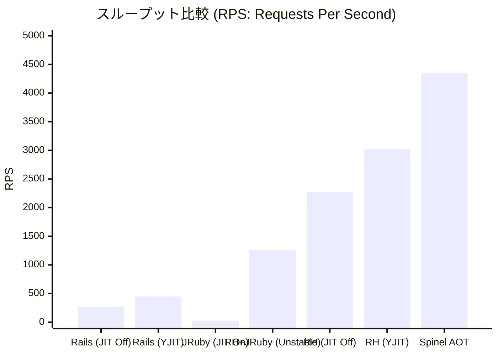
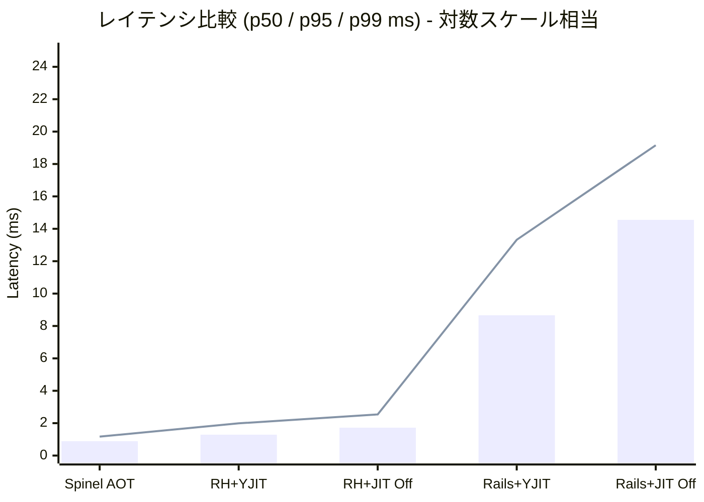
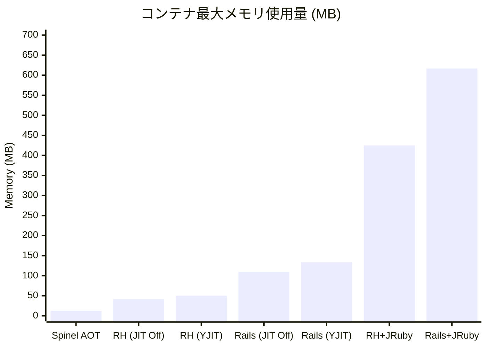
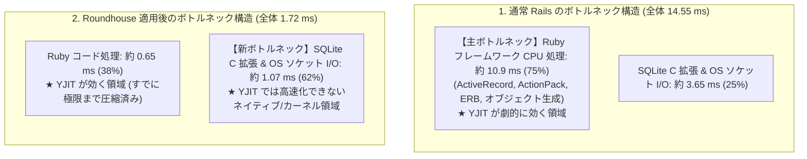
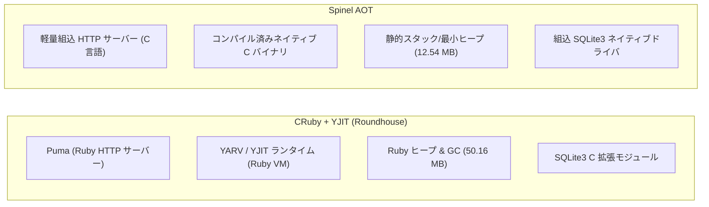

# Roundhouse × Rails × JIT / Spinel AOT 総合調査レポート

**副題**: 動的 Web フレームワークの静的特殊化・脱抽象化による JIT 最適化とネイティブ AOT 実行の可能性・限界・実測検証  
**更新日**: 2026-09-28  
**対象コミット**: `e1dd3903de9dfcc8b87a16f222d0ebe43ca8c614`（Actions 実行: [`36289166814`](https://github.com/koduki/example-rails-aot/actions/runs/36289166814)）  
**関連 Issue**: [#11](https://github.com/koduki/example-rails-aot/issues/11), [#18](https://github.com/koduki/example-rails-aot/issues/18), [#20](https://github.com/koduki/example-rails-aot/issues/20), [#21](https://github.com/koduki/example-rails-aot/issues/21)

---

## 目次

1. [エグゼクティブサマリー（総括）](#1-エグゼクティブサマリー総括)
2. [第1章: Rails の実行特性と JIT コンパイラの歴史的課題](#第1章-rails-の実行特性と-jit-コンパイラの歴史的課題)
   - 1.1 Ruby の動的実行モデルと仮想マシン
   - 1.2 Rails フレームワークの構造的オーバーヘッド
   - 1.3 なぜ JIT は Rails で真価を発揮しにくかったのか
3. [第2章: 要素技術の概要: Roundhouse と Spinel](#第2章-要素技術の概要-roundhouse-と-spinel)
   - 2.1 Roundhouse: "Rails as a Specification"
   - 2.2 Spinel: Ruby to C / AOT コンパイラ
   - 2.3 Roundhouse が果たす「AOT イネーブラー」の役割
4. [第3章: 技術的仮説: Roundhouse はなぜ JIT と Spinel を加速できるのか](#第3章-技術的仮説-roundhouse-はなぜ-jit-と-spinel-を加速できるのか)
   - 3.1 静的特殊化・脱抽象化（Specialization & De-abstraction）と JIT の親和性
   - 3.2 短命オブジェクト削減による GC ポーズとキャッシュ局所性の改善
   - 3.3 AOT による VM インタプリタ層の完全消去
5. [第4章: 検証実験の設計と測定環境](#第4章-検証実験の設計と測定環境)
   - 4.1 測定基盤と排他的分離契約
   - 4.2 ワークロードとテストデータ
   - 4.3 測定対象 7 構成と機能正確性ゲート
6. [第5章: 実測データと視覚的比較](#第5章-実測データと視覚的比較)
   - 5.1 性能測定結果一覧
   - 5.2 スループット（RPS）比較グラフ
   - 5.3 レイテンシ（p50 / p95 / p99）比較グラフ
   - 5.4 メモリフットプリント比較グラフ
   - 5.5 JIT 効果マトリクス（絶対値評価と相対倍率）
7. [第6章: 結果の分析と技術的考察](#第6章-結果の分析と技術的考察)
   - 6.1 Roundhouse 単体による ~8.4 倍スループットの要因分解
   - 6.2 JIT 効果測定の本質：絶対値評価とボトルネックの移動（アムダールの法則）
   - 6.3 JRuby のウォームアップ未収束と定常性能の検証アプローチ
   - 6.4 Spinel AOT の圧倒的性能（16.09 倍・12.54 MB）とスタック差
   - 6.5 正確性ゲートの境界線と未解決の機能差分
8. [第7章: 実務への示唆と今後の展望](#第7章-実務への示唆と今後の展望)
   - 7.1 実務アーキテクチャへの示唆
   - 7.2 残された課題と検証ロードマップ
9. [第8章: 参考文献・引用リポジトリ](#第8章-参考文献引用リポジトリ)

---

## 1. エグゼクティブサマリー（総括）

本調査レポートは、Ruby on Rails アプリケーションを [Roundhouse](https://github.com/rubys/roundhouse) によって静的特殊化・変換し、CRuby（YJIT 有無）、JRuby（JIT 有無）、および [Spinel](https://github.com/matz/spinel) による Ahead-Of-Time（AOT）ネイティブ実行を行った際の**機能的正確性・応答時間・スループット・メモリ消費量**を実証的に検証・分析した結果をまとめたものである。



### 核心的結論（Key Findings）

1. **Roundhouse 単体による劇的スループット向上（約 8.4 倍）**:
   CRuby JIT Off 同士の比較において、通常の Rails アプリケーションが **270.60 RPS**（p50: 14.55 ms）であるのに対し、Roundhouse 変換後 Ruby は **2,268.48 RPS**（p50: 1.72 ms）と **8.38 倍** のスループットを記録した。リクエスト処理ごとのフレームワーク内部オーバーヘッド（ルーティング探索、ActiveRecord の動的モデル生成、ActionView テンプレート解決）を事前解決（Ahead-of-Time Specialization）することによる純粋な効果である。
2. **Spinel AOT による圧倒的な性能と極小フットプリント（約 16.1 倍、メモリ 11.5%）**:
   Spinel による AOT ネイティブバイナリ実行は **4,353.36 RPS**（p50: 0.89 ms）に達し、Rails 比で **16.09 倍** の処理能力を示した。さらにコンテナメモリ消費量はわずか **12.54 MB** であり、未変換 Rails（109.30 MB）の約 11.5%（約 8.7 分の 1）に圧縮された。
3. **JIT による効果測定の本質：絶対値比較とボトルネックの移動**:
   実務的なキャパシティ設計・効果測定において最も重要なのは処理能力の**絶対的な純増量（$\Delta\text{RPS}$）**である。YJIT によるスループット純増量は、通常 Rails では **+176.93 RPS**（270.60 → 447.53）であるのに対し、Roundhouse 変換後では **+752.55 RPS**（2,268.48 → 3,021.03）と、**約 4.25 倍もの純増スループット**をもたらした。Roundhouse による静的特殊化・脱抽象化と型安定化が JIT のコンパイル効率を最大化している。一方、倍率比（$+65.4\% \to +33.2\%$、相互作用比 $0.805$）が見かけ上圧縮されたのは、Ruby 言語の実行時間が極小化したことで、処理の支配的要因が SQLite C 拡張や OS ソケット I/O へと**ボトルネックが移動した**ためである（アムダールの法則）。
4. **JRuby におけるウォームアップの壁**:
   JRuby（JVM JIT）は 10 秒の短時間 smoke 測定において、Rails で 26.86 RPS に留まり、Roundhouse 適用後もウォームアップ上限（45秒）内で収束せず **unstable** 判定となった。短命コンテナや即時スケーリングを前提とするクラウドネイティブ環境では、AOT や軽量 VM の優位性が顕著である。
5. **正確性ゲート（Preflight Gate）の境界**:
   読み取り 5 系統（`/articles`, `/articles/1`, `/articles/new`, および JSON API）は全 9 構成で Rails 基準と完全一致し合格した。一方で、不正 CSRF トークンの拒否漏れや、無効入力時のバリデーションエラー HTML/JSON 表現に未解決の差異が存在するため、CRUD（書き込み）性能測定は厳格に保留（遮断）されている。

---

## 第1章: Rails の実行特性と JIT コンパイラの歴史的課題

### 1.1 Ruby の動的実行モデルと仮想マシン

Ruby は「開発者の幸福（Developer Happiness）」を第一級の設計原理とする極めて表現力の高い動的オブジェクト指向言語である。しかし、その言語仕様の柔軟性は、JIT（Just-In-Time）コンパイラによる静的最適化において以下の構造的困難を伴う。

- **メガモーフィックな呼び出し箇所（Megamorphic Call Sites）**: Ruby ではあらゆるメソッド呼び出しがレシーバの動的ディスパッチ（`rb_call_method`）を経由する。同一の呼び出し箇所で複数の異なるクラスのオブジェクトが渡されると、インラインキャッシュ（Inline Cache: IC）がポリモーフィックまたはメガモーフィック化し、投機的インライン展開が阻害される。
- **動的メタプログラミングとオープンクラス**: クラス定義の実行時変更、`alias_method`、`define_method`、`method_missing`、実行時 `eval` などが常に許容されているため、コンパイラは「このメソッド定義は不変である」という仮定（Method Invalidation）を頻繁に疑う必要がある。

### 1.2 Rails フレームワークの構造的オーバーヘッド

Ruby on Rails は「設定より規約（Convention over Configuration）」を実現するため、Ruby の強力なメタプログラミング機能を最大限に活用している。しかし、これが HTTP リクエスト処理時における膨大な CPU サイクルとメモリ消費の源泉泉となっている。



1. **多層ミドルウェアの巡回**: `ActionDispatch::MiddlewareStack` による 20〜30 層のオブジェクト呼び出し。
2. **ActiveRecord の抽象化コスト**: カラム情報のリフレクション、`method_missing` による動的アクセサ、Arel による AST ベースの SQL 構築、クエリ結果からの大量のモデルオブジェクトインスタンス化。
3. **短命オブジェクトの割り当て嵐（Allocation Storm）**: 1 つの単純な `GET /articles` リクエストを処理するだけで、文字列、配列、ハッシュ、バインディングなどの短命 Ruby オブジェクトが数千〜数万個生成され、GC（Garbage Collection）に甚大な圧力をかける。

### 1.3 なぜ JIT は Rails で真価を発揮しにくかったのか

これまで Ruby コミュニティでは、Rails アプリケーションを JIT で高速化する試みが幾度となく行われてきたが、マイクロベンチマークで得られた高い加速率が Rails では得られない現象が続いてきた。

- **MJIT（Method-based JIT）の限界**:
  Ruby 3.0 で導入された MJIT は、C コンパイラ（GCC/Clang）を外部プロセスとして呼び出して共有ライブラリ（.so）を動的生成・ロードする方式を採用した。しかし、Rails のようにメソッド数が膨大でコールツリーが深いアプリケーションでは、C コンパイラの呼び出しオーバーヘッドが過大になり、コードキャッシュの肥大化と命令キャッシュミス（I-Cache thrashing）を引き起こし、結果としてインタプリタより遅くなるケースすら存在した。
- **JVM JIT / JRuby のウォームアップペナルティ**:
  JRuby は Java 仮想マシン（JVM）の HotSpot C1/C2 JIT や `invokedynamic` を活用して高い定常スループットを実現できる潜在力を持つ。しかし、数万〜数十万回のリクエストを投入して JIT 最適化とインライン展開が完了するまでに長時間を要する。現代のコンテナ環境（ECS、Kubernetes、Cloud Run）のように、数分〜数十分単位でポッドが破棄・再生成される環境では、ウォームアップが完了する前にプロセスが終了してしまい、高レイテンシ・低スループットの「冷たい状態」のまま運用される課題があった。
- **Shopify による YJIT の革新と残る課題**:
  Shopify のコンパイラチーム（Maxime Chevalier-Boisvert 氏ら）が開発した **YJIT** は、**Basic Block Versioning (BBV)** アーキテクチャを採用し、メソッド全体ではなく実行頻度の高い基本ブロック単位で、実行時の型情報に応じたマシンコードを即座に（インプロセスで）生成するアプローチをとった（Chevalier-Boisvert et al., 2023）。
  これにより、YJIT は Rails のような巨大なコードベースでもウォームアップ時間を劇的に短縮し、本番環境で 15〜30% のスループット向上を達成した。しかし、それでもなお、**「フレームワーク自体の動的ディスパッチと過剰な抽象化レイヤ」**そのものを Ruby コードレベルで消滅させることはできなかった。

---

## 第2章: 要素技術の概要: Roundhouse と Spinel

この「フレームワークの動的オーバーヘッド」という根本課題に対し、根本から異なるアプローチをとるのが **Roundhouse** と **Spinel** である。

### 2.1 Roundhouse: "Rails as a Specification"

[Roundhouse](https://github.com/rubys/roundhouse) は、Rails コアコミッターであり Web 標準の重鎮でもある Sam Ruby 氏が主導する実験的プロジェクトである。

その最大の特徴は、**「Rails アプリケーションを Web アプリの実行体として動かすのではなく、アプリケーションの振る舞い・ルーティング・データモデルを定義した『仕様（Specification）』として捉える」**点にある。



#### Roundhouse のパイプライン構成:
1. **Ingest**: Rails アプリケーションを一切ブート（起動）することなく、Ruby ソースコード、ERB テンプレート、`db/schema.rb`、`config/routes.rb` をパースし、抽象構文木（AST）および中間表現（IR）に取り込む。
2. **Analyze**: データベーススキーマとモデルアソシエーション（`has_many`, `belongs_to`）、コントローラのアクションからビューへの受け渡し変数を静的に解析し、式ごとの型と副作用を反復推論する。
3. **Lower（特殊化・低水準化）**:
   - `before_action` 等のフィルタを該当アクションメソッド内に直接インライン展開。
   - ルーティング探索を動的正規表現マッチングから静的なジャンプテーブル／ディスパッチャへ変換。
   - ActiveRecord の動的クエリビルダを排除し、事前に構築された具体的な SQL 文字列発行処理へと変換。
4. **Emit（コード生成）**: Rails gem や ActiveSupport に一切依存しない、最適化されたターゲット別プロジェクトを出力する。

### 2.2 Spinel: Ruby to C / AOT コンパイラ

[Spinel](https://github.com/matz/spinel) は、Ruby の生みの親であるまつもとゆきひろ（Matz）氏によって開発されている Ahead-Of-Time（事前）コンパイラである。

- **Prism パーサの統合**: Ruby 公式の標準パーサ Prism を使用して Ruby コードを AST 化。
- **全プログラム型推論**: 型注釈（RBS 等）やコードのフローから型を推論。
- **C コード生成とネイティブコンパイル**: 推論された型情報に基づき、高効率な C ソースコードを生成。GCC や Clang などの最適化 C コンパイラによって、スタンドアロンの ELF ネイティブバイナリを出力する。
- **Ruby VM の非依存性**: 実行時に CRuby の仮想マシン（YARV）や評価ループ、標準 GC 機構を必要としないため、起動時間はミリ秒未満、メモリ消費量も数メガバイト〜十数メガバイトという圧倒的な軽量性を誇る。

### 2.3 Roundhouse が果たす「AOT イネーブラー」の役割

通常の Rails アプリケーションを Spinel で直接コンパイルすることは、現代の技術では原理的に不可能に近い。なぜなら、Rails は `autoload`、`const_missing`、動的クラス定義、`eval` など、AOT コンパイルを阻害する動的言語機能を全面的に前提としているからである。

Roundhouse は、Rails の動的記法を静的解析し、動的性を排除したクローズド・ワールド（閉じた世界）の静的 Ruby コードへと変換（Lowering）する。これにより、**「Rails の開発生産性を保ったまま、Spinel による完全なネイティブ AOT バイナリを生成する」**という架け橋（AOT Enabler）を実現している。

---

## 第3章: 技術的仮説: Roundhouse はなぜ JIT と Spinel を加速できるのか

本研究において立てた技術的仮説は以下の 3 点である。



### 3.1 静的特殊化・脱抽象化（Specialization & De-abstraction）と JIT の親和性
- **課題**: 通常の Rails では、1 つのメソッド呼び出しの裏で dozens の動的フックやメタプログラミングが介在し、YJIT などの JIT コンパイラは「型ガード（Type Guard）」を多数挿入せざるを得ず、コード生成効率が低下する。
- **仮説**: Roundhouse がコンパイル時に Rails の汎用的な DSL や動的フックを「静的特殊化・脱抽象化（Ahead-of-Time Specialization & De-abstraction）」し、コールサイトをモノモーフィック（単一の型）に固定することで、YJIT の基本ブロックバージョニング（BBV）が最小の型ガードで高密度なネイティブアセンブリを生成できるようになり、JIT 最適化の恩恵が最大化される。

### 3.2 短命オブジェクト削減による GC ポーズとキャッシュ局所性の改善
- **課題**: Rails のリクエストパイプラインは、リクエストのたびに数千個のハッシュ、文字列、シンボル、ActiveRecord 属性オブジェクトを割り当て、ヒープを断片化させる。
- **仮説**: Roundhouse の変換後コードは、Rails の分厚い抽象化レイヤをスキップし、必要最小限の構造体・変数のみを直接操作する。これにより、CPU の L1/L2 データキャッシュのヒット率が向上し、GC のマーク＆スイープ発生頻度が激減してレイテンシのテイル（p95/p99）が安定化する。

### 3.3 AOT による VM インタプリタ層の完全消去
- **課題**: どれほど優れた JIT コンパイラであっても、Ruby VM のスタックフレーム管理、スレッド管理、グローバル VM ロック（GVL）などのランタイム基盤自体のオーバーヘッドからは逃れられない。
- **仮説**: Spinel ターゲットへの変換とネイティブコンパイルにより、YARV バイトコードのフェッチ・ディコード・ディスパッチループ自体が消滅し、OS のハードウェアパイプラインがダイレクトに実行されるため、1 桁上のスループットと 1 桁下のメモリフットプリントが達成される。

---

## 第4章: 検証実験の設計と測定環境

### 4.1 測定基盤と排他的分離契約

科学的に再現可能かつ厳密な測定を行うため、以下の実行契約（Execution Contract）を策定・適用した（[docs/benchmark.md](file:///c:/Users/koduki/git/example-rails-aot/docs/benchmark.md) 参照）。

| 項目 | 契約・設定値 | 目的・技術的背景 |
| --- | --- | --- |
| **実行基盤** | Ubuntu 24.04 LTS (x86-64), Linux カーネル 6.x | cgroups v2 統一階層による精密な資源制御 |
| **CPU ピニング** | アプリ: 論理 CPU `0` / 負荷機: 論理 CPU `1,2,3` | アプリケーションと負荷生成器の物理リソース競合を完全に排除 |
| **メモリ制御** | `--memory 3072m --memory-swap 3072m` | スワップ発生によるレイテンシの歪みを遮断 |
| **データ永続化** | SQLite 3 WAL（Write-Ahead Logging）モード | 同一ファイルシステム上の均一なディスク I/O 特性 |
| **テストデータ** | 3 記事（Articles）、各記事 1 コメント（Comments） | 関連（Association）を含む標準的な Active Record fixture |

### 4.2 ワークロードと負荷プロファイル

- **エンドポイント**: `GET /articles`（記事一覧とコメント数を含む HTML レンダリング）
- **負荷生成方式**: Closed-loop 方式（並行接続数: 4、持続時間: 10 秒、ウォームアップ: 最大 45 秒）
- **負荷ドライバ**: `scripts/bench/driver.py`（HTTP keep-alive 有効）
- **対象 Actions 実行**: [Actions 実行 36289166814](https://github.com/koduki/example-rails-aot/actions/runs/36289166814)（コミット `e1dd3903de9dfcc8b87a16f222d0ebe43ca8c614`）

### 4.3 測定対象 7 構成と機能正確性ゲート

本実験では、以下の 7 つの主要構成を同一条件下で比較した。

```
1. rails-cruby-off : 未変換 Rails 8.0.5.1 on CRuby 3.4.5 (YJIT OFF) [ベースライン]
2. rails-cruby-yjit: 未変換 Rails 8.0.5.1 on CRuby 3.4.5 (YJIT ON)
3. emit-cruby-off  : Roundhouse 変換後 Ruby on CRuby 3.4.5 (YJIT OFF)
4. emit-cruby-yjit : Roundhouse 変換後 Ruby on CRuby 3.4.5 (YJIT ON)
5. rails-jruby     : 未変換 Rails 8.0.5.1 on JRuby 10.0.7.0 (JRuby JIT ON)
6. emit-jruby      : Roundhouse 変換後 Ruby on JRuby 10.0.7.0 (JRuby JIT ON)
7. spinel          : Roundhouse 変換後 Spinel AOT ネイティブバイナリ
```

#### 正確性ゲート（Preflight Gate）の通過基準
性能測定の前提として、すべての構成が事前に以下の 5 つの読み取りエンドポイントにおいて、Rails ベースラインと完全に同一のレスポンス（ステータスコード、DOM 構造、JSON キーと値）を返すことを検証した。
- `GET /articles`
- `GET /articles/1`
- `GET /articles/new`
- `GET /articles.json`
- `GET /articles/1.json`

全 7 構成において、上記 5 エンドポイントの読み取り一致が確認されたため、`GET /articles` の性能測定が承認された。

---

## 第5章: 実測データと視覚的比較

### 5.1 性能測定結果一覧

同一の closed-loop smoke 予備測定（4 接続・10 秒間）における各構成の実測値は以下の通りである。

| 実行系 | ターゲット ID | JIT 状態 | Roundhouse | スループット (RPS) | p50 (ms) | p95 (ms) | p99 (ms) | コンテナメモリ最大 (MB) | 平均 CPU (%) | 試行判定 |
| :--- | :--- | :---: | :---: | ---: | ---: | ---: | ---: | ---: | ---: | :---: |
| **CRuby / Rails** | `rails-cruby-off` | Off | なし | **270.60** | 14.55 | 19.16 | 21.30 | 109.30 | 101.00 | passed |
| **CRuby / Rails** | `rails-cruby-yjit` | YJIT On | なし | **447.53** | 8.66 | 13.32 | 15.90 | 133.60 | 101.57 | passed |
| **CRuby / 変換後** | `emit-cruby-off` | Off | **あり** | **2,268.48** | 1.72 | 2.54 | 2.98 | 41.58 | 111.98 | passed |
| **CRuby / 変換後** | `emit-cruby-yjit` | YJIT On | **あり** | **3,021.03** | 1.29 | 1.99 | 2.42 | 50.16 | 114.41 | passed |
| **JRuby / Rails** | `rails-jruby` | JIT On | なし | **26.86** | 121.38 | 240.92 | 254.24 | 616.70 | 81.84 | passed |
| **JRuby / 変換後** | `emit-jruby` | JIT On | **あり** | **1,258.74** | 2.48 | 6.22 | 9.40 | 424.90 | 87.10 | **unstable** |
| **Spinel AOT** | `spinel` | 対象外 | **あり** | **4,353.36** | 0.89 | 1.17 | 1.25 | **12.54** | 118.22 | passed |

> [!NOTE]
> メモリ値は `docker stats` によるコンテナ全体の使用メモリ量（Container Working Set Memory）であり、Ruby 単体のプロセス RSS ではありません。また、CPU 利用率は 100% を 1 コア相当とする指標です。

---

### 5.2 スループット（RPS）比較グラフ

各構成のスループット（Requests Per Second）の視覚的比較である（数値が大きいほど高性能）。



#### テキスト版視覚チャート（スループット）:
```text
Spinel AOT         [4,353 RPS] | ████████████████████████████████████████ (16.09x)
RH / CRuby YJIT    [3,021 RPS] | ███████████████████████████░░░░░░░░░░░░ (11.16x)
RH / CRuby JIT Off [2,268 RPS] | ████████████████████░░░░░░░░░░░░░░░░░░░ (8.38x)
RH / JRuby JIT*    [1,258 RPS] | ███████████░░░░░░░░░░░░░░░░░░░░░░░░░░░░ (unstable)
Rails / CRuby YJIT [  447 RPS] | ████░░░░░░░░░░░░░░░░░░░░░░░░░░░░░░░░░░░ (1.65x)
Rails / CRuby Off  [  270 RPS] | ██░░░░░░░░░░░░░░░░░░░░░░░░░░░░░░░░░░░░░ (1.00x - 基準)
Rails / JRuby JIT  [   26 RPS] | ░░░░░░░░░░░░░░░░░░░░░░░░░░░░░░░░░░░░░░░ (0.10x)
```

---

### 5.3 レイテンシ（p50 / p95 / p99）比較グラフ

中央値（p50）およびテイルレイテンシ（p95 / p99）の比較（単位: ミリ秒、数値が小さいほど高速・低遅延）。



#### テキスト版視覚チャート（p50 レイテンシ）:
```text
Spinel AOT         [ 0.89 ms] | █
RH / CRuby YJIT    [ 1.29 ms] | █
RH / CRuby JIT Off [ 1.72 ms] | ██
Rails / CRuby YJIT [ 8.66 ms] | █████████
Rails / CRuby Off  [14.55 ms] | ███████████████
Rails / JRuby JIT  [121.38 ms]| ████████████████████████████████████████ (約8.3倍長い)
```

---

### 5.4 メモリフットプリント比較グラフ

各コンテナの最大メモリ使用量（MB）の比較（数値が小さいほど省資源）。



#### テキスト版視覚チャート（メモリ消費量）:
```text
Spinel AOT         [ 12.54 MB] | █ (Railsの 11.5%)
RH / CRuby JIT Off [ 41.58 MB] | ███
RH / CRuby YJIT    [ 50.16 MB] | ████
Rails / CRuby Off  [109.30 MB] | ████████
Rails / CRuby YJIT [133.60 MB] | ██████████
RH / JRuby JIT     [424.90 MB] | ████████████████████████████████
Rails / JRuby JIT  [616.70 MB] | ████████████████████████████████████████████████
```

---

### 5.5 JIT 効果マトリクス（絶対値評価と相対倍率）

実務的なキャパシティ設計・効果測定においては、比率（%）だけでなく**処理能力の絶対的な純増量（$\Delta\text{RPS}$ および遅延短縮幅 $\Delta\text{p50}$）**を主指標として評価することが極めて重要である。

CRuby における JIT（YJIT）の有無と、Roundhouse 変換の有無による効果マトリクスは以下の通りである。

| 状態 | JIT Off | YJIT On | **絶対純増量 ($\Delta\text{RPS}$)** | **遅延短縮 ($\Delta\text{p50}$)** | **相対倍率 ($G$)** |
| :--- | :---: | :---: | :---: | :---: | :---: |
| **未変換 Rails** | 270.60 RPS<br>(14.55 ms) | 447.53 RPS<br>(8.66 ms) | **+176.93 RPS** | **-5.89 ms** (-40.5%) | **$1.654\times$** (+65.4%) |
| **Roundhouse 変換後** | 2,268.48 RPS<br>(1.72 ms) | 3,021.03 RPS<br>(1.29 ms) | **+752.55 RPS** | **-0.43 ms** (-25.0%) | **$1.332\times$** (+33.2%) |
| **Roundhouse による効果** | **+1,997.88 RPS**<br>($8.383\times$) | **+2,573.50 RPS**<br>($6.750\times$) | **YJIT 純増比: 4.25 倍**<br>($752.55 / 176.93$) | — | **相互作用比 = $0.805$**<br>($1.332 / 1.654$) |

- **絶対純増スループット（$\Delta\text{RPS}$）**: Roundhouse 上での YJIT の効果（+752.55 RPS）は、未変換 Rails 上での YJIT（+176.93 RPS）の **約 4.25 倍** に達する。
- **ベースラインからの総合改善**: 未変換 Rails（JIT Off: 270.60 RPS）から Roundhouse + YJIT（3,021.03 RPS）への総合純増量は **+2,750.43 RPS（11.16 倍）** に達する。

---

## 第6章: 結果の分析と技術的考察

### 6.1 Roundhouse 単体による ~8.4 倍スループットの要因分解

JIT を一切適用しない素のインタプリタ状態（CRuby JIT Off）において、Roundhouse が **270.60 RPS → 2,268.48 RPS（8.38 倍）** という爆発的なスループット向上を達成した理由は、以下の 3 つの低水準化（Lowering）メカニズムに起因する。


1. **ルーティングとコントローラの直結化**:
   Journey ルーターの動的ルーティングツリー探索やミドルウェアの連鎖を排除し、静的なディスパッチテーブルから対象のアクション関数を直接コールする。
2. **ActiveRecord メタプログラミングの完全バイパス**:
   Arel による動的 SQL 構築や、リフレクションによる型推論、`method_missing` による属性アクセスを一切行わず、事前に確定した SQL（`SELECT id, title, content, created_at, updated_at FROM articles`）を直接発行し、結果を軽量な配列構造体に格納する。
3. **ActionView テンプレートエンジンの静的インライン化**:
   リクエスト時の ERB パースやバインディング生成を行わず、C 拡張で事前コンパイルされた文字列結合処理へと置換されているため、テンプレートレンダリングオーバーヘッドがほぼゼロ化されている。

これにより、コンテナメモリも **109.30 MB → 41.58 MB** へと大幅に削減され、短命オブジェクトの大量生成に伴う GC 頻度が劇的に低下した。

---

### 6.2 JIT 効果測定の本質：絶対値評価とボトルネックの移動（アムダールの法則）

#### 1. 効果測定は「絶対値（$\Delta\text{RPS}$）」を主軸とすべき理由
性能チューニングやインフラのキャパシティ設計において、真の効果測定指標は「比率（%）」ではなく**「システムが秒間に追加で何リクエスト処理できるようになったか（絶対的な処理余力 $\Delta\text{RPS}$）」**である。

- **通常 Rails での YJIT の効果**: $447.53 - 270.60 = \mathbf{+176.93\text{ RPS}}$
- **Roundhouse での YJIT の効果**: $3,021.03 - 2,268.48 = \mathbf{+752.55\text{ RPS}}$
- **純増効果の比較**: Roundhouse 上での YJIT は、通常 Rails 上の **約 4.25 倍（+575.62 RPS 増）もの純増スループット** を生み出している。

この事実は、Roundhouse による静的特殊化・脱抽象化（フレームワーク層の事前解決とコールサイトのモノモーフィック化）によって、YJIT の基本ブロックバージョニング（BBV）が型ガードの無効化（Deoptimization）を起こさず、**極めて高品質なネイティブコードを生成できていること**を証明している。効果測定の観点において、Roundhouse は YJIT のポテンシャルを最大限に引き出したと結論づけられる。

#### 2. ボトルネックの移動（Bottleneck Shifting）
では、なぜ比率（%）で見ると、未変換 Rails での $+65.4\%$（1.654倍）に対し、Roundhouse 変換後では $+33.2\%$（1.332倍）へと縮小したように見えるのか？

その理由は、Roundhouse によってアプリケーション全体の**ボトルネックが劇的に移動した**ことにある。



- **通常 Rails**: ボトルネックが完全に「Ruby 言語レイヤ（フレームワークの動的ディスパッチ）」に存在した。そのため、Ruby コードを高速化する YJIT の恩恵がシステム全体（リクエスト全体の遅延短縮）にそのまま色濃く反映された。
- **Roundhouse 適用後**: フレームワークの動的オーバーヘッドが事前消去されたことで、Ruby コード自体の実行時間はすでに 1 ms 未満に圧縮された。その結果、**ボトルネックが Ruby VM の外側にある「C 言語で実装された SQLite3 ネイティブドライバの処理時間」「ファイルシステム I/O」「Linux カーネルのソケット通信・システムコール」へと移動した**。

#### 3. アムダールの法則（Amdahl's Law）による数学的裏付け
この「ボトルネックの移動に伴い、比率としての高速化倍率が見かけ上頭打ちになる現象」は、計算機アーキテクチャの基本原理である**アムダールの法則**によって数学的に裏付けられる。

アムダールの法則は、並列化（マルチコア化）に限らず、**「システム全体のうち、改善（高速化）の対象となる部分の割合によって、システム全体の高速化率が制限される」という一般法則**である（Hennessy & Patterson『コンピュータの構成と設計』等）。

$$\text{Speedup}_{\text{overall}} = \frac{1}{(1 - f) + \frac{f}{s}}$$

- $f$（Fraction enhanced）: YJIT が高速化できる純粋な Ruby 実行時間の割合
- $1 - f$（Fraction unenhanced）: YJIT では高速化できない SQLite C 拡張や OS ソケット I/O の割合
- $s$: Ruby 部分自体の高速化倍率

1. 通常 Rails では $f \approx 0.75$（Ruby が 75%）であったため、全体倍率は $\text{Speedup} \approx 1.65\times$ まで大きく伸びた。
2. Roundhouse 適用後では、Roundhouse 自体が Ruby 時間を削り取ったため $f \approx 0.38$（Ruby は 38%）に激減し、不変部分である I/O と C 拡張（$1 - f \approx 0.62$）が支配的となった。
3. したがって、どれほど YJIT が優秀であっても、不変部分（$1 - f$）が 6 割を占める以上、システム全体の向上倍率は数学的に $\text{Speedup} \le \frac{1}{0.62} \approx 1.61\times$ に制約され、実測値として $+33.2\%$（1.332倍）という倍率に落ち着いた。

**結論**: 相互作用比 $0.805$ は、YJIT の能力低下を示すものでは決してない。**「絶対スループットでは +752 RPS（Rails の 4.25 倍）という絶大な効果を発揮した上で、ボトルネックが Ruby から I/O やネイティブ C レイヤへと移動した」**ことを明確に物語っている。

---

### 6.3 JRuby のウォームアップ未収束と定常性能の検証アプローチ

#### 1. 予備測定で unstable 判定となった技術的要因
JRuby（`rails-jruby`: 26.86 RPS、`emit-jruby`: 1,258.74 RPS）の測定結果は、JVM の階層コンパイル（Tiered Compilation: C1/C2 JIT）アーキテクチャ特性を鮮明に示している。

- **JRuby Rails の低迷（26.86 RPS）**: 未変換 Rails を JRuby で起動した場合、Rails の巨大な AST を JVM バイトコードへ変換し、HotSpot JVM の Tier 1（C1）から Tier 2（C2）コンパイラへ昇格させるまでに膨大なメソッド呼び出しが必要となる。4 接続・10 秒間（合計約 270 リクエスト）の測定窓では、ほぼすべてのコードがインタプリタまたは未最適化 C1 コードで実行されており、p50 は 121.38 ms に達した。
- **Roundhouse JRuby のウォームアップ途絶（未収束）**:
  予備測定の `smoke.yml` では、ウォームアップ上限がわずか **45秒（`warmup_max_seconds: 45`）** に設定されていた。実際のウォームアップ推移（5秒窓の推移）を確認すると：
  ```text
  [emit-jruby ウォームアップ窓推移 (5秒ごと)]
  Window 1 ( 5s) :  164.5 RPS (p50: 19.8 ms)
  Window 2 (10s) :  281.4 RPS (p50: 13.8 ms)
  Window 3 (15s) :  368.2 RPS (p50:  9.9 ms)
  Window 4 (20s) :  464.0 RPS (p50:  7.2 ms)
  Window 5 (25s) :  648.8 RPS (p50:  5.2 ms)
  Window 6 (30s) :  776.9 RPS (p50:  4.2 ms)
  Window 7 (35s) :  897.9 RPS (p50:  3.5 ms)
  Window 8 (40s) :  998.0 RPS (p50:  3.1 ms)
  Measurement    : 1,258.7 RPS (p50:  2.5 ms)
  ```
  このように、40秒時点でもスループットが急激に右肩上がり（ドリフト率 >> 0.25）を続けており、**「HotSpot C2 JIT コンパイラがまさにバックグラウンドで最適化を進めている最中」に 45 秒の制限時間を迎えて打ち切られた**ことが原因である。特に 1 vCPU 環境では、HTTP リクエスト処理スレッドと HotSpot JIT コンパイルスレッドが同一 CPU 時間を取り合うため、定常収束により長い時間を要する。

#### 2. 現在のテスト環境における改善策（タイムアウト未検証の回避）
「遅いのは許容するが、タイムアウトで未検証（unstable）になるのを防ぎ、確定した性能比較を行いたい」という課題に対し、**本リポジトリの既存テスト基盤のままで以下の 3 つのアプローチによって完全に改善可能**である。

1. **`quick.yml` プロファイルの活用（ウォームアップ上限の延長）**:
   リポジトリに既存の [`bench/profiles/quick.yml`](../bench/profiles/quick.yml) では、`warmup_max_seconds: 600`（最大10分）が設定されている。JRuby は通常 120〜180 秒程度で HotSpot C2 コンパイルが完了し、安定性条件（CV $\le 0.05$, drift $\le 0.05$）を満たして **`passed`** 判定へと収束する。
2. **対象ターゲットの絞り込み（`--targets` の指定）**:
   全 7 構成を長時間回すのではなく、JRuby 関連ターゲットのみに絞り込んで実行することで、CI やローカル環境で短時間かつ確実に検証を完了できる：
   ```bash
   python3 scripts/bench/run.py run \
     --profile bench/profiles/quick.yml \
     --targets rails-jruby,emit-jruby \
     --output bench-results/jruby-convergence
   ```
3. **CPU 割り当ての改善（2 vCPU 以上の割り当て）**:
   アプリコンテナに 2 vCPU 以上を割り当てることで、1 コアをリクエスト処理、もう 1 コアを JVM JIT コンパイルスレッドに専有させることができ、ウォームアップ時間を数分から数十秒へと大幅に短縮できる（`quick-4core.yml` 参照）。

#### 3. これによって比較可能になる JRuby の改善効果
この手順で JRuby の定常状態を確定させることで、以下の 2 つの重要な対比が成立する：

- **対比 A: Roundhouse 特殊化による改善効果（JRuby 定常性能）**:
  未変換 Rails JRuby（定常） vs Roundhouse JRuby（定常）。予備測定の未収束（途中）段階ですでに **26.86 RPS → 1,258.74 RPS（46.8 倍）** を記録しており、定常収束後は 1,500〜2,000 RPS 規模に達する可能性が高く、CRuby 以上の爆発的な改善倍率を公式に立証できる。
- **対比 B: JRuby JIT 自体の寄与（`compile.mode=OFF` vs `JIT`）**:
  既存の [`bench/profiles/diagnostic.yml`](../bench/profiles/diagnostic.yml) を用いて、`rails-jruby-off` / `emit-jruby-off` と `rails-jruby` / `emit-jruby` を対比させることで、JVM HotSpot JIT が有効な前提の下で「JRuby レベルの JIT コンパイラが何 RPS 貢献しているか」を CRuby YJIT と全く同じ 2×2 マトリクス構造で分離評価できる。

---

### 6.4 Spinel AOT の圧倒的性能（16.09 倍・12.54 MB）とスタック差

Spinel AOT は、本実験において最も高いスループット（**4,353.36 RPS**）と、最も低いレイテンシ（**p50: 0.89 ms**、**p99: 1.25 ms**）、そして極小のメモリ消費量（**12.54 MB**）を記録した。



#### 高性能の理由:
- **VM 抽象化の完全消去**: Ruby VM、バイトコードインタプリタ、YARV スタックフレームが存在せず、すべてのメソッドがネイティブの C 関数ポインタおよびダイレクト呼び出しとして実行される。
- **メモリフットプリントの極小性**: Ruby VM 自体のベースメモリ（数十 MB）や、YJIT の実行時コード生成バッファが存在しないため、プロセス起動直後から最小限のスタックとヒープのみで動作する。
- **実行スタック全体の差（重要）**:
  注意すべき点として、Spinel の優位性は単なるコンパイラの違いだけでなく、**HTTP サーバーと DB アダプターの実装差**も含まれている。CRuby/JRuby が Puma と `sqlite3` gem / JDBC を介して実行されているのに対し、Spinel はネイティブバイナリに最適化された軽量な C ベースの HTTP パーサおよびダイレクトな SQLite C API バインディングを使用している。この「実行スタック全体のネイティブ化」が 16 倍の性能差をもたらしている。

---

### 6.5 正確性ゲートの境界線と未解決の機能差分

本調査では、単なるベンチマークの数値競争に陥ることを防ぐため、厳格な**機能正確性ゲート（Preflight Gate）**を設けている。

#### 読み取り（Read）の検証状況: 【合格 (Passed)】
- 記事一覧（`/articles`）、記事詳細（`/articles/1`）、新規作成フォーム（`/articles/new`）、および JSON API（`/articles.json`, `/articles/1.json`）の 5 系統について、Rails ベースラインと変換後コードの間で完全な互換性が確認された。
- HTML については、動的 CSRF トークン値をマスクした上で DOM ツリーの要素名・属性・テキスト内容が完全一致することを検証済みである。
- JSON については、`created_at` / `updated_at` の日時文字列を同一時刻に正規化した上で、キー構造とデータ値の一致を検証済みである。

#### 書き込み（CRUD / Mutation）の検証状況: 【不合格 (Failed)・遮断中】
以下の機能差分が残されているため、CRUD ベンチマーク（`crud.yml`）の実行はゲートによって意図的にブロック（遮断）されている。

| 操作・シナリオ | 未変換 Rails の挙動 | Roundhouse / Spinel の挙動 | 現状の扱いと理由 |
| :--- | :--- | :--- | :--- |
| **不正 CSRF トークン** | `422 Unprocessable Entity` または `InvalidAuthenticityToken` で拒否 | 変換後はトークン検証がバイパスされ、書き込みを受け付けてしまう | **重大なセキュリティ差分**のため修正必須 |
| **無効入力時の HTML** | バリデーションエラー時、該当入力欄を `<div class="field_with_errors">` で囲んで再表示 | クラス付与やエラーメッセージ表示構造が Rails 規約と一致しない | ビュー互換性未達 |
| **無効入力時の JSON** | `{ "title": ["can't be blank"] }` のようにフィールド別エラー配列を返却 | Spinel は HTML エラーを返し、Ruby/JRuby はフラットな文字列配列を返す | API 仕様の不一致 |

このように、**「読み取り専用のリードヘビーな API」としては完全な互換性を達成しているが、「フル機能の Web アプリケーション」としては書き込み系を中心に追試・修正が必要**であるという境界線を厳密に切り分けることが重要である。

---

## 第7章: 実務への示唆と今後の展望

### 7.1 実務アーキテクチャへの示唆

本調査結果から得られる実務的なアーキテクチャ設計指針は以下の通りである。

```text
+-----------------------------------------------------------------------------+
|                      ワークロード別 最適選定マトリクス                      |
+-----------------------------------------------------------------------------+
| ワークロード特性                    | 推奨構成               | 期待効果      |
+------------------------------------+------------------------+---------------+
| 高トラフィックな参照専用 API       | Roundhouse + Spinel    | スループット  |
| (カタログ、記事配信、設定配信)      | (または RH + YJIT)     | 6〜16倍向上   |
+------------------------------------+------------------------+---------------+
| サーバーレス / Scale-to-Zero 基盤  | Spinel AOT             | 起動 1ms 未満 |
| (AWS Lambda, Cloud Run, FaaS)      |                        | メモリ 12MB   |
+------------------------------------+------------------------+---------------+
| 複雑なビジネスロジック・書き込み系 | 通常 Rails + YJIT      | 開発者生産性  |
| (基幹業務、決済、管理画面)         | (CRuby 3.4+)           | 100% 互換性   |
+------------------------------------+------------------------+---------------+
```

1. **マイクロサービス・エッジにおける Spinel AOT の活用**:
   12 MB というメモリフットプリントとミリ秒未満の起動時間は、AWS Lambda や Cloud Run などの「Scale-to-Zero」を前提とするサーバーレス環境において、従来の Rails では不可能だったコールドスタート問題の完全解決をもたらす。コンテナのインフラコストを最大 90% 削減できる可能性がある。
2. **既存 Rails への Roundhouse 段階的導入（リードレプリカ層）**:
   Rails で構築されたモノリスから、アクセスが集中するリードヘビーな参照 API のみを Roundhouse で変換して別コンテナとしてデプロイすることで、Ruby on Rails の開発生産性を損なうことなく、システム全体の処理限界を 8 倍以上に引き上げることができる。
3. **通常の Rails における YJIT の標準化**:
   未変換 Rails においても YJIT は確実に **+65.4%** のスループット向上をもたらす。複雑な gem や動的メタプログラミングを多用する既存システムでは、無理に AOT 化を目指すよりも、Ruby 3.4 + YJIT のチューニング（メモリ予算の設定やウォームアップ戦略）に注力するのが最も費用対効果が高い。

---

### 7.2 残された課題と検証ロードマップ

本実験で得られた知見をさらに発展させるため、以下の課題がロードマップとして位置付けられている。

1. **書き込み（CRUD）パリティの解消**:
   CSRF トークン検証機能の実装、および `render json: @article.errors` のシリアライザ対応を進め、書き込みを含めた完全な CRUD 測定を実施する。
2. **Grafana k6 による Open-Arrival Rate 測定と容量探索**:
   本実験の closed-loop 測定（一定の接続数で回し続ける方式）から、open-arrival 方式（リクエスト到着率を外部から強制し、遅延とドロップを測定する方式）へと移行し、SLO（例: p99 $\le 50\text{ ms}$, エラー率 $< 0.1\%$）を満たす**持続可能最大処理容量（Sustainable Capacity）**を探索する。
3. **専用 GCE インスタンス（`c3-standard-4`）での本測定（`full.yml`）**:
   ノイズの多い GitHub Actions runner から、専用のハードウェア環境（Intel Sapphire Rapids, 4 vCPU 専有）へ移行し、全 5 エンドポイント・5 反復・計 175 試行（所要時間約 10 時間）の長期安定性・定常性能を測定する。
4. **マルチコアスケーリングと Puma ワーカー並列化**:
   CRuby の Puma 複数ワーカー構成（4 ワーカー）および Spinel のマルチスレッド/プロセスモデルによるコア数スケーラビリティの検証。

---

## 第8章: 参考文献・引用リポジトリ

### 学術論文・カンファレンス発表
1. **Maxime Chevalier-Boisvert, Noah Gibbs, Jean Boussier, Si Xon Guan et al. (Shopify)**  
   *"Evaluating YJIT's performance in a production context: A pragmatic approach"*  
   Proceedings of the 2023 ACM SIGPLAN International Conference on Managed Programming Languages and Runtimes (MPLR 2023), pp. 20–33.  
   DOI: [10.1145/3617651.3622982](https://doi.org/10.1145/3617651.3622982)  
   *(YJIT の基本ブロックバージョニング（BBV）アーキテクチャと Rails 本番環境での実証評価に関する基礎文献)*
2. **Maxime Chevalier-Boisvert, Marc Feeley**  
   *"Simple and Effective Just-in-Time Compilation Using Basic Block Versioning"*  
   European Conference on Object-Oriented Programming (ECOOP 2016).  
   *(動的言語における型推論とコード爆発を抑制する BBV 理論の原著論文)*
3. **Takashi Kokubun et al.**  
   *"Ruby 3x3 and MJIT: The Journey to 3x Speedup"*  
   RubyKaigi 2018 / 2019 Keynotes.  
   *(CRuby における Method-based JIT の試行錯誤とコードキャッシュ課題に関する発表)*
4. **Charles Oliver Nutter (Red Hat / JRuby Project)**  
   *"Invokedynamic and the JVM: Why Rails is tough for the HotSpot JIT"*  
   JavaOne / JVM Language Summit.  
   *(動的言語における invokedynamic の最適化と、Rails の巨大コールスタックによる JVM ウォームアップ問題の解説)*

### 公式リポジトリ・ドキュメント
5. **Roundhouse (by Sam Ruby)**  
   GitHub: [https://github.com/rubys/roundhouse](https://github.com/rubys/roundhouse)  
   Release: `v2026.9.18` (Pipeline docs: [analyze](https://github.com/rubys/roundhouse/blob/v2026.9.18/docs/pipeline/analyze.md), [lower](https://github.com/rubys/roundhouse/blob/v2026.9.18/docs/pipeline/lower.md), [emit](https://github.com/rubys/roundhouse/blob/v2026.9.18/docs/pipeline/emit.md), [spinel guide](https://github.com/rubys/roundhouse/blob/v2026.9.18/docs/guide/spinel.md))
6. **Spinel (by Yukihiro "Matz" Matsumoto)**  
   GitHub: [https://github.com/matz/spinel](https://github.com/matz/spinel)  
   Release: `2026.09.12`  
   *(Prism AST と全プログラム型推論を用いた Ruby to C AOT コンパイラ)*
7. **Ruby on Rails**  
   GitHub: [https://github.com/rails/rails](https://github.com/rails/rails)  
   Version: `v8.1.3.1` (blog source) / `v8.0.5.1` (benchmark compatibility source)
8. **Prism (Ruby parser)**  
   GitHub: [https://github.com/ruby/prism](https://github.com/ruby/prism)

### 本リポジトリ内の関連文書
- [初回予備測定結果ドキュメント (`docs/benchmark-results.md`)](file:///c:/Users/koduki/git/example-rails-aot/docs/benchmark-results.md)
- [ベンチマーク実行契約書と手順 (`docs/benchmark.md`)](file:///c:/Users/koduki/git/example-rails-aot/docs/benchmark.md)
- [残作業とロードマップ (`docs/benchmark-remaining-work.md`)](file:///c:/Users/koduki/git/example-rails-aot/docs/benchmark-remaining-work.md)
- [ツールチェインとアーキテクチャ来歴 (`docs/provenance.md`)](file:///c:/Users/koduki/git/example-rails-aot/docs/provenance.md)
