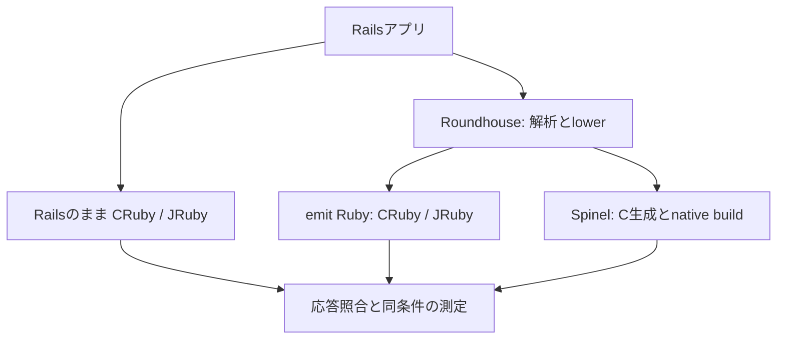
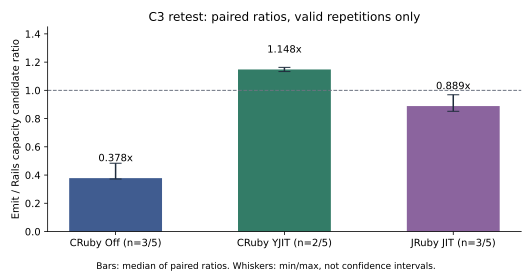

# RailsとRoundhouseの効果：JITからSpinelまで

対象：Rails 8.0.5.1の記事・コメントアプリ、Roundhouse v2026.9.18、Spinel 2026.09.12。

測定：GCE C3、1,000記事・page 1の20記事、2026-10-01実施。更新日：2026-10-02。

問い：RailsをRoundhouseで変換すると、処理量とJITの効果はどう変わるか。Spinelまで変換した場合、何を評価できるか。

今回の有効な同一反復ではemit/Rails比の中央値はCRuby Offで0.378倍、YJITで1.148倍、JRuby有効で0.889倍だった。Roundhouse経路の効果はruntime/JIT設定に依存する。反復不足のため完全ランキングと内部機序は未確定で、Spinelの正式容量は1/5確認にとどまる。JRuby Offは補助診断として付録に分離する。

## 1. RailsとJITの性能特性

RailsはHTTP/Rack、routing、controller、model/DB、viewなどの層を組み合わせて応答を作る。動的DSLや規約は開発を簡潔にするが、リクエスト時にもframework処理がある。[Rails 8.0 Rack guide](https://guides.rubyonrails.org/v8.0/rails_on_rack.html)、[controller guide](https://guides.rubyonrails.org/v8.0/action_controller_overview.html)を参照。このアプリで各層がCPU時間の何割を占めるかは未測定である。

CRubyのYJITは実行中のcodeを遅延コンパイルするBasic Block Versioning方式のJITである。warmup、生成codeのメモリ、コンパイル時間が結果に影響する。[Ruby 3.4 YJIT公式文書](https://docs.ruby-lang.org/en/3.4/yjit/yjit_md.html)を参照。測定ではOff/Onを明示し、実プロセスで状態を検査した。DB/HTTPの待機がJITによって解消するとは限らない。

JRubyはRubyをJVM上で実行する。主要比較はcompile_mode=JITで、JRuby 10.0.7.0、Java 21.0.12.1、HotSpot Tiered Compilersをprobeで確認した。compile_mode=OFFはJVM JIT全体の無効化ではなく、補助診断として付録に分離する。

## 2. RoundhouseとSpinelの役割

RoundhouseはRailsのRuby、ERB、schema、routesを取り込み、解析後にRails固有の処理を明示的な表現へlowerして独立したprojectを生成する。生成物はframework相当の共通runtimeとターゲット別のHTTP/DB primitivesを組み合わせる。[固定版lower](https://github.com/rubys/roundhouse/blob/v2026.9.18/docs/pipeline/lower.md)、[固定版runtime](https://github.com/rubys/roundhouse/blob/v2026.9.18/docs/pipeline/runtime.md)を参照。

CRuby/JRubyのemitは変換後のRubyを各処理系で実行する。Spinelは対応RubyからCを経てnative binaryを作る。[固定版Spinel](https://github.com/matz/spinel/tree/2026.09.12)、[このリポジトリのbuild](../bench/Dockerfile)を参照。Spinelの比較にはcompilerに加えHTTP、DB adapter、scheduling、memory managementの差も含まれる。

同じruntimeのRails/emit比較はRoundhouse経路全体の差、同じ形状のOff/YJITは設定差を評価する。Spinelとの比較をAOT単独の因果効果へ帰属させない。生成codeには[`emit.py`](../scripts/bench/emit.py)の明示的な修正を含み、未修正の上流Roundhouse単体のベンチマークではない。CSRF無効は検証アプリの固定条件である。

## 3. 仮説と検証可能な予測

| 仮説 | 予測 | 今回の判定 | 追加証拠 |
| --- | --- | --- | --- |
| Roundhouseは同じruntimeで一律に高速化する | emit/Rails >1 | 強い形は支持されない。CRuby Off、JRuby有効は <1 | workload別の反復と処理段階別計測 |
| 生成RubyでもYJITの利益が残る | emit On/Off >1 | 3有効pairで支持 | 同条件の反復、JIT/GC統計 |
| RoundhouseとYJITの相互作用がある | 2×2 interactionが1から離れる | 全4セルが揃う2 pairでは >1 | 失敗を含む全反復と内部処理の分解 |
| JRubyのwarmup/code形状が効果を変える | 同じworkloadでも結果が状態に依存 | 原因未確定。今回3 pairはemit < Rails | JFR、allocation/GC、同負荷比較 |
| Spinelが高い持続容量を出す | open arrivalの確認が反復で再現 | 未確定。低VUでは健全、正式は1/5確認 | VU pool、接続、過負荷履歴の対照実験 |

throughputだけから内部機序を確定しない。「Rails層の仕事が減る」「JIT向けにcodeが変わる」は説明候補であり、この測定でCPU割合や原因を観測した事実ではない。

## 4. 測定方法と正確性

測定sourceは[`4ae7f78111b1bdab07f455f793615e039018a276`](https://github.com/koduki/example-rails-aot/commit/4ae7f78111b1bdab07f455f793615e039018a276)。[releaseと完全raw](https://github.com/koduki/example-rails-aot/releases/tag/gce-c3-retest-20261001-c3-retest-20261001T061200Z)を根拠とする。

Archive SHA-256：`86df7f78755c2259fdf3e5210458b35717f46e52489738f8450857129ef6fced`。正式profile SHA-256：`783b54f45834f89c23809b19829a68dbdc7b602eb3f992f28ce4f1e3c4e81a72`。

| 項目 | 条件 |
| --- | --- |
| 配置 | 別のc3-standard-4二台、asia-northeast1-b、private通信 |
| CPU/メモリ | 各4論理CPU、2 core × SMT 2。App cpuset 0–3、container上限14,336 MiB |
| workload | 1,000記事・1,000コメント、/articles?page=1、20記事応答。application slicingでありDB-paged性能ではない |
| runtime/DB | CRuby 3.4.5、JRuby 10.0.7.0 JIT、Spinel AOT。SQLiteは順に3.53.2、3.46.1、3.45.1 |
| warmup | closed loop 4 VU、30秒窓、180–900秒、4連続安定窓、CV/drift 0.08 |
| 容量測定 | open arrival、探索30秒、confirm 120秒、予定各5反復、VU pool 512/4096 |
| SLO | p99 ≤100 ms、failed/total <0.001、drops=0、client saturationなし |
| tester/App条件 | tester CPU <85%、network errors=0、remote telemetryあり。App sampleあり、throttle増加0、OOMなし |
| 区間精度 | 幅 ≤ min(5 RPS, lower ×0.05)。上限のprobe時間を個別表示 |
| 予算/coverage | 10時間、正式45件中30件開始、19件合格・11件失敗・15件not_run |

全9構成でprimary pageのpreflightが合格した。ただし全構成complete=falseで、invalid input応答やCSRFの除外が残る。アプリ全体の機能同等性やCRUD性能はこのpage試験から結論しない。

正式合格19件は最終120秒confirmとSLO、tester/App条件を確認した。受信10,344件・最終10,348件のmanifestは全件一致。両VM停止も記録されている。どの構成も5反復すべての有効確認がないため完全ランキングは出さない。失敗は隠さず、未実行を0 RPSにしない。

根拠はformal/plan.json、env.json、trials/per-run.json、各trial.json、capacity-search.json、phase k6/telemetry。[全反復・全診断表と照合手順](gce-c3-retest-analysis-20261001.md)、[機械可読の抽出値](data/c3-retest-20261001.json)を併記する。

## 5. 結果：CRubyとJRuby有効

数値は最終confirmのsuccessful achieved RPS。partial medianは成功反復だけの中央値であり、5反復全体の推定値ではない。trial間のp99中央値はpooled p99ではない。

| 構成 | rep 1 | rep 2 | rep 3 | rep 4 | rep 5 | 確認数 | partial median RPS |
| --- | --- | --- | --- | --- | --- | --- | --- |
| rails-cruby-off | 57.80 | 48.42 | 60.92 | 未実行 | 未実行 | 3/5 | 57.80 |
| rails-cruby-yjit | 93.71 | 93.75 | 境界再確認失敗 | 未実行 | 未実行 | 2/5 | 93.73 |
| emit-cruby-off | 21.87 | 23.43 | 22.65 | 未実行 | 未実行 | 3/5 | 22.65 |
| emit-cruby-yjit | 108.96 | 106.21 | 80.85 | 未実行 | 未実行 | 3/5 | 106.21 |
| rails-jruby | 54.49 | 49.99 | 42.19 | 予算終了 | 未実行 | 3/5 | 49.99 |
| emit-jruby | 48.43 | 48.43 | 35.93 | 45.31 | 未実行 | 4/5 | 46.87 |

容量区間はoffered RPSを使う。Rails JRuby rep 1は下限54.492／上限56.25 RPS、幅1.758 RPS、両端120秒。全19件中16件の失敗上限は30秒、3件は120秒であり、すべてを両端120秒の区間とは扱わない。

### 同じ反復の倍率

各pairのsuccessful RPSを割り、その比率の中央値を使う。partial median同士の単純除算へ置き換えない。

| 分子/分母 | 各repの比率 | pair数 | 比率中央値 | min–max |
| --- | --- | --- | --- | --- |
| emit-cruby-off/rails-cruby-off | r1 0.378, r2 0.484, r3 0.372 | 3/5 | 0.378 | 0.372–0.484 |
| emit-cruby-yjit/rails-cruby-yjit | r1 1.163, r2 1.133 | 2/5 | 1.148 | 1.133–1.163 |
| emit-jruby/rails-jruby | r1 0.889, r2 0.969, r3 0.852 | 3/5 | 0.889 | 0.852–0.969 |
| rails-cruby-yjit/rails-cruby-off | r1 1.621, r2 1.936 | 2/5 | 1.779 | 1.621–1.936 |
| emit-cruby-yjit/emit-cruby-off | r1 4.982, r2 4.533, r3 3.569 | 3/5 | 4.533 | 3.569–4.982 |

図：2026-10-01 C3 cohort。棒はpaired ratio中央値、線はmin–maxで信頼区間ではない。失敗・未実行を除いたpair数を表示。1は同等の観測値を示す。

CRuby Offでは全3 pairでemitがRailsを下回り、YJITでは有効な2 pairで上回った。JRuby有効では全3 pairで下回った。Roundhouse経路の効果はこのworkloadでruntime/JIT設定に依存したが、一般に何倍速いという保証ではない。

### YJITの絶対効果と相互作用

全4セルが合格したrep 1／2では、YJITによるsuccessful RPSの絶対増分はRails +35.92／+45.32 RPS、emit +87.09／+82.78 RPS。両方の絶対値が上昇し、emitの相対比率も上昇した。

`I = (emit-YJIT / emit-Off) / (Rails-YJIT / Rails-Off)`

Iはrep 1が3.073、rep 2が2.341、中央値2.707（n=2/5）。rep 3はRails YJITの最終再確認p99=102.81 msで失敗したため含めない。emit-YJIT rep 3も80.85 RPSで最初の2回から低下しており、最初の2回だけで再現性を確定しない。

## 6. Spinel：低VUの健全性とopen arrivalの未解決点

| 試験 | successful RPS | p99 ms | 解釈 |
| --- | --- | --- | --- |
| 1 VU closed、3反復 | 中央値53.63 | 21.82–22.07 | 120秒で全3回エラーゼロ |
| 4 VU closed、3反復 | 中央値137.14 | 37.96–38.06 | 120秒で全3回エラーゼロ |
| 1/5/10 RPS open、各3反復 | 指定rateに追従 | 22.61–27.83 | 全9回SLO条件適合 |
| 正式capacity rep 3 | 14.458 achieved、14.453 offered | 64.86 | 120秒合格。失敗上限14.843 offeredは30秒 |
| 正式rep 1/2 | 容量未確認 | timeoutあり | 探索途中の回復判定不成立 |
| 正式rep 4/5 | 未実行 | — | 予算終了 |

4 VUで137 RPS出たことからopen arrivalで同じ容量があるとは結論しない。診断はwarmup 1 VU・VU pool 10/50、正式はwarmup 4 VU・pool 512/4096で、過負荷履歴も異なる。正式rep 3の14.843 RPSはp99=58.96 msでも2/446 timeoutで不合格であり、p99だけの比較は失敗を見落とす。

記録上のtester CPU飽和、App OOM、CPU throttlingはない。HTTP接続・worker分配、DB待ち、過負荷後の残存処理などの原因は未確定。clientの5秒timeoutを観測したことと、server queue timeoutの原因特定は区別する。

## 7. 分析と追加検証

1,000記事から20記事を返すため、frameworkの省略に加えSQL、全行のmaterialization、関連コメントの生成、renderが影響し得る。生成runtimeの仕事量が増えた、あるいはJITへの適合性が変わった可能性はあるが、処理段階別traceはなく、支配的要因は未確定である。

capacity時のoffered rateは構成ごとに異なるため、そのCPU/peak memoryから同負荷の効率順位を出さない。メモリはcontainer bytes / 2^20のMiBでprocess RSSではない。CPU 100%=1論理CPU相当、収集区間にはremote orchestrationを含む。

追加検証は[再試験指示書](gce-c3-followup-instructions.md)に定義する。まず主要6構成を共通10 RPS・各3反復で比較する。容量反復はCRuby4構成とJRuby2構成へ分け、計測あり実験は別cohortとする。Spinelは同じwarmup・fresh container・maxVUsでpreallocated poolを10/512へ変える診断を独立実施する。

[Actions cohort](roundhouse-actions-20260928-report.md)は3記事・短時間closed loop、[9/30 C3 cohort](gce-c3-benchmark-report.md)は32 VU warmupと粗い探索である。今回との割り算をruntime改善/退行率に変換しない。今回の結論は今回の1,000記事workloadと設定に限定する。

## 付録：JRuby Offの位置付け

主要なJRuby評価はJIT有効のRails/emitで行う。Off二構成はcompile設定の補助診断で本文の性能倍率に必須ではない。正式はRails Offが4失敗・1未実行、emit Offが3失敗・2未実行。1 RPS診断ではエラーゼロでもp99はそれぞれ184–192 ms、532–538 msで100 ms SLO不適合。[全診断と失敗理由](gce-c3-retest-analysis-20261001.md#付録a-jruby-offの補助診断)を参照。

回復healthに正式p99条件を適用していたため、応答が戻っていてもunrecoveredになった例がある。これはqueue残存の証明ではない。次回実装は応答healthと性能SLOを別記録にし、性能SLO自体は維持する。TCP観測もHTTP active-request gaugeの代用にはしない。

## 総括

今回の有効pairではemit/RailsがCRuby Offで0.378倍、YJITで1.148倍、JRuby有効で0.889倍だった。Roundhouseの効果はこのworkloadで一律の高速化ではなくruntimeとJIT設定に依存した。YJITの利益はemitでも残り、全4セルが揃った2 pairでは相対効果も上がったが、内部機序と再現性は未確定である。

Spinelには低VUで健全に応答する条件がある一方、正式open arrivalの容量は1回の確認にとどまる。失敗・未実行を含む証跡を保持し、主要6構成の比較を先に補強しながらSpinelの接続条件を別実験で切り分ける。
