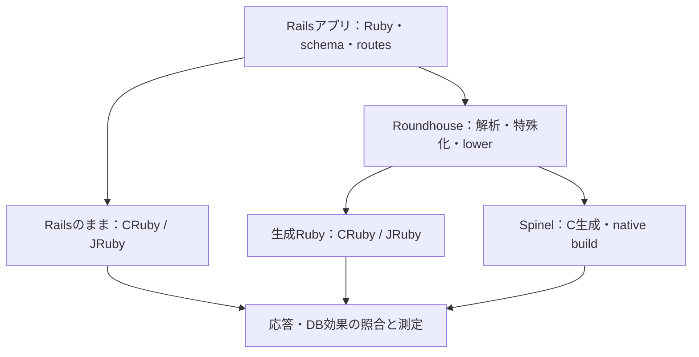
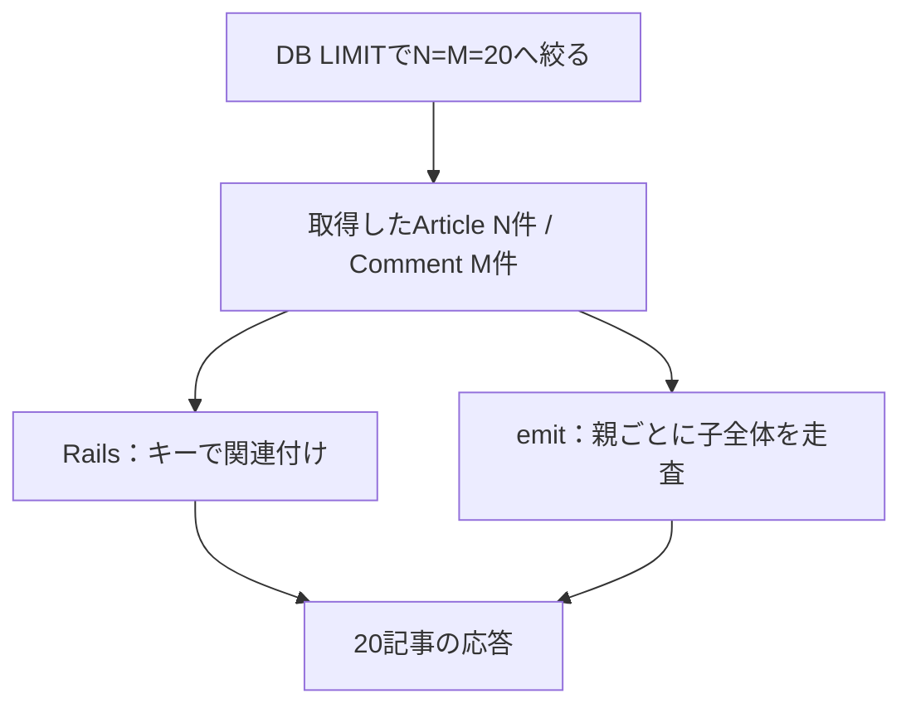

# Railsの特殊化とJIT/AOTへの影響の考察

対象：Rails 8.0.5.1の記事・コメントアプリ、Roundhouse v2026.9.18、CRuby 3.4.5、JRuby 10.0.7.0、Spinel 2026.09.12。作成日：2026年10月4日。

問い：Railsのアプリ固有情報を事前に解決する「特殊化」は、実行時の仕事量、JITの効果、AOTの適用可能性、メモリ使用量をどのように変えるか。

本報告は、小規模の処理量観測、C3上の同負荷比較・容量探索、データ件数・ページング・接続資源の対照を、一つの検証として扱う。測定系列ごとの条件を保持し、条件が異なる値を混ぜた平均や倍率は作らない。

## 1. RailsとJITの特性

### 1.1 Railsの汎用性と実行時の仕事

Railsはルーティング、controller、Active Record、view、HTTP/Rackの層を組み合わせる。規約やDSLからモデル・関連・描画方法を解決する仕組みは、開発時の柔軟性と引き換えに実行時の処理を持つ。性能はRubyの実行速度だけでなく、SQL取得量、モデル生成、関連付け、描画、I/Oと待機に依存する。

Rails自身も最適化された実装を持つ。Action ViewはテンプレートをRubyメソッドへコンパイルし、単純にERBを毎回最初から解釈するわけではない。Active Recordのpreloaderも関連先をキーで探す。このため、Railsの汎用性を減らす変換が、すべての処理でRailsより効率的になるとは限らない。[R1](https://guides.rubyonrails.org/v8.0.0/action_view_overview.html) [R9](https://github.com/rails/rails/blob/v8.0.5.1/activerecord/lib/active_record/associations/preloader/association.rb)

### 1.2 YJITとJRubyの違い

YJITはCRuby内で実行中のコードを遅延コンパイルするJITで、Basic Block Versioningを使う。実行時に見える型やホットパスに応じてコードを生成する。間接呼び出しやhot pathの割当を減らし、変数・引数の型を安定させることが性能上の利点になり得る。ウォームアップと生成コードのメモリも必要になる。[R2](https://docs.ruby-lang.org/en/3.4/yjit/yjit_md.html)

JRubyはRubyをJVM上で実行し、RubyメソッドをJVM bytecodeへコンパイルする層と、JVMが機械語を生成する層を持つ。本検証の主要条件はJRuby JIT有効で、実プロセスのcompile modeとHotSpotの状態を確認した。CRubyのYJIT切替とJRuby/JVMの切替は同じ介入ではない。[R3](https://github.com/jruby/jruby/wiki/JRubyCompiler)

| 対象となる仕事 | JITに期待できる効果 | 比較時に残る要因 |
| --- | --- | --- |
| Rubyの呼び出し・分岐・型依存処理 | 頻繁な経路の実行コストを減らす | どの経路がコンパイルされるか、コード形状 |
| DB取得・モデル生成・関連付け | その前後のRuby処理を高速化する | 取得行数、アルゴリズム、DBアダプタ |
| 起動・コンパイル・GC | 定常段階で速度の利益が出る | 収束時間、割当、生成コードとheapのメモリ |
| HTTP・socket・OS資源 | 周辺コードが速くなる可能性 | 接続数、FD上限、待機や例外時の回復 |

JITの効果は「同じ仕事を安く実行すること」と、「生成コードで仕事が変わること」を分けて読む必要がある。フレームワーク処理が減っても、SQLや関連付けの仕事量が増えれば、全体が速くなるとは限らない。

## 2. Spinelの紹介とRails適用への課題

### 2.1 全体解析からネイティブ実行へ

SpinelはRubyプログラム全体を解析・型推論し、Cコードを生成してネイティブ実行ファイルへコンパイルするAOT処理系である。実行時にCRubyやJVMを必要とせず、実行前に解決できる情報を機械語生成へ使う。今回のアプリbinaryはlibc、SQLite、jemallocなどのネイティブライブラリを利用する。[R4](https://github.com/matz/spinel/blob/112bae85c1a25fc5399009a849f805bfe691426b/README.md) [R13](https://github.com/koduki/example-rails-aot/blob/19504f9f1f9e4c53930fbd235fc61116aa63773c/bench/Dockerfile)

### 2.2 Railsをそのまま入力する際の障壁

全体解析型AOTでは、実行中に初めて決まるプログラム構造が難しい。使用版Spinelには、文字列eval、実行時に組み立てるdefine_method、動的な反射、一般的なmethod_missingへのfallbackなどの制約がある。Railsと周辺gemは動的DSLやランタイム依存を多用するため、通常のRailsプロジェクトをそのままAOT化することは、本検証の経路ではない。[R5](https://github.com/matz/spinel/blob/112bae85c1a25fc5399009a849f805bfe691426b/docs/limitations.md)

| Rails適用の課題 | 本検証で必要になる対応 |
| --- | --- |
| DSL・関連・routes・schemaの実行時解決 | アプリ固有の定義を事前解析して具体的な処理へ展開 |
| gem・C拡張・動的ロードへの依存 | 対応するruntime、DB・HTTP primitives、native libraryを用意 |
| 動作の同等性 | HTML/JSON、HTTP status、保存後のDB効果をRails基準と照合 |
| ネイティブ実行の運用資源 | 接続数、FD、メモリ、workers、例外時の解放を評価 |

AOTには低い実行時負担を期待できるが、入力のアルゴリズムやHTTP runtimeの資源管理まで自動的に最適になるわけではない。今回のSpinelの結果は、特殊化されたアプリとネイティブruntimeを合わせた実行スタックの評価である。

## 3. Roundhouseというソリューション

### 3.1 特殊化とは何をすることか

RoundhouseはRailsアプリのRuby、ERB、schema、routesを読み、解析後にRails固有の表現をターゲット共通の明示的な処理へlowerする。今回使う「特殊化」は、アプリが固定されると変わらない判断を変換時に済ませ、要求ごとに変わる値を実行時に残すことを指す。[R6](https://github.com/rubys/roundhouse/blob/2e286e6f93a970fa7e93a5da2e53ee2d127f7169/docs/pipeline/lower.md)

例として、既知のモデル属性を専用のアクセス処理へ、既知のquery形状をSQLへ、既知のviewを描画関数へ展開する。元のRails gemをそのまま実行する経路から、生成Rubyと必要なframework相当runtimeを実行する経路へ移る。runtimeには共通のRails相当層と、HTTP・DBなどのターゲット別primitivesがある。[R7](https://github.com/rubys/roundhouse/blob/2e286e6f93a970fa7e93a5da2e53ee2d127f7169/docs/pipeline/runtime.md)

上流の設計説明は、この性能仮説をpartial evaluationとして位置づける。これは「Rubyを別言語へ翻訳すれば速い」という主張より、同じ結果を作るための実行時判断を減らすという主張である。上流の公開性能値は、本報告の実測表には混ぜない。[R8](https://intertwingly.net/blog/2026/06/11/The-Ruby-JRuby-Was-Built-to-Run.html)



図1：Railsのままの経路と、Roundhouseで特殊化した後のCRuby/JRuby・Spinel経路。応答とDB効果を照合してから性能を比較する。

### 3.2 何の効果を比較しているか

| 比較 | 評価する差 | 単独では分離できないこと |
| --- | --- | --- |
| Rails / emit、同じ処理系・JIT | 特殊化経路全体の速度・資源量 | 生成コードとHTTP/DB/runtime差の内訳 |
| 同じ形状のCRuby Off / YJIT | その入力でのYJIT有効化の効果 | JITが改善した内部stageの割合 |
| emit CRuby / emit JRuby | 実行環境全体としての差 | JIT単体、SQLite/adapter/VMの寄与 |
| 生成Ruby / Spinel AOT | native stackとしての速度・資源量 | AOT compilerだけの倍率 |

生成物には、SQLite PRAGMA、DBページング対応、測定用probeなど、リポジトリのemit.pyによる明示的な修正を含む。したがって、未修正のRoundhouse上流だけの性能とは呼ばない。また、Roundhouseの解析上の型情報が、そのままYJITの型保証へ渡るわけではない。YJITは生成Rubyを実行したときの情報を使う。[R12](https://github.com/koduki/example-rails-aot/blob/19504f9f1f9e4c53930fbd235fc61116aa63773c/scripts/bench/emit.py)

## 4. 実験前の仮説

設計から導く予測を、同一条件で判定できる比較に分ける。仮説の強さを区別し、「JITの利益が残ること」と「特殊化によりJITの倍率も必ず大きくなること」を同一視しない。

| 仮説 | 実験で期待する観測 | 比較の条件 |
| --- | --- | --- |
| H1：特殊化で汎用処理の負担が減る | 同じ出力でemitの低レイテンシ・低CPU負荷 | 同じ処理系/JIT、同件数、同負荷 |
| H2：生成RubyにもJITの利益が残る | emit YJITがemit Offより速い | 同一source・同じ取得/表示条件 |
| H3：特殊化とJITが倍率でも相乗する | emitのOn/Off比がRailsのOn/Off比を上回る | 4構成が揃う同一反復 |
| H4：特殊化でメモリ負担が減る | 同負荷のemitのcontainer peakが小さい | 同じruntime、負荷・duration・計上方法 |
| H5：Spinelのnative stackに利点がある | 低い応答時間・資源量を有効な負荷で確認 | 応答適格性、接続policy、SLOを明示 |
| H6：取得量と関連付け方式が効果を変える | 表示件数固定でも全取得量で優位が変化 | 20/1,000件、全取得/DB LIMITの対照 |
| H7：接続資源がSpinelの安定性を左右する | pool・actual nofileで失敗状態が変わる | 同RPS、fresh container、FD/TCP/log保存 |

H1やH4は速度と資源に関する観測予測であり、framework内部の削減箇所を直接測る予測ではない。H3は条件依存の相互作用を問う強い仮説である。H5もAOT compiler単独ではなく、今回のnative実行スタックを対象にする。

## 5. 実験レポート

### 5.1 検証設計と測定系列

対象はArticle/Commentを持つRailsアプリのHTML一覧である。fixtureは1記事1コメント。3件では3記事、20件・1,000件では20記事を返す。app-slicedは全取得・関連付け後に20件を選び、db-pagedはDBから親20件と対応する子を取得する。[R11](https://github.com/koduki/example-rails-aot/blob/19504f9f1f9e4c53930fbd235fc61116aa63773c/blog/app/controllers/articles_controller.rb)

| 系列 | 役割 | 主な条件 | 実施記録 |
| --- | --- | --- | --- |
| A | 小規模CRuby / Spinel | 3件、4接続・10秒closed loop、各1回 | [E1](https://github.com/koduki/example-rails-aot/actions/runs/36380159185) |
| B | 小規模JRuby JIT | 3件、4接続・30秒closed loop、各3回 | [E2](https://github.com/koduki/example-rails-aot/actions/runs/36362615236) |
| C | C3容量・負荷方式 | 1,000件全取得、open arrival探索、closed/open負荷の診断 | [E3](https://github.com/koduki/example-rails-aot/releases/tag/gce-c3-capacity-20260930) [E4](https://github.com/koduki/example-rails-aot/releases/tag/gce-c3-retest-20261001-c3-retest-20261001T061200Z) |
| D | C3同負荷・容量・接続数 | 10 RPS各3回、容量各5回、Spinel pool別各3回 | [E5](https://github.com/koduki/example-rails-aot/releases/tag/gce-c3-followup-20261002-c3-followup-20261001T225541Z) |
| E | C3件数・ページング・FD | 件数とページング10 RPS、FD対照25 RPS、各3回 | [E6](https://github.com/koduki/example-rails-aot/releases/tag/gce-c3-mechanism-20261003-c3-mechanism-20261003T001500Z) |

A/Bはhosted Actions、C/D/EはAppとloadgenを別のGCE c3-standard-4に配置する。検証全体で共通の問いを扱うが、source、duration、load model、poolの異なる測定を同一cohortの反復として足さない。小規模のclosed-loop RPSは観測処理量であり、C3の持続容量と同じ尺度として比較しない。

| C3の共通条件 | 内容 |
| --- | --- |
| 配置 | asia-northeast1-b、App/loadgen別VM、private通信 |
| CPU・メモリ | App 4 vCPU = 2 core × SMT2、cpuset 0-3、container上限14,336 MiB |
| runtime | CRuby 3.4.5、JRuby 10.0.7.0 / Java 21.0.12.1、Spinel 2026.09.12 |
| SQLite | CRuby 3.53.2、JRuby 3.46.1、Spinel 3.45.1。各接続のPRAGMAを揃える |
| warmup | closed loop 4 VU、30秒窓、180-900秒、4安定窓、CV/drift 0.08 |
| 容量確認 | open arrival探索、120秒confirm、各5反復予定 |
| SLO | p99 ≤100 ms、failed/total <0.001、drop 0、client saturationなし |
| 観測の成立条件 | 負荷生成器の余力/network error、App sample・throttle増加0・OOMなし |
| 固定負荷D/E | 10 RPS・120秒各3反復。Dはpool512、Eはpool10。Spinel FDは25 RPS |

容量探索の有効結果は、下限の120秒確認と失敗上限を保存し、区間幅 ≤ min(5 RPS, 下限×0.05)を満たすものとした。探索記録Cのうち、同じ区間証拠を持たない値は候補観測として扱い、主表の容量へ混ぜない。実施45件の記録を保持し、未収束・失敗・未実施を成功へ置き換えていない。

HTML/JSONとDB効果のpreflightを性能試験の適格性ゲートにした。一覧routeは適格で、Eのページング両方式は全4構成でcanonical応答が一致した。app抽出物とruntimeは中間stageに一致し、Spinel binaryもhash一致を確認した。invalid inputの表示・JSON error形状の不一致、CSRF条件は別の適用範囲として残る。

数値表のp50/p95/p99は各trialのpercentileの中央値で、要求を結合したpercentileではない。対応反復の比は各組の比を求めてから中央値化する。メモリはdocker statsのcontainer memory peakをMiBへ換算したものでRSSではない。CPUはcollectorの平均%で、複数vCPUを使えば100%を超える。collectorとk6の観測区間が完全一致しないため、CPU%から要求当たりCPU時間へ変換しない。

### 5.2 小規模での観測処理量

| 構成（系列A） | 観測RPS | p50 / p95 / p99（ms） |
| --- | --- | --- |
| Rails CRuby Off | 321.52 | 12.26 / 16.03 / 18.70 |
| Rails CRuby YJIT | 546.58 | 7.11 / 11.37 / 13.90 |
| emit CRuby Off | 2,407.74 | 1.61 / 2.46 / 3.03 |
| emit CRuby YJIT | 3,066.75 | 1.24 / 1.96 / 2.62 |
| Spinel AOT | 4,516.54 | 0.88 / 1.16 / 1.25 |

3件・短時間closed loopでは、emit Off / Rails Offの観測RPS比は7.489、emit YJIT / Rails YJITは5.611。Spinelも高い観測処理量を示した。各1試行なので分布や持続容量を表す値ではない。[E1](https://github.com/koduki/example-rails-aot/actions/runs/36380159185)

| 構成（系列B） | 反復1 / 2 / 3 RPS | 中央値RPS | p50 / p95 / p99中央値（ms） |
| --- | --- | --- | --- |
| Rails JRuby JIT | 105.00 / 301.41 / 313.84 | 301.41 | 12.39 / 20.96 / 26.88 |
| emit JRuby JIT | 2,211.64 / 2,312.39 / 2,257.07 | 2,257.07 | 1.68 / 3.14 / 4.44 |

系列BのJRuby JITではemitの高い処理量が3回とも観測されたが、Rails側は105→301→314 RPSという段差を持つ。系列内の中央値の比は7.488で、同一反復比は21.06 / 7.67 / 7.19。局所的な収束は反復間で同じ性能段階になることを保証しない。系列AとBの値を割ってYJIT/JRubyの強さを順位付けしない。JRuby compile mode OFFは主要比較から外し、JIT有効をJRubyの評価条件とする。[E2](https://github.com/koduki/example-rails-aot/actions/runs/36362615236)


図2：3記事・3コメント。左は系列Aの単一試行、右は系列Bの3反復中央値。図の左右はsource・host・warmup・durationが異なるため、横断倍率を算出しない。

### 5.3 同10 RPSでの速度とメモリ

| 系列D・1,000件全取得 | p50 ms | p95 ms | p99 ms | CPU平均% | peak MiB | 成功 |
| --- | --- | --- | --- | --- | --- | --- |
| Rails Off | 33.62 | 35.90 | 71.73 | 28.26 | 324.10 | 3/3 |
| Rails YJIT | 17.90 | 19.43 | 63.37 | 14.98 | 458.80 | 3/3 |
| emit Off | 69.38 | 71.08 | 73.61 | 57.51 | 150.80 | 3/3 |
| emit YJIT | 19.10 | 19.90 | 21.65 | 15.52 | 179.80 | 3/3 |
| Rails JRuby JIT | 25.91 | 38.74 | 46.69 | 39.12 | 1212.42 | 3/3 |
| emit JRuby JIT | 31.01 | 39.99 | 48.85 | 38.75 | 884.10 | 3/3 |

同負荷ではCRuby YJITのemitは、Railsよりp50と平均CPUが少し大きい一方、container peakは179.80対458.80 MiBと小さい。対応反復のメモリ比中央値は0.392で約60.8%減、p99比は0.342で約65.8%小さい。JRubyはemitのp50が約20%大きく、メモリの対応反復比中央値は0.750で約25.0%減。表のメモリ中央値同士を割った約27.1%減とは集計方法が異なる。[E5](https://github.com/koduki/example-rails-aot/releases/tag/gce-c3-followup-20261002-c3-followup-20261001T225541Z)

ここで見えるのは1,000件全取得・同10 RPSでの各stackの挙動である。CRuby YJIT / JRuby JITの横断比較はSQLite/adapter/VMも変わる。JRubyのJIT単体がYJITより弱いとする証拠ではないが、このworkloadでemit JRubyの優位は観測していない。


図3：系列D、同10 RPS・同120秒、各3反復のcontainer peak中央値。RSS/heapだけの測定ではない。

### 5.4 大件数での持続容量とJIT効果

| 系列D・1,000件全取得 | 有効容量中央値 RPS | 有効/予定 | 反復1 / 2 / 3 / 4 / 5 RPS |
| --- | --- | --- | --- |
| Rails Off | 56.24 | 5/5 | 54.68 / 60.92 / 57.80 / 56.24 / 52.73 |
| Rails YJIT | 96.86 | 4/5 | 81.73 / 76.46 / 不成立 / 115.61 / 111.99 |
| emit Off | 21.87 | 5/5 | 19.53 / 23.43 / 21.09 / 21.87 / 21.87 |
| emit YJIT | 103.11 | 5/5 | 96.86 / 106.23 / 103.12 / 80.85 / 103.11 |
| Rails JRuby JIT | 50.00 | 3/5 | 50.00 / 56.24 / 不成立 / 不成立 / 49.56 |
| emit JRuby JIT | 52.39 | 4/5 | 59.37 / 48.78 / 不成立 / 48.43 / 56.00 |

不成立の内訳は、Rails YJIT 1件の容量境界不安定、Rails JRuby 2件のwarmup未収束、emit JRuby 1件の容量探索不成立である。成功数の少ない部分中央値から完全な順位を確定しない。Spinelには同じ条件で揃った5反復の容量値がないため、この容量表へ推定値を置かない。


図4：点は有効な各反復、横線は有効反復の中央値、上部は有効/予定数。不成立を0 RPSとして描かない。CRubyとJRubyの容量は別の測定系列として保持する。

| 同一反復の容量比 | 比の中央値 | 有効pair | 範囲 |
| --- | --- | --- | --- |
| emit Off / Rails Off | 0.38 | 5 | 0.357-0.415 |
| emit YJIT / Rails YJIT | 1.05 | 4 | 0.699-1.389 |
| Rails YJIT / Rails Off | 1.78 | 4 | 1.255-2.124 |
| emit YJIT / emit Off | 4.71 | 5 | 3.697-4.960 |
| emit JRuby JIT / Rails JRuby JIT | 1.13 | 3 | 0.867-1.187 |

emit YJIT / emit Offは4.715倍、Rails YJIT / Rails Offは1.775倍。emit対RailsのYJIT有効時は中央値1.053だが、4 pair中2組でemitが上、2組でRailsが上。JRubyも3 pair中2組でemitが上、1組でRailsが上となり、常に有利という結果ではない。

### 5.5 取得件数が性能をどう変えるか

| 系列E・同10 RPS | 3件 p50 ms | 20件 p50 ms | 1,000件 p50 ms | 20→1,000件の比 |
| --- | --- | --- | --- | --- |
| Rails Off | 5.02 | 8.49 | 34.61 | 4.08 |
| Rails YJIT | 2.82 | 4.61 | 18.53 | 4.01 |
| emit Off | 1.03 | 1.38 | 69.73 | 50.64 |
| emit YJIT | 0.78 | 1.03 | 19.14 | 18.58 |

全36試行がSLO合格。3件では3記事を返すため、3→20件は取得量と応答量が両方変わる。20→1,000件は応答20記事を固定し、全取得する行数の影響を見ている。


図5：系列Eの各3反復中央値。縦軸は対数目盛で、同じ表示20件でも全取得量が増えるとemitのレイテンシが大きく増える。

20件ではemit Offが1.38 ms、Rails Offが8.49 ms。1,000件ではemit Offが69.73 ms、Rails Offが34.61 msへ逆転した。20→1,000件のp50増加はRails約4倍、emit Off約50.64倍、emit YJIT約18.58倍。同一環境で少件数の優位と大件数の不利が両立する。

### 5.6 同じ応答をDBページングで作る場合

| 系列E・1,000件fixture | 全取得 p50 ms | DB20件 p50 ms | DB20件 p99 ms | CPU平均% | peak MiB |
| --- | --- | --- | --- | --- | --- |
| Rails Off | 34.34 | 9.00 | 11.27 | 28.35 → 7.53 | 317.20 → 315.50 |
| Rails YJIT | 18.42 | 4.95 | 6.97 | 14.14 → 4.19 | 453.50 → 461.20 |
| emit Off | 69.49 | 1.48 | 2.65 | 58.06 → 1.20 | 138.80 → 140.90 |
| emit YJIT | 19.16 | 1.14 | 2.27 | 15.62 → 0.89 | 180.00 → 183.40 |

両方式を同じ24試行の対照として測定し、すべてSLO合格。4構成ともapp-sliced/db-pagedのcanonical応答が一致する。DB20件取得のemit/Rails p50対応反復比中央値はOff 0.164、YJIT 0.230。emitの応答時間はRailsの約1/6.10・1/4.36であり、JITなしでも低レイテンシの優位が戻る。[E6](https://github.com/koduki/example-rails-aot/releases/tag/gce-c3-mechanism-20261003-c3-mechanism-20261003T001500Z)


図6：系列E、両方式それぞれ各3反復のp50中央値。同じ1,000件fixtureから同じ20記事を返す。全取得側もこの対照の中で測定している。

app-sliced/db-pagedのp50対応反復比はRails Off 3.82、Rails YJIT 3.69、emit Off 47.06、emit YJIT 16.83。これはレイテンシ短縮の比で、最大RPSの倍率ではない。取得量・モデル生成・関連付け・外側走査が同時に減るため、各stageの寄与率はこの対照だけでは分離できない。

### 5.7 Spinelの接続数とFD上限

| pool | actual soft nofile | 成功 | p50 ms | p99 ms | peak MiB | FD数最大 |
| --- | --- | --- | --- | --- | --- | --- |
| 10 | 1024 | 3/3 | 20.95 | 28.16 | 88.78 | 61 |
| 512 | 1024 | 0/3 | 25.57 | 5000.45 | 627.60 | 1024 |
| 10 | 8192 | 3/3 | 20.87 | 28.04 | 88.32 | 61 |
| 512 | 8192 | 3/3 | 20.52 | 84.42 | 633.40 | 1065 |

同25 RPSのFD対照12試行は、成功9・失敗3。default actual limitはsoft 1,024/hard 524,288、raisedはsoft/hardとも8,192。pool512/defaultの全3反復でFD数1,024・最大番号1,023に達し、serverはdup(2) failed for fd 1023を記録した。失敗件数は94/3,001、93/3,000、94/3,000で約3.1%、p99約5秒。上限8,192では同pool512・同25 RPSが失敗0で3/3 SLO合格となる。[E6](https://github.com/koduki/example-rails-aot/releases/tag/gce-c3-mechanism-20261003-c3-mechanism-20261003T001500Z)


図7：系列E、各3反復。左のFDは観測snapshotの最大、中央と右はtrial値の中央値。pool512/defaultは失敗条件であり、そのメモリ・p99を正常性能として扱わない。

正常pool10はFD数61・socket FD22・ESTABLISHED10、正常pool512/8,192はFD数1,065・socket FD1,026・ESTABLISHED512。同一inodeの重複FDと、接続ごとのIO.for_fd wrapperに整合する。snapshot最大は基礎FD41 + 接続数×2で説明できる。poolは同時に処理する要求数ではなく、保持するkeep-alive接続数とも関係する。[R10](https://github.com/rubys/roundhouse/blob/2e286e6f93a970fa7e93a5da2e53ee2d127f7169/runtime/spinel/tep/server_threaded.rb)

FD不足を障害の主因として支持するが、syscallのerrnoそのものは記録していない。また、失敗時は接続threadが例外終了し、全3反復で最後のFD数が開始41→42となり、FD1,023のsocketが残る。正常セルは41へ戻った。上限の調整で成功しても、例外時解放まで修正されたことにはならない。

pool512/8,192のp99は79.51 / 84.97 / 84.42 msで、pool10/8,192の中央値28.04 msより大きい。container peakも633.40対88.32 MiB。少接続では低い資源量で25 RPSを処理できるが、多接続のtailとメモリは別の適用特性として残る。

## 6. 考察

### 6.1 特殊化の軽さと、アルゴリズムの仕事量

小規模closed loopとC3の少件数測定は、emitの低レイテンシ・高い観測処理量という方向で一致する。DBに1,000件あっても取得を20件に絞ればemitの優位が戻るため、DB全体の規模より要求ごとの取得・生成・関連付け量が重要である。

実測servingイメージから抽出したArticlesController#indexには、全Articleごとに全Commentを走査する二重ループがあった。CRuby/JRubyの中間stageとservingのapp各34ファイル・runtime全ファイルがバイト一致し、Spinelの中間/serving binaryもSHA-256一致している。生成器に経路があるという可能性にとどまらず、使用した生成物の処理形状を確認できている。[E6](https://github.com/koduki/example-rails-aot/releases/tag/gce-c3-mechanism-20261003-c3-mechanism-20261003T001500Z)

```ruby
results.each do |article|
  group = []
  loaded_comments.each do |comment|
    group << comment if comment.article_id == article.id
  end
  article._preload_comments(group)
end
```



図8：実生成物は親N件×子M件を比較する。1記事1コメントでは、3件で9回、20件で400回、1,000件で100万回。比較回数はコードから導ける値で、実測stage時間ではない。

Railsの使用版preloaderはowners_by_keyで関連先を探す。今回の一対一fixtureでは、Railsのキー分配とemitの二重ループは処理量の増え方が異なる。特殊化は実行時判断を減らせても、元のframeworkより悪いアルゴリズムを生成すれば大件数で負け得る。[R9](https://github.com/rails/rails/blob/v8.0.5.1/activerecord/lib/active_record/associations/preloader/association.rb)

二重ループの存在、件数による逆転、DBページングでの優位回復は、一つの整合的な説明を作る。ただし取得行数やモデル生成も変化しているため、全体の遅さの何%が関連付けだけに由来するかは、このデータでは特定しない。Railsが全面的に速いとも、emitが全面的に速いとも言えず、実際の処理形状で判断する。

### 6.2 JITの絶対効果と相互作用

容量の2×2では、RをRails、Eをemitとすると、相互作用比を I = (E_On / E_Off) / (R_On / R_Off) と定義できる。同一反復の4値が揃う組だけで算出する。I>1はemitのJIT倍率がRailsより大きいことを表し、特殊化が必ず絶対性能を上げることとは別である。

系列Dの1,000件全取得容量では、4完全pairのI中央値は2.769、範囲1.798-3.612で、すべて1を上回った。emitには大きなYJIT利益がある。一方、小規模系列Aの観測RPSではRailsのYJIT倍率1.700に対してemitは1.274で、相互作用比は約0.749となる。負荷と仕事量が変われば相互作用の方向も変わる。

| 系列E・p50 Off / YJIT比 | Rails | emit |
| --- | --- | --- |
| 20件全取得 | 1.85 | 1.34 |
| 1,000件全取得 | 1.87 | 3.64 |
| 1,000件からDB20件 | 1.82 | 1.30 |

1,000件全取得ではemitのYJITレイテンシ短縮が大きいが、DB20件では約1.30分の1に縮む。YJIT有効で使った生成Rubyにも二重ループは残っている。大きいJIT倍率は、生成コードの追加コストを軽減する効果を含む説明と整合する。「JITへの適性が上がった」という説明だけで結論を閉じない。

この検証はYJITが特定stageを何%改善したか、ratio_in_yjitがCPU時間の何%に相当するかを測っていない。速度の上昇、特殊化の相対優位、JIT倍率はそれぞれ別の指標である。

### 6.3 JRuby JITはemitに特別強いか

小規模系列BではJRuby JIT上のemitが高い処理量を示すが、系列AのYJITと条件が異なるためJITの優劣は決まらない。大件数の同負荷系列Dではemit JRubyはemit YJITよりp50・p99・メモリが大きかった。これは入力・DB/adapter・VMを含むstackの結果で、JITだけの序列ではない。

系列Dの容量warmupではemit JRubyは5/5収束、中央値270.31秒（240.22-360.46秒）。Rails JRubyは3/5収束し、2件は約901秒の上限で未収束だった。Railsの局所的な処理量段階や収束時間が結果へ影響するため、成功反復の中央値だけで一般的なJRubyの性能を表さない。

特殊化で動的判断が減ればJRuby/JVMにも有利という設計仮説は妥当だが、DBページングのJRuby性能系列は本データにない。20件に絞ったemitでJRubyがYJITを上回るかは、本検証の測定範囲では未確定である。

### 6.4 省メモリは独立した成果である

CRuby YJITのemitは1,000件全取得でもDB20件でも、Railsより約60%小さいcontainer peakを示す。速度が同等の条件でも省メモリの価値は残る。JRubyでも同負荷の対応反復で約25%小さい。runtimeごとの絶対量を混ぜずに、同じruntimeのRails/emitで読む必要がある。

DBページングでemitのp50と平均CPUが大きく減っても、container peakはほぼ同じだった。計上値にはruntimeの常駐領域、warmup中の履歴、allocator保持、その他container使用分が含まれ得る。peakからheap/RSSやGCの寄与を分離しない。Spinelもpool10では約88 MiBだが、pool512では約633 MiBであり、省メモリは接続policyにも依存する。

### 6.5 Spinelの成果と運用上の境界

Spinelは小規模のclosed loopで高い観測処理量を示し、C3の1,000件全取得でも少接続・25 RPSで低い資源量とSLO合格を確認できる。FD上限の対照は、動かない処理系という説明ではなく、必要FD数とactual limitが衝突した障害という説明を支持する。

しかし、上限不足だけでruntime側の資源管理を免責することはできない。IO wrapperの複製、枯渇時にsocketを解放しない経路、接続数によるメモリ・tailの増加は、このstackの性質として評価対象になる。使用版handle_connectionではwrapper作成後の正常経路にclose処理があり、wrapper作成例外の解放は保証されていない。実測socket残留はその経路と整合する。[R10](https://github.com/rubys/roundhouse/blob/2e286e6f93a970fa7e93a5da2e53ee2d127f7169/runtime/spinel/tep/server_threaded.rb)

25 RPSの120秒・3反復成功は、その負荷を処理できる証拠であり、最大容量の値ではない。native化による内部実行の軽さと、HTTP接続・DB・OS資源の上限は同時に存在する。AOT compiler単体の速度としてstack全体の差を帰属させない。

### 6.6 機能と適用範囲

本検証の性能対象はSQLiteを使う記事一覧であり、一般的なRailsアプリ全体やhouseholdアプリの性能を代表しない。CSRFは検証アプリで無効化され、preflightのCSRF invalidはRails基準自身が拒否契約を満たさずexcluded。emitのinvalid create/update HTMLとJSON error形状には不一致が残る。一覧応答の同等性が成立しても、認証・セッション・全gem・全CRUDの本番互換性まで成立したとは扱わない。

内部stageのCPU時間・割当/GCの内訳、長時間のFD枯渇反復、DBの別製品、後続ページや複数コメントなどは、このレポートで数値化した範囲に含まれない。この境界を保つことで、測定済みの低レイテンシ・省メモリ・資源制約を、そのまま有効な成果として説明できる。

## 資料・数値付録

### 実施記録と来歴

| 系列 | 実施リンク | source SHA | 実施範囲と状態 |
| --- | --- | --- | --- |
| A | [E1](https://github.com/koduki/example-rails-aot/actions/runs/36380159185) | 2b66fbb2c90752320926e2715a8c48c31bbd33c1 | 3記事、closed loop、CRuby/Spinel各1試行 |
| B | [E2](https://github.com/koduki/example-rails-aot/actions/runs/36362615236) | f3c67327e71c074ece3622d8f18ef24f41c5263d | 3記事、JRuby JIT各3反復 |
| C1 | [E3](https://github.com/koduki/example-rails-aot/releases/tag/gce-c3-capacity-20260930) | bf098d3e724af5b84d26da9e8398942716a50009 | 45実施：24 passed / 13 unstable / 8 failed。区間証拠の異なる候補値は主容量表へ不採用 |
| C2 | [E4](https://github.com/koduki/example-rails-aot/releases/tag/gce-c3-retest-20261001-c3-retest-20261001T061200Z) | 4ae7f78111b1bdab07f455f793615e039018a276 | 45予定：19 passed / 11 failed / 15 not_run。成功区間の確認と診断記録 |
| D | [E5](https://github.com/koduki/example-rails-aot/releases/tag/gce-c3-followup-20261002-c3-followup-20261001T225541Z) | 98a1beec9a406ead2fe3b3e219086c171e1883a4 | 66実施：59 passed / 5 failed / 2 unstable。matched・capacity・connection |
| E | [E6](https://github.com/koduki/example-rails-aot/releases/tag/gce-c3-mechanism-20261003-c3-mechanism-20261003T001500Z) | 19504f9f1f9e4c53930fbd235fc61116aa63773c | 72実施：69 passed / 3 failed。scaling36・pagination24・FD12 |

C1/C2の未収束・失敗・未実施は、実験全体の成立範囲として保持する。Dのmatchedは全18成功、容量CRuby19/20・JRuby7/10、接続対照15/18成功。Eのscaling36/36・pagination24/24成功、FD9/12成功。FDの失敗3件はpool512/defaultを検証する対照条件そのものである。

C1 archive SHA-256：`4ceded406c302c877a9faa3394b47b8edb38084190b0a6cb5fdf808518ac3646`。

C2 archive SHA-256：`86df7f78755c2259fdf3e5210458b35717f46e52489738f8450857129ef6fced`。

D archive SHA-256：`26af7b1efd2485ecc30ba34a7aa3daafc4e6e27ccd3bcdf4245783627cec0a46`。

E archive SHA-256：`fd23e03a7ff9ade4497bbe0840dde32756cc10aa3fc512e81f86c98269148982`。

D/Eはarchive hashとmanifestの照合、trial.jsonとk6 summary/invocation、profile/fixture/source/image identityを確認した。EはSHA256SUMS 9,397ファイル、受信時manifest 9,395ファイルがすべて一致。EのFD snapshotは全反復で取得エラーなし。両VMの停止状態は各releaseのcleanup記録に保持する。

### 主要な一次資料

R1：[Rails 8.0 Action View Overview](https://guides.rubyonrails.org/v8.0.0/action_view_overview.html)。

R2：[Ruby 3.4 YJIT公式文書](https://docs.ruby-lang.org/en/3.4/yjit/yjit_md.html)。

R3：[JRuby Compiler / Performance Tuning](https://github.com/jruby/jruby/wiki/JRubyCompiler)。

R4：[Spinel固定版 README](https://github.com/matz/spinel/blob/112bae85c1a25fc5399009a849f805bfe691426b/README.md)。

R5：[Spinel固定版の制約](https://github.com/matz/spinel/blob/112bae85c1a25fc5399009a849f805bfe691426b/docs/limitations.md)。

R6：[Roundhouse固定版のlowering](https://github.com/rubys/roundhouse/blob/2e286e6f93a970fa7e93a5da2e53ee2d127f7169/docs/pipeline/lower.md)。

R7：[Roundhouse固定版のruntime](https://github.com/rubys/roundhouse/blob/2e286e6f93a970fa7e93a5da2e53ee2d127f7169/docs/pipeline/runtime.md)。

R8：[Sam Ruby：特殊化とJRubyの性能仮説](https://intertwingly.net/blog/2026/06/11/The-Ruby-JRuby-Was-Built-to-Run.html)。

R9：[Rails 8.0.5.1の関連付けpreloader](https://github.com/rails/rails/blob/v8.0.5.1/activerecord/lib/active_record/associations/preloader/association.rb)。

R10：[Roundhouse固定版のSpinel HTTP runtime](https://github.com/rubys/roundhouse/blob/2e286e6f93a970fa7e93a5da2e53ee2d127f7169/runtime/spinel/tep/server_threaded.rb)。

R11：[実測sourceのcontroller](https://github.com/koduki/example-rails-aot/blob/19504f9f1f9e4c53930fbd235fc61116aa63773c/blog/app/controllers/articles_controller.rb)。

R12：[生成物への測定用修正](https://github.com/koduki/example-rails-aot/blob/19504f9f1f9e4c53930fbd235fc61116aa63773c/scripts/bench/emit.py)。

R13：[container buildと実行対象](https://github.com/koduki/example-rails-aot/blob/19504f9f1f9e4c53930fbd235fc61116aa63773c/bench/Dockerfile)。

Roundhouseの固定commit：`2e286e6f93a970fa7e93a5da2e53ee2d127f7169`。Spinelの固定commit：`112bae85c1a25fc5399009a849f805bfe691426b`。生成物と公開設計文書の両方を使用し、上流の別workloadのベンチマーク値は本検証の表へ入れていない。

## 7. 総括

| 仮説 | 検証全体での結論 |
| --- | --- |
| H1：特殊化による速度改善 | 条件付きで支持。少件数・DB20件ではemitの優位が再現し、全1,000件ではOffの優位が逆転 |
| H2：生成RubyにJIT利益が残る | 支持。emit YJITはOffより低レイテンシ・高い有効容量 |
| H3：倍率でも一律に相乗する | 一律の形は支持されない。仕事量・load modelで相互作用の方向が変わる |
| H4：同負荷で省メモリ | 支持。CRuby YJITで約60%、JRubyで約25%の対応反復メモリ削減 |
| H5：Spinel native stackの利点 | 測定範囲で支持。小規模で高処理量、C3少接続で低メモリ・25 RPS成功 |
| H6：取得量と関連付けが効果を左右 | 支持。実生成物の二重ループ、件数による逆転、DB LIMITでの優位回復が整合 |
| H7：接続資源が安定性を左右 | 支持。FD上限到達と上限対照の成功。例外時socket残留とtail/memory増加も観測 |

Railsの特殊化は、JIT/AOTへ渡す処理を軽くし、少件数やDBで取得対象を絞った条件では低レイテンシ・低CPU負荷につながる。省メモリは、速度の優位が小さい条件でも独立した成果として残る。

一方、特殊化後のアルゴリズムがRailsより多くの仕事をすれば、その利点は失われる。今回の大件数全取得はその具体例で、YJITの大きな倍率も生成コードの追加コストを軽減する側面を含む。JITの倍率、特殊化の優位、絶対性能は別々に評価すべきである。

SpinelはRails適用に向けたnative実行の可能性を示した。実行スタックの軽さと接続資源の制約は両立し、FD上限調整で成功しても例外時解放・多接続のtailとメモリまで解決したわけではない。JRubyについても、特殊化の利益は観測できるが、YJITより一律に強いという結論にはならない。

本検証が示す導入判断の軸は、「Railsを変換するか」だけではない。どれだけ取得して何のアルゴリズムで処理し、どのruntime・JIT・接続policyで実行するかを一体として見ることで、特殊化の利点を適切な範囲で説明できる。
