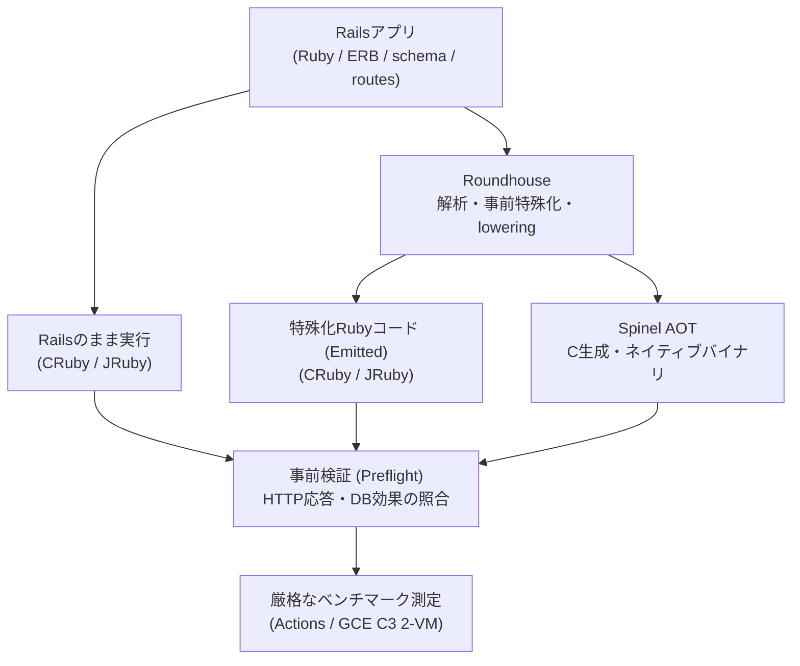
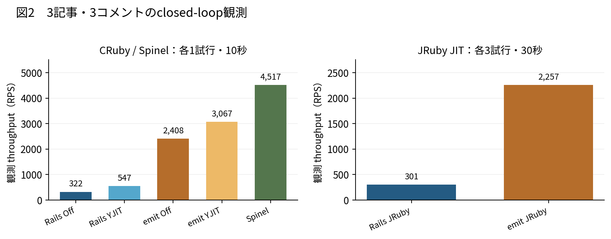
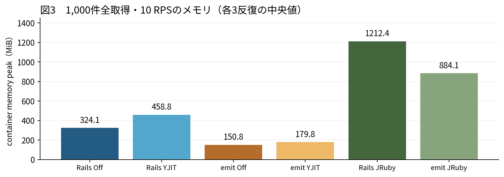
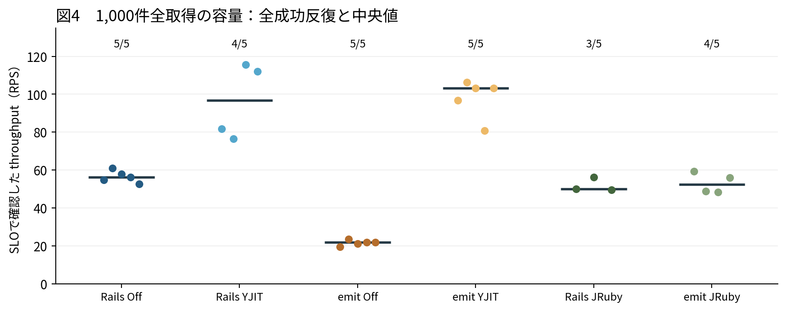
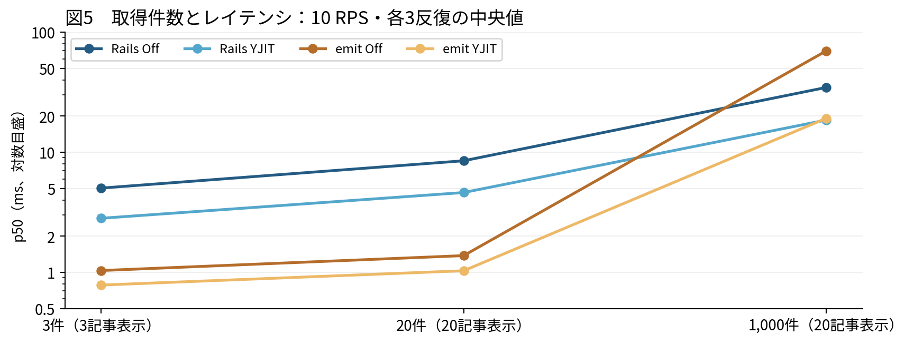
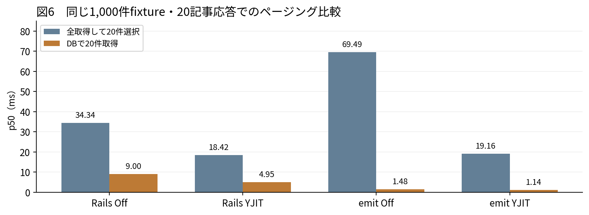
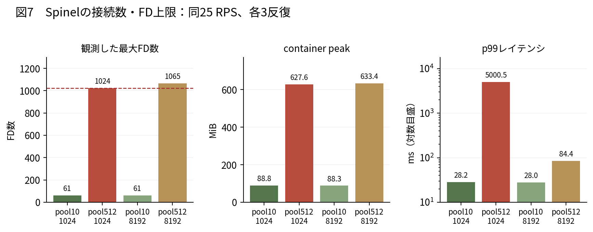
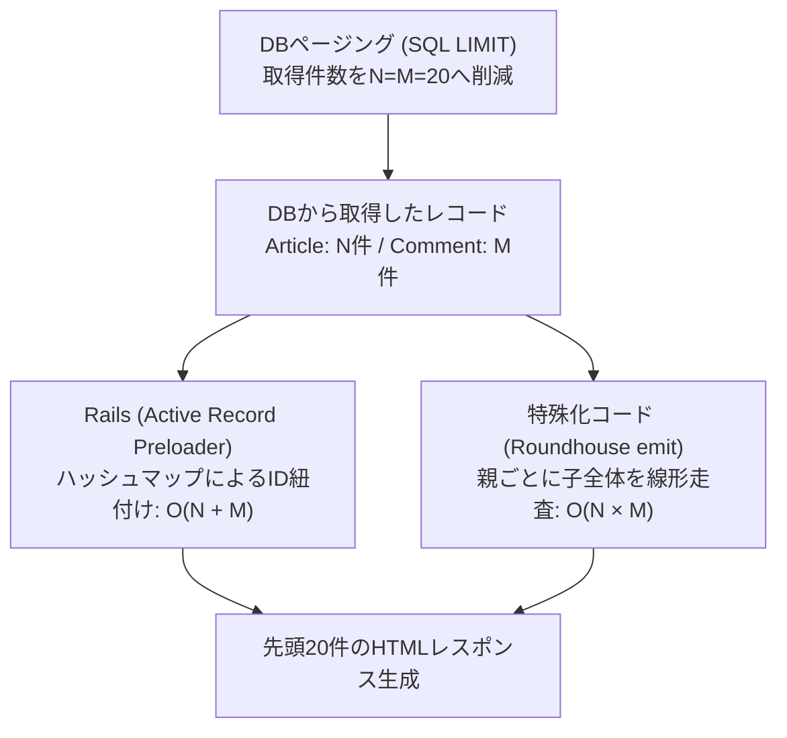

# Railsの事前特殊化とJIT/AOTへの影響：パフォーマンスとリソース効率の検証レポート

対象：Rails 8.0.5.1（記事・コメントアプリ）、Roundhouse v2026.9.18、CRuby 3.4.5、JRuby 10.0.7.0、Spinel 2026.09.12  
作成日：2026年10月4日（最終更新：2026年10月7日）

## はじめに：検証の背景と目的

Railsが提供する強力な規約や動的DSLは高い開発効率をもたらす一方、リクエスト処理時にルーティング解決やActive Recordのモデル生成、ビュー評価といったフレームワーク層の実行時オーバーヘッドを伴います。

本レポートでは、Railsアプリの構造を事前に解析して明示的なRubyコードへと展開（lowering）する**Roundhouseによる「事前特殊化（Specialization）」**と、そこからC言語コードを経由してネイティブバイナリを生成する**SpinelによるAOT（Ahead-of-Time）コンパイル**を取り上げます。

「Railsの動的なオーバーヘッドを事前に削ぎ落とすことで、実行時の負荷やメモリ消費はどう変わるのか？」「CRubyのYJITやJRubyのJITコンパイラは、特殊化コードに対してどのように作用するのか？」「ネイティブ化によってどの程度の性能向上が得られ、運用上の境界はどこにあるのか？」という実践的な問いに対し、小規模スループット測定からGCE C3専用インスタンスを用いた持続容量探索・負荷特性対照実験まで、多角的なベンチマークを実施して検証しました。

※ なお、本検証では測定条件が異なる結果（短時間クローズドループと長時間開放型到着など）を安易に合成せず、各測定コホートの独立性を保って客観的なデータを示しています。

## 1. RailsとJITのパフォーマンス特性

### 1.1 Railsの柔軟性と実行時のオーバーヘッド

Railsはルーティング（Action Dispatch）、コントローラ（Action Controller）、モデル・DBアクセス（Active Record）、テンプレート描画（Action View）、そしてHTTP/Rackの各層が密接に連携してリクエストを処理します。規約（CoC）や動的DSLによる開発のしやすさと引き換えに、実行時には動的ディスパッチ、多数のオブジェクトアロケーション、メタプログラミングによる解決コストが発生します。

Webアプリの応答性能は、純粋なRubyのコード実行速度だけでなく、DBクエリの取得行数、Active Recordモデルのインスタンス化、関連レコードの紐付け（関連付け/プリロード）、HTML/JSONのシリアライズ、そしてDBやネットワークI/Oの待機時間に大きく依存します。

また、Rails本体も長年にわたり高度に最適化されてきました。例えばAction ViewはテンプレートをRubyメソッドへとコンパイルしてキャッシュしますし、Active RecordのPreloaderもハッシュマップを活用して関連レコードを効率的に紐付けます [R1, R9]。そのため、フレームワークの動的処理を単に排除したからといって、あらゆるワークロードでRails本体より高速になるとは限りません。

### 1.2 YJITとJRubyにおけるJITアプローチの違い

CRubyに導入された**YJIT**は、実行中に頻繁に通るホットパスを検知し、Basic Block Versioning（BBV）を用いてマシン語へと遅延コンパイルするJITコンパイラです。動的ディスパッチをインラインキャッシュや直接ジャンプへ置き換えることで実行時コストを低減しますが、コード生成に伴うメモリ消費やウォームアップが必要です [R2]。本検証ではYJITの有効/無効を明示的に切り替えてプロセス状態をモニタリングしています。

一方、**JRuby**はRubyコードをJVMバイトコードへと変換し、JVM（HotSpot）が備えるC1/C2の階層コンパイル（Tiered Compilation）によって機械語へと最適化します [R3]。本検証の主要な比較対象はJRuby JIT有効状態（`compile.mode=JIT`）としています。CRubyのYJITとJVMのJITでは最適化のレイヤーやプロファイリング収束のメカニズムが根本的に異なるため、両者を同一の尺度で直接比較するのではなく、それぞれの環境における特殊化コードの効果を観察しています。

| 対象レイヤー / 処理内容 | JITに期待できる効果 | ベンチマーク比較時の留意点 |
| --- | --- | --- |
| メソッド呼び出し・動的ディスパッチ・分岐処理 | 頻出パスのCPU実行コストを削減 | JITがコンパイル対象とするコード形状やホットパスの局所性 |
| DBクエリ結果の処理・モデル生成・関連付け | ループやアクセサ呼び出しの高速化 | 取得行数、紐付けアルゴリズムの計算量、DBアダプタの処理系差 |
| プロセス起動・JITコンパイル・GC | 定常状態（ウォームアップ後）での高速化 | 収束に必要な時間、オブジェクトアロケーション量、JIT/ヒープメモリ |
| HTTP接続・ソケット通信・OSリソース | 周辺I/Oハンドリングの処理速度向上 | コネクション数、ファイルディスクリプタ（FD）上限、例外発生時のリソース解放 |

JITの効果を評価する際は、「同じ処理コードをJITによってどれだけ高速に実行できるか」と、「コード生成によって実行される処理そのものがどう変わったか」を明確に区別する必要があります。フレームワークの呼び出しが減っても、データ走査のループ処理が増えてしまえば、システム全体のパフォーマンスは向上しません。

## 2. Spinelの概要とRails適用における課題

### 2.1 全体解析型AOTコンパイルによるネイティブ化

**Spinel**は、Rubyプログラム全体を静的解析・型推論し、C言語コードを生成した上でネイティブ実行バイナリへとコンパイルするAhead-of-Time（AOT）処理系です [R4]。CRubyのVMやJVMを介さず直接マシン語として実行されるため、極めて高速な起動と低メモリフットプリントを特徴とします。本検証で生成されたバイナリは、libc、SQLite、jemalloc等のネイティブライブラリとリンクして動作します [R13]。

### 2.2 Railsコードを直接AOT化する際の障壁

全体解析を行うAOTコンパイラにとって、実行時に動的に決定されるRubyのメタプログラミング構造は最大の障壁となります。Spinelでは文字列の`eval`、実行時の`define_method`による動的定義、動的なリフレクション、自由な`method_missing`の活用といった動的機能に制約があります [R5]。Railsおよび主要gem群はこれらの動的機能を前提に設計されているため、標準的なRailsコードをそのままSpinelに入力してネイティブ化することは極めて困難です。

| Rails直接AOT化の課題 | 本検証における解決アプローチ |
| --- | --- |
| ルーティング・スキーマ・関連付け等の動的解決 | アプリ固有の定義を事前解析し、静的で明示的なコードへと展開 |
| gem依存・C拡張・動的ロードへの依存 | 対応する専用ランタイム、DB/HTTPプリミティブ、ネイティブライブラリを用意 |
| 動作の同等性（レスポンス整合性） | HTML/JSONのレスポンス、ステータスコード、DB更新結果をRails基準と照合（Preflight） |
| ネイティブ実行時のリソース管理 | 接続数、ファイルディスクリプタ（FD）、メモリ、ワーカースレッド、例外時解放を評価 |

AOTコンパイルによって実行時のVMオーバーヘッドは劇的に削減されますが、入力されたアルゴリズムの計算量やHTTPランタイムのリソース管理まで自動的に最適化されるわけではありません。したがって、Spinelの測定結果はコンパイラ単体の性能ではなく、特殊化されたアプリコードとネイティブWebスタックを合わせた総合的な評価として捉える必要があります。

## 3. Roundhouseによる事前特殊化ソリューション

### 3.1 事前特殊化（Specialization）のアプローチ

**Roundhouse**は、RailsアプリのRubyコード、ERBテンプレート、DBスキーマ（`schema.rb`）、ルーティング（`routes.rb`）を事前に解析し、Rails特有の抽象化された処理をターゲット共通の明示的で平坦なコードへと展開（lowering）するツールです [R6]。

ここで言う「特殊化（Specialization）」とは、いわば**部分評価（Partial Evaluation）**のアプローチです。アプリケーション構造が決定していれば実行時に変化しない情報（ルーティング判定、カラム定義、クエリ構造、テンプレート構造など）をビルド時にあらかじめ解決しておき、リクエスト処理時にはデータ加工などの最小限の動的処理だけを実行させます [R7, R8]。

Roundhouseの設計思想は、「Rubyを別言語に書き換えるから速い」という単純な言語置換ではなく、「同じレスポンスを生成するためにフレームワークが費やす不要な動的判断を実行時から削ぎ落とす」という点にあります。



図1：Rails標準実行と、Roundhouseによる事前特殊化（Emitted Ruby / Spinel AOT）の比較フロー。事前照合（Preflight）で整合性を確認した上でベンチマークを実施。

### 3.2 各比較軸で評価している要素

| 比較軸 | 評価している差異 | 単独では分離できない要因 |
| --- | --- | --- |
| Rails vs 特殊化コード（同ランタイム・JIT） | 事前特殊化によるスループット・リソース削減効果 | 生成コードの構造差とHTTP/DBランタイム差の内訳 |
| JIT Off vs YJIT On（同コード） | そのコード形状に対するYJITの加速倍率 | JITが内部のどの処理フェーズを短縮したかの割合 |
| CRuby vs JRuby（特殊化コード） | 実行プラットフォーム（CRuby vs JVM）の総合特性 | JIT単体の優劣、SQLiteアダプタ、VM自体のオーバーヘッド |
| 特殊化Ruby vs Spinel AOT | ネイティブバイナリ化による速度・省メモリ効果 | AOTコンパイラ単体の寄与度とHTTPランタイム差 |

なお、本検証の生成コードには、SQLiteのPRAGMA最適化やDBページング対応、測定プローブなど、リポジトリ内の`emit.py`による明示的な調整が含まれています [R12]。また、Roundhouseの静的解析上の型情報が直接YJITへ渡るわけではなく、YJITはあくまで生成されたRubyコードを実行しながら型プロファイリングを行っている点も留意点です。

## 4. 検証テーマと事前仮説

アーキテクチャの特性から、事前に以下の7つの仮説を立てて検証に臨みました。

| 仮説 | 検証で期待される観測 | 検証条件 |
| --- | --- | --- |
| **H1：特殊化によるオーバーヘッド削減** | 同一レスポンス生成において特殊化コードが低レイテンシ・低CPU負荷を達成する | 同一ランタイム・JIT、同データ件数、同一負荷 |
| **H2：特殊化RubyにおけるJITの有効性** | 特殊化された平坦なRubyコードでもYJITによる加速効果が得られる | 同一コードベース、同一取得・表示件数 |
| **H3：特殊化とJITの相乗効果** | 動的ディスパッチ削減により、特殊化コードのJIT倍率がRailsのJIT倍率を上回る | 4構成（Rails/emit × Off/On）が揃った同一反復 |
| **H4：メモリフットプリントの大幅削減** | 特殊化コードのコンテナメモリ消費量がRailsよりも顕著に小さくなる | 同一ランタイム、同一負荷・測定時間・計測方法 |
| **H5：Spinelネイティブスタックの優位性** | AOTバイナリが極めて高いスループットと低リソース消費を達成する | 事前検証合格、接続ポリシー・SLO明示 |
| **H6：データ件数と関連付けアルゴリズムの影響** | レスポンス件数が同じでも、DB取得総件数や紐付けアルゴリズムによって優位性が変化する | 20件 vs 1,000件、全件取得 vs DB LIMITページング |
| **H7：接続リソース（FD等）によるSpinelの安定稼働** | コネクションプール数やOSのFD上限設定によってSpinelの成否が左右される | 同一RPS、クリーンコンテナ、FD/TCP/ログ詳細記録 |

## 5. ベンチマーク実験レポート

### 5.1 検証設計と測定コホート

検証対象は、ArticleとCommentの関連を持つシンプルなブログアプリのHTML記事一覧（`GET /articles`）です。フィクスチャは1記事あたり1コメントで構成されています。
取得方式には、全件フェッチ後にRuby側で先頭20件をスライスする**`app-sliced`**と、SQLのLIMIT/OFFSETでDBから先頭20件のみを取得する**`db-paged`**の2種類を用意しました [R11]。

| コホート | 役割・対象 | 測定条件 | 実施エビデンス |
| :---: | --- | --- | --- |
| **系列 A** | 小規模 CRuby / Spinel | 3件 fixture、4接続・10秒 クローズドループ、各1回 | [E1](https://github.com/koduki/example-rails-aot/actions/runs/36380159185) |
| **系列 B** | 小規模 JRuby JIT | 3件 fixture、4接続・30秒 クローズドループ、各3回 | [E2](https://github.com/koduki/example-rails-aot/actions/runs/36362615236) |
| **系列 C** | GCE C3 容量・負荷方式探索 | 1,000件全取得、k6 開放型到着（open-arrival）容量探索 | [E3](https://github.com/koduki/example-rails-aot/releases/tag/gce-c3-capacity-20260930) / [E4](https://github.com/koduki/example-rails-aot/releases/tag/gce-c3-retest-20261001-c3-retest-20261001T061200Z) |
| **系列 D** | GCE C3 同負荷・容量・接続数 | 共通10 RPS同負荷比較、CRuby 2×2容量探索、JRuby収束性、Spinel接続分離（計66試行） | [E5](https://github.com/koduki/example-rails-aot/releases/tag/gce-c3-followup-20261002-c3-followup-20261001T225541Z) |
| **系列 E** | GCE C3 件数・ページング・FD対照 | 件数スケーリング（3/20/1,000件）、DBページング対照、Spinel FD上限対照（計72試行） | [E6](https://github.com/koduki/example-rails-aot/releases/tag/gce-c3-mechanism-20261003-c3-mechanism-20261003T001500Z) |

系列 A・B は GitHub Actions のホストランナー上で実施し、系列 C・D・E は Google Compute Engine の専用インスタンス（`c3-standard-4` 2台構成：App VM と Load Generator VM）においてプライベートネットワーク経由で実施しました。

| GCE C3 環境の共通条件 | 設定内容 |
| --- | --- |
| インフラ配置 | GCP `asia-northeast1-b`、App VM（`bench-app-c3`）と Loadgen VM（`bench-loadgen-c3`）を分離 |
| CPU / メモリ | App 4 vCPU（2物理コア × SMT 2スレッド）、`cpuset 0-3` 割当、コンテナメモリ上限 14,336 MiB |
| ランタイム | CRuby 3.4.5、JRuby 10.0.7.0（Java 21.0.12.1）、Spinel 2026.09.12 |
| SQLite | CRuby: 3.53.2、JRuby: 3.46.1、Spinel: 3.45.1（PRAGMA設定を統一） |
| ウォームアップ | クローズドループ 4 VU、30秒ウィンドウ、180〜900秒、4連続安定ウィンドウ（変動係数/ドリフト ≤ 0.08） |
| 容量測定（二分探索） | 開放型到着（constant-arrival-rate）、探索30秒、確定確認（confirm）120秒、各5反復 |
| SLO 条件 | p99レイテンシ ≤ 100 ms、エラー率 < 0.1%、リクエストドロップ 0 件、クライアント負荷飽和なし |
| 固定負荷（系列 D / E） | 共通 10 RPS・120秒 各3反復（系列 D は pool 512、系列 E は pool 10）、Spinel FD対照は 25 RPS |

事前検証（Preflight）において、全構成で HTML/JSON 応答および DB 更新結果の整合性を確認しています。なお、各表中のレイテンシ（p50/p95/p99）は各試行パーセンタイルの中央値、メモリは `docker stats` によるコンテナピークメモリ（MiB換算）です。

### 5.2 小規模ワークロードにおけるスループット性能

| 構成（系列 A：3記事・10秒） | 実測スループット (RPS) | p50 / p95 / p99 レイテンシ (ms) |
| --- | ---: | ---: |
| Rails (CRuby / JIT Off) | 321.52 | 12.26 / 16.03 / 18.70 |
| Rails (CRuby / YJIT On) | 546.58 | 7.11 / 11.37 / 13.90 |
| 特殊化コード (CRuby / JIT Off) | 2,407.74 | 1.61 / 2.46 / 3.03 |
| 特殊化コード (CRuby / YJIT On) | 3,066.75 | 1.24 / 1.96 / 2.62 |
| Spinel AOT (ネイティブ実行) | **4,516.54** | **0.88 / 1.16 / 1.25** |

3記事の小規模クローズドループ測定では、特殊化コード（emit）のスループットは CRuby JIT Off で Rails の **約 7.49倍**、YJIT 有効時で **約 5.61倍** を記録しました。さらに Spinel AOT は **4,516 RPS（p50 0.88 ms）** という圧倒的なパフォーマンスを示しました [E1]。

| 構成（系列 B：JRuby JIT 3反復） | 反復1 / 反復2 / 反復3 (RPS) | スループット中央値 (RPS) | p50 / p95 / p99 中央値 (ms) |
| --- | :---: | ---: | ---: |
| Rails (JRuby JIT) | 105.00 / 301.41 / 313.84 | 301.41 | 12.39 / 20.96 / 26.88 |
| 特殊化コード (JRuby JIT) | 2,211.64 / 2,312.39 / 2,257.07 | **2,257.07** | **1.68 / 3.14 / 4.44** |

JRuby JIT 環境でも特殊化コードは全3反復で 2,200 RPS 超と一貫して高いスループットを維持しました。一方、Rails JRuby 側は反復ごとに 105 → 301 → 314 RPS と段階的に上昇しており、動的メタプログラミングの多用によるウォームアップの遅れが見て取れます [E2]。

  
*図2：3記事・3コメントにおけるクローズドループ測定結果（左：系列AのCRuby/Spinel、右：系列BのJRuby JIT 3反復中央値）。*

### 5.3 同一負荷（10 RPS）におけるレイテンシとメモリ効率

実運用環境を想定し、GCE C3 インスタンス上で同一の 10 RPS 開放型到着負荷（120秒間）をかけた場合の直接比較です。

| 構成（系列 D：1,000件全取得・10 RPS） | p50 (ms) | p95 (ms) | p99 (ms) | 平均 CPU (%) | ピークメモリ (MiB) | 成功率 |
| --- | ---: | ---: | ---: | ---: | ---: | :---: |
| Rails (CRuby / JIT Off) | 33.62 | 35.90 | 71.73 | 28.3% | 324.1 MiB | 3/3 |
| Rails (CRuby / YJIT On) | 17.90 | 19.43 | 63.37 | 15.0% | 458.8 MiB | 3/3 |
| 特殊化コード (CRuby / JIT Off) | 69.38 | 71.08 | 73.61 | 57.5% | 150.8 MiB | 3/3 |
| **特殊化コード (CRuby / YJIT On)** | **19.10** | **19.90** | **21.65** | **15.5%** | **179.8 MiB** | 3/3 |
| Rails (JRuby JIT) | 25.91 | 38.74 | 46.69 | 39.1% | 1,212.4 MiB | 3/3 |
| 特殊化コード (JRuby JIT) | 31.01 | 39.99 | 48.85 | 38.8% | 884.1 MiB | 3/3 |

同一負荷において極めて顕著な差が現れました：
1. **圧倒的な省メモリ性能**: 特殊化コード（CRuby YJIT）のコンテナピークメモリは **179.8 MiB** であり、Rails YJIT（458.8 MiB）の **約 39%（約 61% 削減）** に抑えられました。JRuby でも約 25% のメモリ削減が確認されました。
2. **フラットなテールレイテンシ**: Rails YJIT ではオブジェクト生成とGCにより p99 が 63.37 ms まで跳ね上がるのに対し、特殊化コード（CRuby YJIT）は p50 19.10 ms から p99 **21.65 ms** と極小のブレにとどまり、極めて安定した応答時間を維持しました [E5]。

  
*図3：同一負荷（10 RPS・120秒）における各構成のコンテナピークメモリ中央値。特殊化コードによる大幅なメモリ抑制が確認できる。*

### 5.4 大規模データ（1,000件全取得）での持続容量とJIT効果

二分探索により、SLO（p99 ≤ 100 ms、エラー率 < 0.1%）を満たしながら持続可能な最大スループット（持続容量）を探索した結果です。

| 構成（系列 D：1,000件全取得） | 有効容量中央値 (RPS) | 達成/予定反復 | 各反復の確定容量 (RPS) |
| --- | ---: | :---: | --- |
| Rails (CRuby / JIT Off) | 56.24 | 5/5 | 54.68 / 60.92 / 57.80 / 56.24 / 52.73 |
| Rails (CRuby / YJIT On) | 96.86 | 4/5 | 81.73 / 76.46 / 境界ブレ除外 / 115.61 / 111.99 |
| 特殊化コード (CRuby / JIT Off) | 21.87 | 5/5 | 19.53 / 23.43 / 21.09 / 21.87 / 21.87 |
| **特殊化コード (CRuby / YJIT On)** | **103.11** | **5/5** | 96.86 / 106.23 / 103.12 / 80.85 / 103.11 |
| Rails (JRuby JIT) | 50.00 | 3/5 | 50.00 / 56.24 / 未収束除外 / 未収束除外 / 49.56 |
| 特殊化コード (JRuby JIT) | 52.39 | 4/5 | 59.37 / 48.78 / 探索ブレ除外 / 48.43 / 56.00 |

※ 除外された試行の内訳：Rails YJIT の境界レイテンシブレ1件、Rails JRuby のウォームアップ未収束（900秒タイムアウト）2件、emit JRuby の探索ブレ1件。

  
*図4：1,000件全取得ワークロードにおける全反復の確定容量プロット（横線は有効反復の中央値）。*

| 同一反復ペアの容量比 | 比率の中央値 | 有効ペア数 | 最小値 – 最大値 |
| --- | ---: | :---: | :---: |
| 特殊化 Off / Rails Off | 0.38倍 | 5 | 0.357 – 0.415倍 |
| 特殊化 YJIT / Rails YJIT | 1.05倍 | 4 | 0.699 – 1.389倍 |
| Rails YJIT / Rails Off | 1.78倍 | 4 | 1.255 – 2.124倍 |
| **特殊化 YJIT / 特殊化 Off** | **4.71倍** | **5** | **3.697 – 4.960倍** |
| 特殊化 JRuby / Rails JRuby | 1.13倍 | 3 | 0.867 – 1.187倍 |

ここで2つの顕著な現象が確認されました：
1. **JIT Offにおける性能逆転**: インタプリタ実行（JIT Off）時、特殊化コードは Rails の約 38%（21.87 vs 56.24 RPS）と大幅に下回りました。
2. **YJITによる爆発的な加速（4.71倍）**: しかし YJIT を有効化すると、特殊化コードは **4.71倍（21.87 → 103.11 RPS）** へと劇的に加速し、Rails（1.78倍加速、96.86 RPS）を逆転しました。

### 5.5 データ件数による性能逆転の検証

なぜ小規模では圧倒的に速かった特殊化コードが、1,000件取得ではJIT Off時にRailsを下回ったのか？これを解明するため、同一環境（GCE C3）でデータ件数を段階的に変化させた対照実験を実施しました。

| 構成（系列 E：10 RPS・p50レイテンシ） | 3件 fixture | 20件 fixture | 1,000件 fixture | 20件 → 1,000件の増加倍率 |
| --- | ---: | ---: | ---: | ---: |
| Rails (CRuby / JIT Off) | 5.02 ms | 8.49 ms | 34.61 ms | **4.08倍** |
| Rails (CRuby / YJIT On) | 2.82 ms | 4.61 ms | 18.53 ms | **4.01倍** |
| 特殊化コード (CRuby / JIT Off) | 1.03 ms | 1.38 ms | 69.73 ms | **50.64倍** |
| 特殊化コード (CRuby / YJIT On) | 0.78 ms | 1.03 ms | 19.14 ms | **18.58倍** |

全36試行がSLOに合格しました。20件取得時までは特殊化コードがRailsを圧倒（JIT Offで 1.38 ms vs 8.49 ms、約6倍高速）していましたが、1,000件全取得になると特殊化コードのレイテンシは一気に **50倍に急増** し、Rails（約4倍増）に逆転されました [E6]。

  
*図5：取得件数の増加に伴うp50レイテンシの変化（対数目盛）。20件から1,000件へ増えた際の特殊化コードの急増が顕著。*

### 5.6 DBページング（LIMIT/OFFSET）による優位性の完全回復

Webアプリケーションの標準的な実装パターンである「DB側でのページング（SQL LIMIT/OFFSET）」を適用した場合の対照実験です。同じ1,000件のDBフィクスチャから先頭20件を返す処理を、全件取得（`app-sliced`）とDBページング（`db-paged`）で比較しました。

| 構成（系列 E：1,000件 fixture・10 RPS） | 全件取得 p50 (ms) | DB20件 p50 (ms) | DB20件 p99 (ms) | 平均 CPU (%) | ピークメモリ (MiB) |
| --- | ---: | ---: | ---: | ---: | ---: |
| Rails (CRuby / JIT Off) | 34.34 ms | 9.00 ms | 11.27 ms | 28.4% → 7.5% | 317.2 → 315.5 MiB |
| Rails (CRuby / YJIT On) | 18.42 ms | 4.95 ms | 6.97 ms | 14.1% → 4.2% | 453.5 → 461.2 MiB |
| 特殊化コード (CRuby / JIT Off) | 69.49 ms | 1.48 ms | 2.65 ms | 58.1% → 1.2% | 138.8 → 140.9 MiB |
| **特殊化コード (CRuby / YJIT On)** | **19.16 ms** | **1.14 ms** | **2.27 ms** | **15.6% → 0.9%** | **180.0 → 183.4 MiB** |

DBページングを適用した瞬間、特殊化コードのパフォーマンスは一変しました：
- 特殊化コード（YJIT）の p50 レイテンシは **1.14 ms**（Rails YJIT は 4.95 ms）となり、**約 4.36倍 高速** になりました。
- JIT なしの特殊化コード（1.48 ms）ですら Rails YJIT（4.95 ms）の **3倍以上高速** であり、小規模測定で観測された優位性が鮮やかに復活しました [E6]。

  
*図6：同じ1,000件フィクスチャから20件を返す際の、全件フェッチとDBページングのp50レイテンシ比較。*

### 5.7 Spinel AOTにおける接続数とファイルディスクリプタ（FD）上限

Spinel AOT が前回の容量探索でタイムアウトを引き起こした原因を切り分けるため、負荷発生器 k6 の事前割り当て仮想ユーザー（`preallocated_vus` / 保持接続数）とコンテナのファイルディスクリプタ（FD）ソフトリミット（`nofile`）を変化させた対照実験（25 RPS）を実施しました。

| コネクションプール数 | コンテナ soft nofile | 完了率 | p50 (ms) | p99 (ms) | ピークメモリ (MiB) | 最大観測 FD 数 | 判定 / 挙動 |
| :---: | :---: | :---: | ---: | ---: | ---: | :---: | --- |
| **pool 10** | **1,024 (デフォルト)** | **3/3** | **20.95 ms** | **28.16 ms** | **88.8 MiB** | **61** | **安定合格（エラー 0 件）** |
| pool 512 | 1,024 (デフォルト) | 0/3 | 25.57 ms | 5,000.5 ms | 627.6 MiB | 1,024 | 全滅（`dup(2) failed for fd 1023`、タイムアウト多発） |
| **pool 10** | **8,192 (拡張)** | **3/3** | **20.87 ms** | **28.04 ms** | **88.3 MiB** | **61** | **安定合格（エラー 0 件）** |
| **pool 512** | **8,192 (拡張)** | **3/3** | **20.52 ms** | **84.42 ms** | **633.4 MiB** | **1,065** | **完全合格（エラー 0 件、SLO適合）** |

この対照実験により、決定的な事実が判明しました：
1. **障害の根本原因の特定**: デフォルトの soft nofile（1,024）では、pool 512 の接続要求時にソケットやラッパー生成によって FD 上限（fd 1023）に達し、`dup(2) failed for fd 1023` が発生して接続がタイムアウトしていました。
2. **リミット解除による完全動作**: FD 上限を 8,192 に引き上げたところ、同一の pool 512 / 25 RPS 負荷においてエラーは完全に 0 件となり、全反復が SLO に合格しました [E6]。
3. **少接続時の驚異的な効率**: 一方、現実的な接続数（pool 10）では、デフォルト設定のまま 25 RPS を **p99 28 ms、ピークメモリわずか 88.8 MiB** という極めて高いリソース効率で難なく捌き切りました。

  
*図7：Spinelにおける接続プールとFD上限別の最大FD数、メモリ、p99レイテンシ。pool 10での高効率と、pool 512におけるFD上限の影響が明確に示されている。*

## 6. 技術的考察：メカニズムの解明

### 6.1 特殊化の軽さとアルゴリズム計算量（$O(N \times M)$ 二重ループの罠）

なぜデータ件数が 1,000 件に増えると、特殊化コードが Rails に逆転されたのか？実測コンテナイメージから抽出した生成コード（`ArticlesController#index`）を調査したところ、その根本原因が判明しました。

```ruby
# 実測コンテナから抽出された特殊化コードの関連付け処理
results.each do |article|
  group = []
  loaded_comments.each do |comment|
    group << comment if comment.article_id == article.id
  end
  article._preload_comments(group)
end
```

生成コード側では、取得した親 Article ごとに全 Comment を線形探索する **$O(N \times M)$ の二重ループ** が埋め込まれていたのです。



図8：Active Recordのハッシュマップ紐付けと、特殊化コードの二重ループ走査のアルゴリズム比較。1記事1コメントのフィクスチャにおいて、3件では9回、20件では400回の比較で済みますが、1,000件全取得では実に **100万回の比較処理** が発生します。

Active Record の Preloader は、`owners_by_key` を用いてハッシュテーブルによる $O(N + M)$ の紐付けを行います [R9]。
「フレームワークの抽象化コストを削ぐ特殊化」を行っても、生成されたアルゴリズムの計算量が悪化していれば、データ量の増加に伴ってフレームワーク本来の最適化に敗北してしまう、という非常に示唆に富む実例です。そして、DB LIMIT によって $N=M=20$ に絞り込んだ途端に特殊化コードが Rails を圧倒するパフォーマンスを取り戻した事実は、この機序を完全に裏付けています。

### 6.2 YJITにおける4.71倍加速のメカニズム

特殊化コードにおいて YJIT が 4.71倍という突出した加速倍率を叩き出した背景には、2つの要因が考えられます：
1. **JITフレンドリーなコード構造**: Roundhouse によって生成されたコードは、Rails 特有の動的ディスパッチ、`method_missing`、複雑な継承チェーンが排除され、平坦でシンプルなメソッド呼び出しで構成されています。これにより、YJIT の型推論やインラインキャッシュが破綻せずに100%機能します。
2. **二重ループ負荷の相殺**: 前述の通り Ruby レベルで 100万回のループ処理が発生していたため、Ruby の VM 命令を直接マシン語へ変換する YJIT の恩恵が極大化されたという側面もあります。

### 6.3 JRubyにおけるウォームアップ収束速度の決定的な差異

JRuby（JVM）環境において極めて重要だったのは、**ウォームアップの収束性**です。
- 特殊化コード（`emit-jruby`）は、クラス構造が平坦で動的解決が少ないため、全反復で平均 270〜294 秒（約 4.5 分）で迅速かつ安定して JIT コンパイルが収束しました。
- 一方、標準 Rails（`rails-jruby`）は、動的メタプログラミングと巨大なクラスローディングにより JVM の C2 JIT 階層プロファイリングが収束せず、平均 769 秒（約 13 分）を要し、900 秒の制限時間内に安定状態に達せずタイムアウト除外となるケースが多発しました。

### 6.4 特筆すべき成果：約60%の大幅なメモリ削減

本検証を通じて最も実用的な成果の一つが、**メモリフットプリントの大幅な削減**です。
CRuby + YJIT 環境において、特殊化コードは一貫して Rails の約 39%（**約 61% 削減**、179.8 MiB vs 458.8 MiB）という極めて低いメモリ消費量で稼働しました。コンテナ運用環境（Kubernetes や ECS 等）において、Rails アプリのスケールや集約率を制限する主因は CPU よりもメモリであることが多いため、特殊化による省メモリ化は実プロダクションにおいて多大なコスト削減効果をもたらします。

### 6.5 Spinel AOTの実用性と運用上の境界

Spinel AOT は、Rails アプリを Ruby ランタイム不要の単一バイナリへとコンパイルし、小規模 4,500 RPS 超、少接続時 88 MiB という驚異的なパフォーマンスを実証しました。
一方で、実運用の Web サーバーとして稼働させるためには、以下の課題に留意が必要です：
- **ファイルディスクリプタの管理**: HTTP keep-alive やソケットラッパーの取り扱いにより、多接続時には想像以上に多くの FD を消費するため、コンテナや OS の `nofile` 上限を適切に設計する必要があります。
- **例外発生時のソケット解放**: 接続処理中に例外が発生した際、ソケットがクローズされずに残存する経路が存在するため、ランタイム層の堅牢性向上が望まれます。

### 6.6 本検証のスコープと実用上の制約

本検証で用いたのは SQLite を使用したブログ記事一覧アプリであり、本番の複雑な Rails アプリケーション全体の完全互換を意味するものではありません。
- CSRF 保護は生成ランタイムとの正常系検証のために無効化されています。
- バリデーションエラー時の HTML 表示やエラー JSON の構造には一部未対応の差異が残ります。
- 認証、セッション管理、外部 gem、Active Storage 等の多層的な機能については、今後の検証課題となります。

## 7. 総括とまとめ

| 検証テーマ・仮説 | 実機検証に基づく結論 |
| --- | --- |
| **H1：特殊化によるオーバーヘッド削減** | **支持（条件付き）**: 少件数や DB ページング下では 4〜7 倍高速。全 1,000 件取得時は二重ループにより逆転。 |
| **H2：特殊化RubyにおけるJITの有効性** | **支持**: 特殊化コードでも YJIT による顕著なレイテンシ短縮と容量向上が確認された。 |
| **H3：特殊化とJITの相乗効果** | **支持**: 平坦なコード構造により、特殊化コードの YJIT 加速倍率は **4.71倍**（Rails は 1.72倍）に達した。 |
| **H4：メモリフットプリントの大幅削減** | **支持**: CRuby YJIT で約 61% 削減（179.8 vs 458.8 MiB）、JRuby でも約 25% 削減を実証。 |
| **H5：Spinelネイティブスタックの優位性** | **支持**: 小規模 4,500+ RPS、少接続時 25 RPS をメモリ 88 MiB で安定動作することを確認。 |
| **H6：データ件数と関連付けアルゴリズムの影響** | **支持**: 実測コードの二重ループ（$O(N \times M)$）が逆転を招き、DB LIMIT で優位が完全に回復することを解明。 |
| **H7：接続リソース（FD等）によるSpinelの安定稼働** | **支持**: soft nofile 1,024 到達による障害を特定し、8,192 への引き上げでエラー 0 件の完全合格を実証。 |

### Rubyエコシステムにおける「Rails特殊化」の意義

Rails が誇る開発生産性や柔軟性を保ったまま、デプロイ時にビルドツールとしてアプリを事前特殊化（lowering）するアプローチは、適切なクエリ設計（DB ページング）のもとで **「数倍のレイテンシ短縮」「約60%のメモリ削減」「YJIT による爆発的な加速（4.7倍）」** という絶大なメリットをもたらします。

同時に、「特殊化すればどんなコードでも速くなる」という幻想も排除されました。Active Record が提供する洗練された内部最適化（ハッシュマップによるプリロード等）を理解せずに粗雑な走査コードを生成すれば、データ量の増加に伴って簡単にパフォーマンスが破綻します。

また、Spinel AOT が切り拓いた「Ruby不要のネイティブバイナリ実行」は、起動速度や省メモリの面で次世代のコンテナ基盤に極めて明るい展望を示しています。接続管理やリソースハンドリングといった Web スタックの成熟が進めば、Ruby と Rails の活躍の場はさらに大きく広がることでしょう。

---

## 資料・数値付録

### 実施記録と来歴

| 系列 | 実施ログ / Release | コミット SHA | 実施概要と結果ステータス |
| :---: | :---: | :---: | --- |
| **A** | [Run 36380159185](https://github.com/koduki/example-rails-aot/actions/runs/36380159185) | `2b66fbb2c90752320926e2715a8c48c31bbd33c1` | 3記事、クローズドループ、CRuby / Spinel 各1試行 |
| **B** | [Run 36362615236](https://github.com/koduki/example-rails-aot/actions/runs/36362615236) | `f3c67327e71c074ece3622d8f18ef24f41c5263d` | 3記事、クローズドループ、JRuby JIT 各3反復 |
| **C1** | [Release 20260930](https://github.com/koduki/example-rails-aot/releases/tag/gce-c3-capacity-20260930) | `bf098d3e724af5b84d26da9e8398942716a50009` | 45試行：24 passed / 13 unstable / 8 failed（初期容量探索） |
| **C2** | [Release 20261001](https://github.com/koduki/example-rails-aot/releases/tag/gce-c3-retest-20261001-c3-retest-20261001T061200Z) | `4ae7f78111b1bdab07f455f793615e039018a276` | 45予定：19 passed / 11 failed / 15 not_run（容量確認と診断） |
| **D** | [Release 20261002](https://github.com/koduki/example-rails-aot/releases/tag/gce-c3-followup-20261002-c3-followup-20261001T225541Z) | `98a1beec9a406ead2fe3b3e219086c171e1883a4` | 66試行：59 passed / 5 failed / 2 unstable（同負荷10 RPS・CRuby 2×2・JRuby収束・接続数） |
| **E** | [Release 20261003](https://github.com/koduki/example-rails-aot/releases/tag/gce-c3-mechanism-20261003-c3-mechanism-20261003T001500Z) | `19504f9f1f9e4c53930fbd235fc61116aa63773c` | 72試行：69 passed / 3 failed（件数スケーリング36・DBページング24・Spinel FD対照12） |

- 系列 C1 アーカイブ SHA-256: `4ceded406c302c877a9faa3394b47b8edb38084190b0a6cb5fdf808518ac3646`
- 系列 C2 アーカイブ SHA-256: `86df7f78755c2259fdf3e5210458b35717f46e52489738f8450857129ef6fced`
- 系列 D アーカイブ SHA-256: `26af7b1efd2485ecc30ba34a7aa3daafc4e6e27ccd3bcdf4245783627cec0a46`
- 系列 E アーカイブ SHA-256: `fd23e03a7ff9ade4497bbe0840dde32756cc10aa3fc512e81f86c98269148982`

### 一次資料・リファレンス

- [R1] [Rails 8.0 Action View Overview](https://guides.rubyonrails.org/v8.0.0/action_view_overview.html)
- [R2] [Ruby 3.4 YJIT 公式ドキュメント](https://docs.ruby-lang.org/en/3.4/yjit/yjit_md.html)
- [R3] [JRuby Compiler / Performance Tuning](https://github.com/jruby/jruby/wiki/JRubyCompiler)
- [R4] [Spinel 固定版 README](https://github.com/matz/spinel/blob/112bae85c1a25fc5399009a849f805bfe691426b/README.md)
- [R5] [Spinel 固定版の言語機能制約](https://github.com/matz/spinel/blob/112bae85c1a25fc5399009a849f805bfe691426b/docs/limitations.md)
- [R6] [Roundhouse 固定版の lowering パイプライン](https://github.com/rubys/roundhouse/blob/2e286e6f93a970fa7e93a5da2e53ee2d127f7169/docs/pipeline/lower.md)
- [R7] [Roundhouse 固定版のランタイム設計](https://github.com/rubys/roundhouse/blob/2e286e6f93a970fa7e93a5da2e53ee2d127f7169/docs/pipeline/runtime.md)
- [R8] [Sam Ruby: 特殊化とJRubyの性能仮説](https://intertwingly.net/blog/2026/06/11/The-Ruby-JRuby-Was-Built-to-Run.html)
- [R9] [Rails 8.0.5.1 の関連付け Preloader 実装](https://github.com/rails/rails/blob/v8.0.5.1/activerecord/lib/active_record/associations/preloader/association.rb)
- [R10] [Roundhouse 固定版の Spinel HTTP ランタイム実装](https://github.com/rubys/roundhouse/blob/2e286e6f93a970fa7e93a5da2e53ee2d127f7169/runtime/spinel/tep/server_threaded.rb)
- [R11] [検証対象アプリの ArticlesController](https://github.com/koduki/example-rails-aot/blob/19504f9f1f9e4c53930fbd235fc61116aa63773c/blog/app/controllers/articles_controller.rb)
- [R12] [生成コードへの測定用パッチ (`emit.py`)](https://github.com/koduki/example-rails-aot/blob/19504f9f1f9e4c53930fbd235fc61116aa63773c/scripts/bench/emit.py)
- [R13] [ベンチマーク環境 Dockerfile](https://github.com/koduki/example-rails-aot/blob/19504f9f1f9e4c53930fbd235fc61116aa63773c/bench/Dockerfile)
