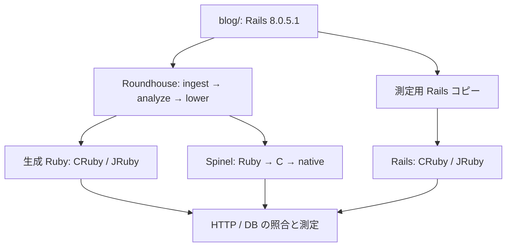
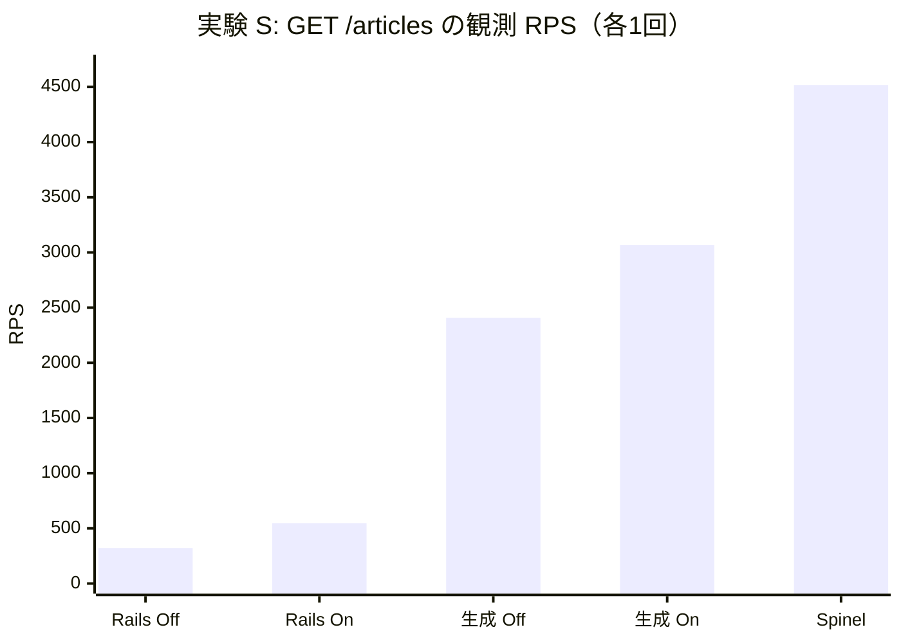
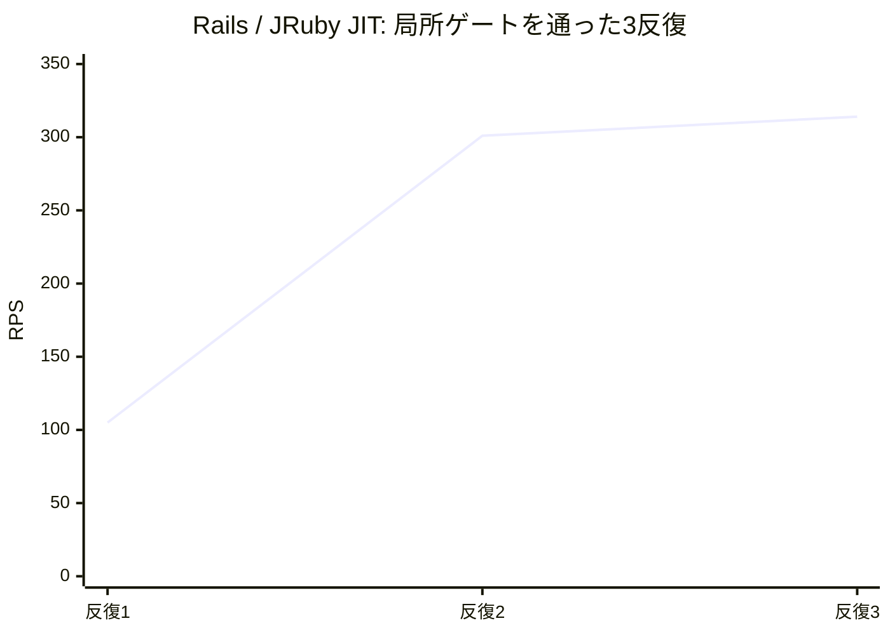
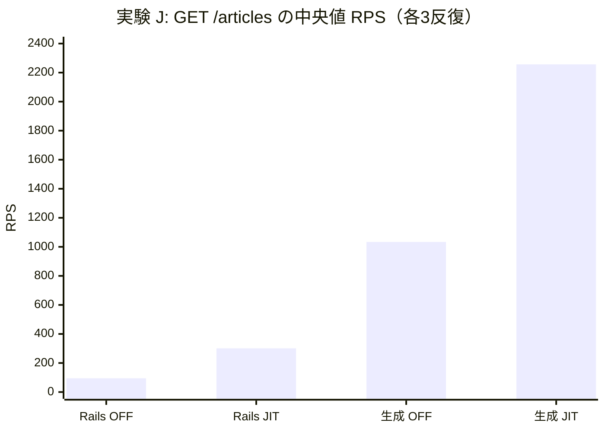

# Rails × Roundhouse × JIT / Spinel AOT 調査報告書

**対象:** 記事・コメントを扱う Rails 8.0.5.1 の小規模アプリ。2026-09-28 時点のリポジトリと公開 CI 成果物に基づく。  
**更新日:** 2026-09-28  
**対象コミット:** [`ad1678c`](https://github.com/koduki/example-rails-aot/commit/ad1678c08cb85a8c076740a4e9d66d6d73c9d5a6)（先行 PR: [#40](https://github.com/koduki/example-rails-aot/pull/40)）  
**主要測定実行:** 実験 S: [Actions 36380159185](https://github.com/koduki/example-rails-aot/actions/runs/36380159185) [[7]](#第8章-参考文献一次資料primary-sources) / 実験 J: [Actions 36362615236](https://github.com/koduki/example-rails-aot/actions/runs/36362615236) [[8]](#第8章-参考文献一次資料primary-sources)

---

### ナラティブの見取り図（本報告書の論理構成）

本調査は、Ruby on Rails アプリケーションの性能向上アプローチとして注目される「Ahead-of-Time（事前）特殊化トランスパイル」と「JIT（Just-In-Time）コンパイル」、そして「C ネイティブ AOT コンパイル」が、同一の Web ワークロードにおいてどのように作用し合うのかを客観的に検証したものです。

```text
+----------------------------------------------------------------------------------------------------+
|                                    本調査報告のナラティブ構造                                      |
+----------------------------------------------------------------------------------------------------+
|  [1. 問いと前提]                                                                                   |
|  Rails を Roundhouse で変換すると、CRuby YJIT や JRuby JIT の効果はどう変わるか？                  |
|  さらに Spinel による C ネイティブ AOT バイナリはどのような特性を示すか？                          |
|                                                                                                    |
|  [2. 技術特性と仮説]                                                                               |
|  フレームワークの多層抽象化と JIT の限界（第1章）--> 事前解決と AOT の役割（第2章）               |
|  --> 観測事実と推論を分離した 5 つの検証可能仮説 H1〜H4 を定式化（第3章）                          |
|                                                                                                    |
|  [3. 厳密な実験分離と正確性]                                                                       |
|  条件の異なる 2 つの実験（S: 短時間 CRuby/Spinel、J: 反復 JRuby）を安易に混同せず分離（第4章）     |
|  読み取り 5 経路の事前検証（Preflight）と正常系 CRUD の機能成立範囲を明示                          |
|                                                                                                    |
|  [4. 実測データの解剖]                                                                             |
|  実験 S: CRuby での絶対増分 (+659 RPS vs +225 RPS) と相対倍率縮小、Spinel 4,516 RPS（第5章）       |
|  実験 J: JRuby のウォームアップ段差（反復1 vs 反復2・3）と中央値の挙動（第6章）                    |
|                                                                                                    |
|  [5. 分析と展望]                                                                                   |
|  相互作用比 I < 1 の数理的意味、事実と推論の境界、容量探索へのロードマップ（第7章〜第9章）         |
+----------------------------------------------------------------------------------------------------+
```

---

## 目次

1. [第1章: Rails と JIT の性能特性](#第1章-rails-と-jit-の性能特性)
2. [第2章: Roundhouse と Spinel の役割](#第2章-roundhouse-と-spinel-の役割)
3. [第3章: 仮説と検証可能な予測](#第3章-仮説と検証可能な予測)
4. [第4章: 測定方法と正確性ゲート](#第4章-測定方法と正確性ゲート)
5. [第5章: 結果 S: CRuby と Spinel](#第5章-結果-s-cruby-と-spinel)
6. [第6章: 結果 J: JRuby の2×2と反復差](#第6章-結果-j-jruby-の22と反復差)
7. [第7章: 結果の分析と今後の検証](#第7章-結果の分析と今後の検証)
   - [7.1 JIT On は何を改善し、何が縮んだか](#71-jit-on-は何を改善し何が縮んだか)
   - [7.2 CRuby と JRuby の違い、Spinel の解釈](#72-cruby-と-jruby-の違いspinel-の解釈)
   - [7.3 次の実験](#73-次の実験)
8. [第8章: 参考文献・一次資料（Primary Sources）](#第8章-参考文献一次資料primary-sources)
9. [第9章: 総括サマリー](#第9章-総括サマリー)

---

## 第1章: Rails と JIT の性能特性

> **本章の視点:** Rails のリクエスト処理構造と、JIT コンパイラが高速化できる領域・原理的に高速化できない領域を整理します。

Rails の HTTP 応答は、Rack ミドルウェア、ルーティング、コントローラ、モデル／DB、ビュー描画などを通る。ルートやコールバック、関連、テンプレートの規約は開発時の表現を簡潔にする一方、リクエスト実行時にもフレームワークの処理がある（Rails 公式ガイド: [Rails on Rack](https://guides.rubyonrails.org/v8.0/rails_on_rack.html) [[9]](#第8章-参考文献一次資料primary-sources)、[Routing](https://guides.rubyonrails.org/v8.0/routing.html) [[9]](#第8章-参考文献一次資料primary-sources)、[Action Controller](https://guides.rubyonrails.org/v8.0/action_controller_overview.html) [[9]](#第8章-参考文献一次資料primary-sources)、[Action View](https://guides.rubyonrails.org/v8.0/action_view_overview.html) [[9]](#第8章-参考文献一次資料primary-sources) 参照）。**このアプリで各層が CPU 時間の何割を占めるかは未測定**である。


JIT は実行中に頻繁に使う Ruby コードを機械語へコンパイルする。CRuby 3.4 の YJIT は遅延コンパイルと Basic Block Versioning（BBV）を用いる。十分な実行回数に達するまでのウォームアップ、生成コードとメタデータのメモリ、コンパイル時間が重要になる。Ruby 公式資料は YJIT の統計とメモリ予算、長生きする worker の効果を説明している（[YJIT 公式文書](https://docs.ruby-lang.org/en/3.4/yjit/yjit_md.html) [[3]](#第8章-参考文献一次資料primary-sources)、および設計論文 [YJIT: A Basic Block Versioning JIT Compiler for CRuby](https://2021.splashcon.org/details/vmil-2021-papers/1/YJIT-A-Basic-Block-Versioning-JIT-Compiler-for-CRuby) [[1]](#第8章-参考文献一次資料primary-sources) 参照）。Rails 8.0 の `config.load_defaults 8.0` は YJIT を含む既定設定を読み込むが、この測定では `BENCH_JIT` により On/Off を明示的に切り替え、実プロセスの状態も検査する（[Rails 設定ガイド](https://guides.rubyonrails.org/v8.0/configuring.html) [[9]](#第8章-参考文献一次資料primary-sources) 参照）。

JRuby は JVM 上で Ruby を実行し、ここでの `-Xcompile.mode=JIT` / `OFF` は **JRuby 自身のコンパイルモード**である。OFF でも HotSpot の JVM JIT は有効で、CRuby の YJIT Off/On と同じ介入ではない（[JRuby のコンパイル設定](https://github.com/jruby/jruby/wiki/PerformanceTuning) [[4]](#第8章-参考文献一次資料primary-sources) に加え、本リポジトリの [起動設定](../bench/runtime/entrypoint.sh) と [実プロセス probe](../bench/runtime/probe.rb) で設定を照合）。

| 実行時間の構成 | JIT に期待できること | JIT だけでは保証できないこと |
| --- | --- | --- |
| **Ruby の呼び出し・分岐・型依存処理** | ホットパスをコンパイルし、反復実行の費用を減らす可能性 | フレームワークの仕事そのものが消えること |
| **DB・HTTP・待機・外部処理** | その前後の Ruby 処理は改善しうる | I/O や SQL の待ち時間の直接短縮 |
| **起動とウォームアップ** | 定常段階で利益が出る可能性 | 短命なプロセスや短い測定での同じ利益 |
| **コードと GC のメモリ** | 処理量との交換条件を評価できる | JIT On でメモリも必ず減ること |

YJIT の実運用評価論文（Chevalier-Boisvert et al., MPLR 2023 [[2]](#第8章-参考文献一次資料primary-sources)）も、ピーク速度だけでなく**メモリとウォームアップを併せて評価**している。本報告の短時間値を容量や導入効果と読み替えない理由である。

---

## 第2章: Roundhouse と Spinel の役割

> **本章の視点:** Rails の動的 DSL を事前解決（Lowering）する Roundhouse と、静的コードを C ネイティブ化する Spinel の技術的境界を明確にします。

[Roundhouse v2026.9.18](https://github.com/rubys/roundhouse/tree/v2026.9.18) [[5]](#第8章-参考文献一次資料primary-sources) は Rails の Ruby、ERB、schema、routes を取り込み、型・副作用を解析し、Rails 固有の DSL や暗黙の処理をターゲットに共通する明示的な表現へ lower する。その後、Ruby 系や Spinel 向けの独立したプロジェクトを出力する。生成物は元の Rails gem を要求ごとに実行しない。Ruby で定義されたフレームワーク相当の共通層と、HTTP／DB 等のターゲット別ランタイムを組み合わせる（固定版の [lower](https://github.com/rubys/roundhouse/blob/v2026.9.18/docs/pipeline/lower.md) [[5a]](#第8章-参考文献一次資料primary-sources) と [runtime](https://github.com/rubys/roundhouse/blob/v2026.9.18/docs/pipeline/runtime.md) [[5b]](#第8章-参考文献一次資料primary-sources) 参照）。

[Spinel 2026.09.12](https://github.com/matz/spinel/tree/2026.09.12) [[6]](#第8章-参考文献一次資料primary-sources) は、生成された Ruby プロジェクトを全体解析・型推論し、C を経てネイティブ実行ファイルにする AOT コンパイラである。ビルド後のアプリ実行に CRuby や JVM は不要だが、このリポジトリのバイナリは libc・SQLite・jemalloc 等のネイティブライブラリを利用する（[Spinel の固定版 README](https://github.com/matz/spinel/blob/2026.09.12/README.md) [[6]](#第8章-参考文献一次資料primary-sources) と [Roundhouse の Spinel 出力手順](https://github.com/rubys/roundhouse/blob/v2026.9.18/docs/guide/spinel.md) [[5c]](#第8章-参考文献一次資料primary-sources) 参照）。Spinel は一般的な Rails gem をそのまま AOT 化する道具ではなく、Roundhouse が生成した対応 Ruby とランタイムが入力になる。



測定用コピーは [`prepare_app.py`](../scripts/bench/prepare_app.py) が正本から作り、JRuby JDBC 用 lockfile と起動・DB・Puma の設定を適用する。正本の CSRF 検証は実験条件としてアプリ全体で無効である。これは保護された本番 Rails アプリへの導入効果や安全性を示さない。対象の固定版と実装差分は [`provenance.md`](provenance.md#appendix-roundhouse-architecture-v2026918) [[10]](#第8章-参考文献一次資料primary-sources) にも記録される。

| 比較 | 主な変更点 | 識別できる範囲 |
| --- | --- | --- |
| **Rails ↔ 生成 Ruby**（処理系・JIT 設定固定） | コード形状、Rails と生成ランタイム | Roundhouse 経路**全体**の差。下層の仕事量も変わる |
| **同形状で CRuby YJIT Off ↔ On** | YJIT の有無 | この条件での切替差 |
| **同形状で JRuby compile.mode=OFF ↔ JIT** | JRuby のコンパイルモード | JVM JIT が有効なままでの切替差 |
| **Rails/CRuby ↔ Spinel AOT** | VM、生成コード、HTTP、DB アダプター | 実行スタック全体の差。AOT コンパイラ単独の効果ではない |

---

## 第3章: 仮説と検証可能な予測

> **本章の視点:** 結果の原因を先取りして断定するのではなく、本実験で検証可能な 5 つの予測を明確に定義します。

Roundhouse 上流は、リクエストごとに変わらない Rails の判断を**変換時に済ませる**ことを設計上の性能仮説としている（[固定版リポジトリ](https://github.com/rubys/roundhouse/tree/v2026.9.18) [[5]](#第8章-参考文献一次資料primary-sources) 参照）。以下はその設計をこのアプリで検証できる形に分けたもので、結果の原因を先取りした断定ではない。

| 仮説 | 検証可能な予測 | 本データでの判定 | 追加で必要な証拠 |
| --- | --- | --- | --- |
| **H1: lower によりリクエスト時の Rails 固有処理が減る** | 同じ処理系・JIT 設定で生成 Ruby の処理量が高く、CPU 時間や割当が減る | 処理量は予測と整合。内部の削減箇所は未確認 | CPU profile、割当/GC、SQL・ルーティング・ビュー時間 |
| **H2a: 生成 Ruby でも JIT の利益が残る** | 同じ形状の On RPS が Off を上回る | CRuby と JRuby の双方で観測上は支持 | 同一コミット・ホストでの反復、JIT 統計 |
| **H2b: Roundhouse と JIT が倍率上も相乗する** | 生成 Ruby の On/Off 比が Rails の On/Off 比を上回る | 両実験の集計比は逆方向。強い形は支持されない | 反復分布とコンパイル・待機時間の分解 |
| **H3: Spinel の AOT と軽い実行スタックが効く** | 生成 Ruby と比べて観測 RPS が高く、コンテナ使用量が小さい | 短時間測定は整合。AOT 単独の因果効果は未分離 | HTTP/DB 層を揃えた対照、起動・定常の反復 |
| **H4: JRuby の段階的ウォームアップが短時間倍率を変える** | 長い試行で Rails/JIT On の処理量段階や倍率が変わる | 短時間値と長い反復の差、反復内の段差を観測 | 同じソースでの時系列、コンパイルログ・GC・試行順の交差 |

> [!NOTE]
> RPS から Ruby CPU、SQLite/OS 時間、型ガード失敗や GC ポーズの内訳を逆算することはできません。これらは直接プロファイルして初めて機構の説明として採用できます。

---

## 第4章: 測定方法と正確性ゲート

> **本章の視点:** 異なる実行条件を持つ 2 つの実験（S と J）を安易に比較せず、機能正確性ゲートの境界線を明示します。

| 実験 | ソースと成果物 | 対象・負荷 | 採用目的 |
| --- | --- | --- | --- |
| **S: CRuby / Spinel 短時間** | [Actions 36380159185](https://github.com/koduki/example-rails-aot/actions/runs/36380159185) [[7]](#第8章-参考文献一次資料primary-sources)・[生データ](https://github.com/koduki/example-rails-aot/actions/runs/36380159185/artifacts/10953212083)、head `2b66fbb2` | 7構成を各1回、`GET /articles`、4接続・10秒 closed-loop。Rails 8.0.5.1 の正本と派生コピー | 正確性、RPS と応答時間の予備観測 |
| **J: JRuby 反復** | [Actions 36362615236](https://github.com/koduki/example-rails-aot/actions/runs/36362615236) [[8]](#第8章-参考文献一次資料primary-sources)・[生データ](https://github.com/koduki/example-rails-aot/actions/runs/36362615236/artifacts/10947538810)、`f3c67327` | JRuby 4構成×3反復、`GET /articles`、4接続・30秒 closed-loop。ウォームアップ60～600秒 | JRuby の2×2と反復差 |

> [!WARNING]
> J の測定用 Rails も 8.0.5.1 ですが、派生元ソース、依存関係、コミット、ランナー、ウォームアップと測定時間は S と異なります。**S と J の RPS を直接割って処理系間の優劣を示してはなりません。**

両実験は 3 記事・3 コメントの SQLite WAL fixture を使用する。最大メモリは `docker stats` のコンテナ使用量であり、プロセス RSS ではない。hosted runner の CPU 指定は物理コアの完全な隔離を保証せず、SMT sibling やホスト負荷の影響が残る。

測定用 Rails では `perform_caching=false`、`cache_store=:null_store` とし、CRuby の `config.yjit` を `BENCH_JIT` で指定する。JRuby は `-Xcompile.mode` を切り替える。実際の起動状態は [`probe.rb`](../bench/runtime/probe.rb) で確認する。これらは[測定用 production 設定](../bench/runtime/production.rb)と[起動設定](../bench/runtime/entrypoint.sh)に記載されている。

測定前の preflight は 9 構成の `/articles`、`/articles/1`、`/articles/new`、`/articles.json`、`/articles/1.json` を Rails 基準と照合し、S の全構成で 5 経路が適格だった（[AOT 全ジョブ](https://github.com/koduki/example-rails-aot/actions/runs/36380159179) 成功）。正常系 read/update と create/delete はそれぞれ 9/9 `verified` で、HTTP と保存後の DB を確認した。ただし `verified` は低負荷の機能確認であり、CRUD の有効な性能反復は **0/1**。操作全体の成功操作/秒や p99 の性能倍率は示せない。CRUD は update がフォーム取得＋更新、create/delete がフォーム取得＋作成＋削除であり、操作単位と HTTP 要求単位を分けて集計する。

無効入力の HTML エラー表示と JSON エラー形状には差が残る。不正 CSRF トークンの拒否は、参照用 Rails 自体が検証を無効にしているため `excluded` である。比較器は CSRF 用 meta/input 要素を比較対象から外すが、フォームの内容、HTTP、DB 効果は比較する。**読み取り 5 経路の適格性はアプリ全体の互換性を意味しない。**

---

## 第5章: 結果 S: CRuby と Spinel

> **本章の視点:** 実験 S における各構成 1 回の観測データ。絶対スループットの増加と相対倍率の縮小を対比します。

各構成 1 回の観測値であり、最大持続容量ではない。p50/p95/p99 はその試行の HTTP 応答時間である。

| 実行構成 | RPS | p50 / p95 / p99 (ms) | 最大コンテナ使用量 (MB) |
| --- | ---: | ---: | ---: |
| **Rails / CRuby YJIT Off** | 321.52 | 12.26 / 16.03 / 18.70 | 102.20 |
| **Rails / CRuby YJIT On** | 546.58 | 7.11 / 11.37 / 13.90 | 126.40 |
| **生成 Ruby / CRuby YJIT Off** | 2,407.74 | 1.61 / 2.46 / 3.03 | 41.89 |
| **生成 Ruby / CRuby YJIT On** | 3,066.75 | 1.24 / 1.96 / 2.62 | 50.16 |
| **Spinel AOT** | 4,516.54 | 0.88 / 1.16 / 1.25 | 12.63 |



| CRuby 内の比較 | 算式 | 観測比 |
| --- | --- | ---: |
| **生成 Ruby / Rails、Off** | 2407.74 / 321.52 | **7.489** |
| **生成 Ruby / Rails、On** | 3066.75 / 546.58 | **5.611** |
| **YJIT On / Off、Rails** | 546.58 / 321.52 | **1.700** |
| **YJIT On / Off、生成 Ruby** | 3066.75 / 2407.74 | **1.274** |
| **相互作用比** | 1.274 / 1.700 | **0.749** |

YJIT On の絶対差は Rails **+225.06 RPS**、生成 Ruby **+659.01 RPS**。On による絶対 RPS の増加と、変換の相対倍率の縮小は両立する。これは同じ短時間条件での観測であり、YJIT が特定の内部処理に作用した割合や定常容量の増分ではない。

Spinel／Rails CRuby Off は **14.047 倍**、Spinel／生成 Ruby YJIT On は **1.473 倍**。HTTP サーバーと SQLite アダプターを含む比較のため、AOT コンパイル単独の倍率として扱わない。

S の Rails/JRuby JIT On は **29.15 RPS**、生成 JRuby JIT On は **1122.00 RPS**。短い 1 回の比 **38.491** は J の長時間反復中央値の比 **7.488** と大きく違う。JIT 段階と実験条件の差を分離できないので、S の JRuby 値は処理系間の順位付けに使わない。

---

## 第6章: 結果 J: JRuby の2×2と反復差

> **本章の視点:** 実験 J（JRuby 反復）における局所安定ゲート通過後のデータと、反復ごとの段差（非定常性）を分析します。

J の 12 試行はすべて `passed`。局所安定ゲートは 15 秒窓 4 つ、CV とドリフト各 10% 以下、測定 30 秒と失敗率条件を用いた（[`ci-jruby-convergence.yml`](../bench/profiles/ci-jruby-convergence.yml) と成果物の `summary.md`、`trials/per-run.json` が根拠）。

| 構成 | 反復1 / 2 / 3 RPS | 中央値 RPS | 中央値 p50 / p95 / p99 (ms) | ウォームアップ |
| --- | ---: | ---: | ---: | ---: |
| **Rails / JRuby OFF** | 97.60 / 92.64 / 95.08 | **95.08** | 34.20 / 66.45 / 75.28 | 120～150秒 |
| **Rails / JRuby JIT** | **105.00** / 301.41 / 313.84 | **301.41** | 12.39 / 20.96 / 26.88 | **211～376秒** |
| **生成 Ruby / JRuby OFF** | 1030.37 / 1033.87 / 1034.10 | **1033.87** | 3.40 / 8.15 / 10.40 | 90～109秒 |
| **生成 Ruby / JRuby JIT** | 2211.64 / 2312.39 / 2257.07 | **2257.07** | 1.68 / 3.14 / 4.44 | 120～180秒 |



| 中央値の比較 | 算式 | 観測比 |
| --- | --- | ---: |
| **生成 Ruby / Rails、OFF** | 1033.87 / 95.08 | **10.874** |
| **生成 Ruby / Rails、JIT** | 2257.07 / 301.41 | **7.488** |
| **JIT / OFF、Rails** | 301.41 / 95.08 | **3.170** |
| **JIT / OFF、生成 Ruby** | 2257.07 / 1033.87 | **2.183** |
| **相互作用比** | 2.183 / 3.170 | **0.689** |



同じ反復番号で組むと、生成 Ruby／Rails の JIT 比は **21.06、7.67、7.19**、OFF 比は **10.56、11.16、10.88**。それぞれの相互作用比は約 **2.00、0.69、0.66** となり、反復 1 だけ方向が逆転する。Rails/JRuby JIT の反復 1 は局所窓では安定しても、残る 2 回と同じ処理量段階ではなかった。ホスト、JVM/JRuby のコンパイル、GC、試行順の寄与は未分離である。したがって中央値から得た **0.689** に一般的な相互作用の精度を与えない。

JRuby OFF は `compile.mode=OFF` であり JVM JIT を切った条件ではない。表の p99 中央値は各試行の p99 の中央値で、全応答をプールした p99 ではない。

---

## 第7章: 結果の分析と今後の検証

> **本章の視点:** 相互作用比 $I < 1$ の意味、事実と推論の切り分け、および確証を得るための検証ロードマップを提示します。

### 7.1 JIT On は何を改善し、何が縮んだか

2×2 の相互作用を次のように定義する。$E$ は生成 Ruby（Emitted Ruby）、$R$ は Rails の同一実験内 RPS である。

$$
I = \frac{E_{\mathrm{On}} / E_{\mathrm{Off}}}{R_{\mathrm{On}} / R_{\mathrm{Off}}} = \frac{E_{\mathrm{On}} / R_{\mathrm{On}}}{E_{\mathrm{Off}} / R_{\mathrm{Off}}}
$$

| 実験 | Rails の On / Off | 生成 Ruby の On / Off | 相互作用比 $I$ |
| --- | ---: | ---: | ---: |
| **S: CRuby YJIT、各1回** | 1.700 | 1.274 | **0.749** |
| **J: JRuby compile.mode、各3反復の中央値比** | 3.170 | 2.183 | **0.689** |

$I < 1$ は On で**生成 Ruby の相対倍率が縮む**ことを表す。両実験で $E_{\mathrm{On}} > E_{\mathrm{Off}}$ かつ $R_{\mathrm{On}} > R_{\mathrm{Off}}$ であり、生成 Ruby の On が Off より遅いという意味ではない。CRuby では生成側の YJIT 増分は **+659.01 RPS**、Rails は **+225.06 RPS** だが、比率では Rails の伸びが大きい。JRuby の中央値にも同じ方向が見える一方、Rails/JIT On の反復 1 は他の 2 回から離れている。反復番号を揃えた相互作用比は約 **2.00、0.69、0.66** で、`0.689` を確定的な機構の係数と扱えない。

> [!IMPORTANT]
> **推論と事実の切り分け:** Rails の実行時処理を Roundhouse が明示化・削減し、JIT の対象になる Ruby の仕事の割合が変わった、という説明は**推論**です。SQL やサーバー待ち、GC、コードキャッシュ、CPU を分離していないため、YJIT/JRuby がどの層を何%改善したかは特定されていません。固定接続数の closed-loop RPS は応答時間と負荷生成条件にも依存し、最大持続容量の証拠ではありません。

### 7.2 CRuby と JRuby の違い、Spinel の解釈

CRuby の YJIT と JRuby の `compile.mode` は異なる設定である。S は 10 秒・1 反復、J は 30 秒・3 反復で、ソースの来歴とホストも異なる。よって表から「JRuby の JIT が YJIT より強い」「Roundhouse は JRuby の方が効く」と結論しない。**共通するのは、各実験内で On の絶対 RPS が上がり、生成 Ruby／Rails の倍率が縮む方向だけ**である。

Spinel は生成 Ruby のソース系統に近い入力を使うが、CRuby/JRuby の JIT 切替とは別の比較である。ネイティブ化に加えて HTTP・SQLite・スケジューリングとメモリ管理も変わる。**4,516.54 RPS と 12.63 MB はこのスタックでの観測であり、AOT コンパイラ単体の効果や一般的な省メモリ率ではない**。

### 7.3 次の実験

| 優先度 | 実験計画 | 判断に使う証拠 |
| :---: | --- | --- |
| **1** | 同一ソース・ホスト・fixture・endpoint で CRuby/JRuby の 8 構成を交差順に反復 | 分布、時系列、ウォームアップ後のドリフト。Rails/JRuby JIT の段差を追跡 |
| **2** | k6 open-arrival の段階的負荷率探索 | 共通 SLO に対する p99、失敗率、drop、負荷生成器の余力から持続容量を定義 |
| **3** | 正常系 CRUD の長時間反復 | フォーム取得を含む論理操作全体の成功操作/秒と p50/p95/p99。無効入力と CSRF 保護は別の機能評価 |
| **4** | 原因の profile と Spinel 対照 | CPU、JIT 統計、GC/割当、SQL、HTTP 待機を分離。AOT 単独なら HTTP/DB 層も揃える |

専用ホストでの容量探索は未実施である。[測定契約 (`docs/benchmark.md`)](benchmark.md) [[10]](#第8章-参考文献一次資料primary-sources) の full profile は 7 構成×5 経路×5 反復の 175 試行で、最短ウォームアップと測定だけでも 14 時間 35 分を要する。アプリと負荷生成器の論理 CPU に加え、SMT sibling も分離する。

---

## 第8章: 参考文献・一次資料（Primary Sources）

本報告書で引用・照合した一次資料および関連文献は以下の通りである。

| 文献番号 | 資料名・書誌情報 | 本報告で利用した内容 | 数値への扱い |
| :---: | --- | --- | --- |
| **[1]** | **Maxime Chevalier-Boisvert et al. (2021)**<br>*"YJIT: A Basic Block Versioning JIT Compiler for CRuby"*<br>VMIL 2021. [Paper link](https://2021.splashcon.org/details/vmil-2021-papers/1/YJIT-A-Basic-Block-Versioning-JIT-Compiler-for-CRuby) | YJIT の Basic Block Versioning 機構、遅延コンパイル、型ガードの設計理論 | 本アプリ固有の高速化率の根拠には使わない |
| **[2]** | **Maxime Chevalier-Boisvert, Noah Gibbs et al. (2023)**<br>*"Evaluating YJIT's Performance in a Production Context: A Pragmatic Approach"*<br>MPLR 2023. [Paper link](https://2023.splashcon.org/details/mplr-2023-papers/7/Evaluating-YJIT-s-Performance-in-a-Production-Context-A-Pragmatic-Approach) | 本番環境評価手法。ピーク速度だけでなくメモリフットプリントとウォームアップを併せて評価する原則 | 本測定の不確かさと次の実験設計に利用 |
| **[3]** | **CRuby Core Team**<br>*"Ruby 3.4 YJIT Documentation"*<br>[Official Docs](https://docs.ruby-lang.org/en/3.4/yjit/yjit_md.html) | YJIT の実行時統計、メモリ予算管理、worker プロセスの生存時間に関する公式仕様 | 測定時の起動オプションの整合性確認 |
| **[4]** | **JRuby Team**<br>*"JRuby Performance Tuning & Compilation Modes"*<br>[Wiki](https://github.com/jruby/jruby/wiki/PerformanceTuning) | `compile.mode=OFF` と JVM HotSpot JIT の関係性の定義 | S と J の処理系横断の数値比較を正当化しない |
| **[5]** | **Sam Ruby**<br>*"Roundhouse v2026.9.18"*<br>[GitHub Repository](https://github.com/rubys/roundhouse/tree/v2026.9.18)<br>- **[5a]** [lower.md](https://github.com/rubys/roundhouse/blob/v2026.9.18/docs/pipeline/lower.md)<br>- **[5b]** [runtime.md](https://github.com/rubys/roundhouse/blob/v2026.9.18/docs/pipeline/runtime.md)<br>- **[5c]** [spinel.md](https://github.com/rubys/roundhouse/blob/v2026.9.18/docs/guide/spinel.md) | DSL の明示化・lower、ターゲット別生成ランタイム、Spinel 出力手順の設計 | 上流の公開ベンチマーク値は条件が異なるため混ぜない |
| **[6]** | **Yukihiro "Matz" Matsumoto**<br>*"Spinel 2026.09.12"*<br>[GitHub Repository](https://github.com/matz/spinel/tree/2026.09.12) | 全体解析・型推論、C コード生成、AOT ネイティブコンパイル仕様 | AOT 単独効果とスタック全体の効果を分離して解釈 |
| **[7]** | **GitHub Actions 実行 36380159185 (実験 S)**<br>[Run link](https://github.com/koduki/example-rails-aot/actions/runs/36380159185) / [生データ Artifact 10953212083](https://github.com/koduki/example-rails-aot/actions/runs/36380159185/artifacts/10953212083) | head `2b66fbb2` における 7 構成 short smoke 観測値 | 第 5 章（結果 S）の直接の算定根拠 |
| **[8]** | **GitHub Actions 実行 36362615236 (実験 J)**<br>[Run link](https://github.com/koduki/example-rails-aot/actions/runs/36362615236) / [生データ Artifact 10947538810](https://github.com/koduki/example-rails-aot/actions/runs/36362615236/artifacts/10947538810) | commit `f3c67327` における JRuby 4 構成×3 反復観測値 | 第 6 章（結果 J）の直接の算定根拠 |
| **[9]** | **Rails Core Team**<br>*"Ruby on Rails 8.0 Guides"*<br>[Official Guides](https://guides.rubyonrails.org/v8.0/) | Rack ミドルウェア、ルーティング、コントローラ、ビュー、設定仕様 | アプリケーションの要求経路の前提定義 |
| **[10]** | **本リポジトリ内部設計書**<br>- [`docs/benchmark.md`](benchmark.md)<br>- [`docs/provenance.md`](provenance.md) | 資源分離契約（CPU ピニング、cgroups、SQLite WAL）、来歴情報 | 実験条件の再現性確保と成立境界の定義 |

---

## 第9章: 総括サマリー

- **変換の観測効果:** `GET /articles` では Roundhouse 生成 Ruby の RPS が Rails を上回った。CRuby の短時間値は YJIT Off **7.489 倍**、On **5.611 倍**。JRuby の別実験での 3 反復中央値比は OFF **10.874 倍**、JIT **7.488 倍**。
- **JIT の観測効果:** Rails と生成 Ruby のどちらも On の絶対 RPS は上がった。相対的な変換倍率は On で縮んだ。JRuby の段差があるため、縮小の大きさや原因は未確定。
- **Spinel の観測効果:** **4,516.54 RPS、12.63 MB** は AOT バイナリ、HTTP サーバー、DB アダプターを含む全スタックの値。AOT コンパイラ単独の寄与は切り出せない。
- **成立範囲:** 読み取り 5 経路と正常系 CRUD の低負荷機能ゲートを通過した。無効入力の差、CSRF 検証無効、短い hosted runner 測定、JRuby の段階差が残る。一般的な Rails アプリの定常容量や本番での効果には外挿しない。
